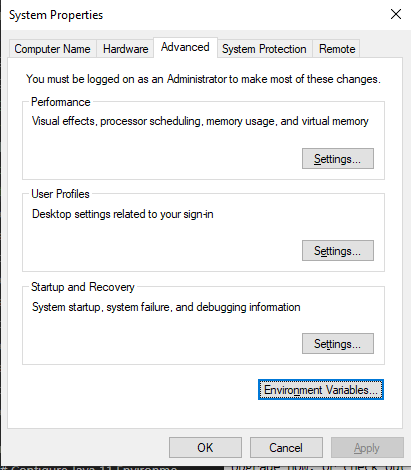
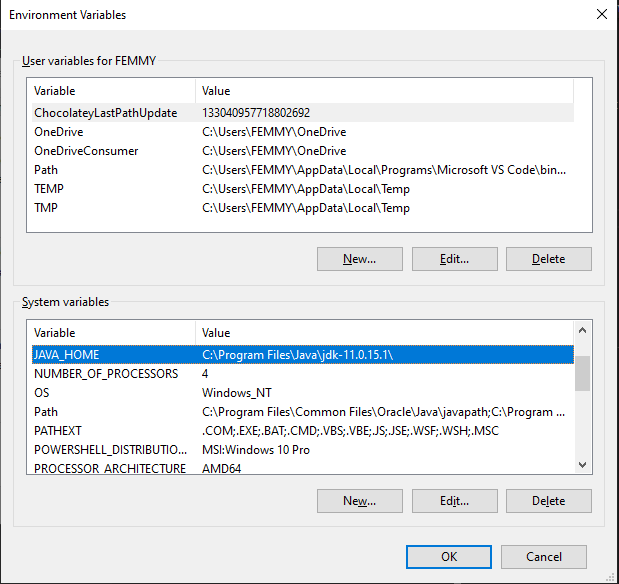
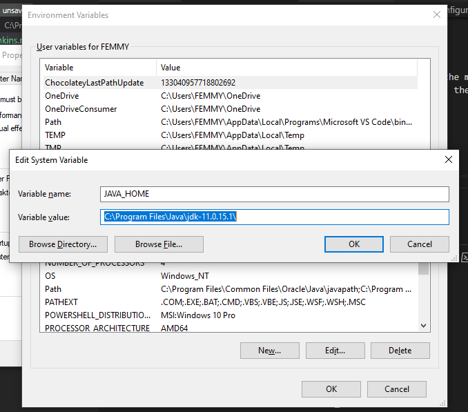
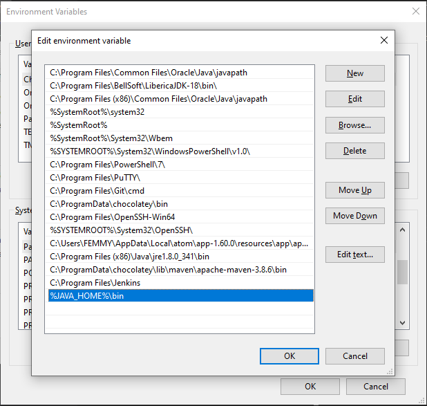
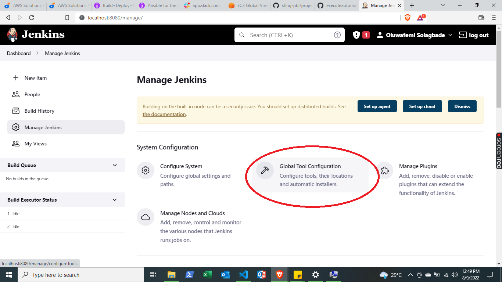
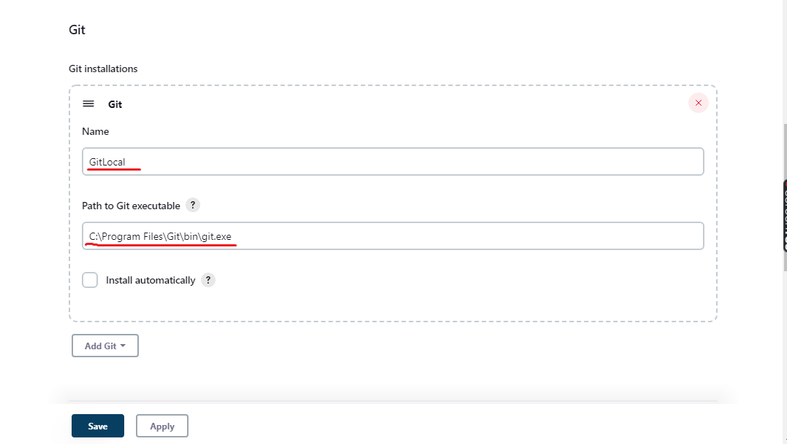

# Installation of Jenkins on Windows Machine

Jenkins works with java 8 and 11; to avoid issues, work with any of these versions

signup and download java 11 windows x64 installer from oracle jdk download page, https://www.oracle.com/java/technologies/downloads/#java11-windows

## Configure Java 11 Environment settings

Open system properties
Right-click **This PC**, and select **Properties** from the menu.
Choose **Advanced system settings** in the System window, then **Environment Variables**



Edit **JAVA_HOME**; 



add path to java installation



Also edit **path** under **system variables**

add **%JAVA_HOME%\bin**



check java version to confirm the succesful installation

```java --version```

## Install Jenkins

**Fom Terminal**

launch powershell in administrator mode, ensure that chocolatey is already installed on your machine. If you do not already have chocolatey running on your system, visit https://chocolatey.org/install for guide on installing chocolatey. 

to instal jenkins, run:

```choco install jenkins```

after the successful installation, run:

```java -jar jenkins```

**From Windows:**

after successful installation, proceed to https://www.jenkins.io/download/ to download generic java package for windows, and run.

After the download completes, open the Windows installer and follow the directions to complete installation of Jenkins. 

To launch Jenkins on your browser after installation, go to

```http://localhost:8080```

you will be asked to provide an initial Admin password at first launch to unlock Jenkins. copy password from the file via the link provided to get into jenkins; default location is C:\Program Files\Jenkins\secrets

provide the initialAdminpassword to continue.

install suggested plug-ins

create the first admin user

## Configure Jenkins

launch jenkins in your browser



on the left hand side of your page, go to **Global Tool Configuration** and update **Git** as shown below. Ensure that Git plug-in is installed.




