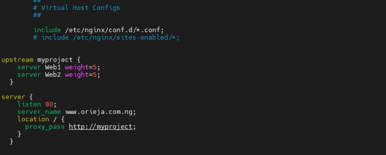
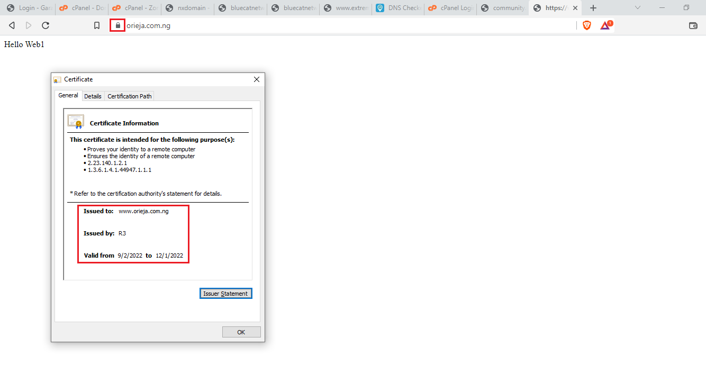

# LOAD BALANCER SOLUTION WITH NGINX AND SSL/TLS

In this project we will configure an Nginx Load Balancer solution.

This project consists of two parts:
1. Configuration of Nginx as a Load Balancer
2. Registeration of a new domain name and secured connection using SSL/TLS certificates.

Your target architecture will look like this:


## CONFIGURE NGINX AS A LOAD BALANCER

Create an EC2 VM based on Ubuntu Server 20.04 LTS and name it Nginx LB.


 Open TCP port 80 for HTTP connections, also open TCP port 443 – this port is used for secured HTTPS connections


Update /etc/hosts file for local DNS with Web Servers’ names (e.g. Web1 and Web2) and their local IP addresses

```sudo vi /etc/hosts```


Install and configure Nginx as a load balancer to point traffic to the resolvable DNS names of the webservers

Update the instance and Install Nginx

```
sudo apt update
sudo apt install nginx
```

Open the default nginx configuration file

```sudo vi /etc/nginx/nginx.conf```

```
#insert following configuration into http section

 upstream myproject {
    server Web1 weight=5;
    server Web2 weight=5;
  }

server {
    listen 80;
    server_name www.domain.com;
    location / {
      proxy_pass http://myproject;
    }
  }
```

look for the line below in the script and add '#' at the begining to comment it out
```
# include /etc/nginx/sites-enabled/*;
```


Restart Nginx and make sure the service is up and running

```
sudo systemctl restart nginx
sudo systemctl status nginx
```

## REGISTER A NEW DOMAIN NAME AND CONFIGURE SECURED CONNECTION USING SSL/TLS CERTIFICATES

Let us make necessary configurations to make connections to our Tooling Web Solution secured!

In order to get a valid SSL certificate – you need to register a new domain name using any Domain name registrar. e.g orieja.com.ng - *domain* was registered on garanntor.com - *registrar*

### Assign an Elastic IP to your Nginx LB server and associate your domain name with this Elastic IP

On your EC2 page, Allocate Elastic IP address,


Now, Assign Elastic IP address to your Nginx LB server instance


Update A record in your registrar to point to Nginx LB using Elastic IP address


Check that your Web Servers can be reached from your browser using new domain name using HTTP protocol – http://<your-domain-name.com>

**Web Server 1**


**Web Server 2**


Configure Nginx to recognize your new domain name
Update your nginx.conf with server_name www.<your-domain-name.com> instead of server_name www.domain.com

```sudo vi /etc/nginx/nginx.conf```



### Install certbot and request for an SSL/TLS certificate
Make sure snapd service is active and running

```sudo systemctl status snapd```

Install certbot

```sudo snap install --classic certbot```

Request your certificate (just follow the certbot instructions – you will need to choose which domain you want your certificate to be issued for, domain name will be looked up from nginx.conf file so make sure you have updated it as described above.

```sudo ln -s /snap/bin/certbot /usr/bin/certbot```

```sudo certbot --nginx```


Test secured access to your Web Solution by trying to reach https://<your-domain-name.com>

You shall be able to access your website by using HTTPS protocol (that uses TCP port 443) and see a padlock pictogram in your browser’s search string.
Click on the padlock icon and you can see the details of the certificate issued for your website.



### Set up periodical renewal of your SSL/TLS certificate
By default, LetsEncrypt certificate is valid for 90 days, so it is recommended to renew it at least every 60 days or more frequently.

You can test renewal command in dry-run mode

```sudo certbot renew --dry-run```


Best pracice is to have a scheduled job to run renew command periodically. Let us configure a cronjob to run the command twice a day.

To do so, lets edit the crontab file with the following command:

```crontab -e```

Add following line:

```
* */12 * * *   root /usr/bin/certbot renew > /dev/null 2>&1
```


You can always change the interval of this cronjob if twice a day is too frequent by adjusting schedule expression.

You have just implemented an Nginx Load Balancing Web Solution with secured HTTPS connection with periodically updated SSL/TLS certificates.