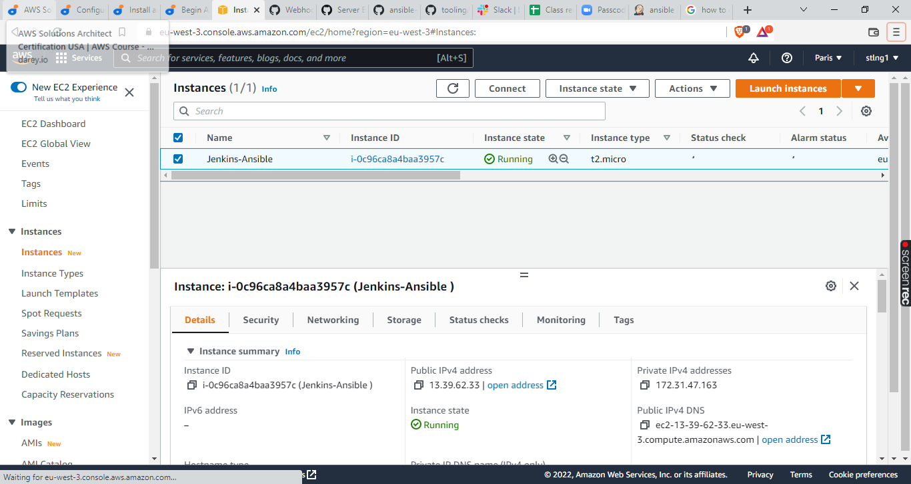
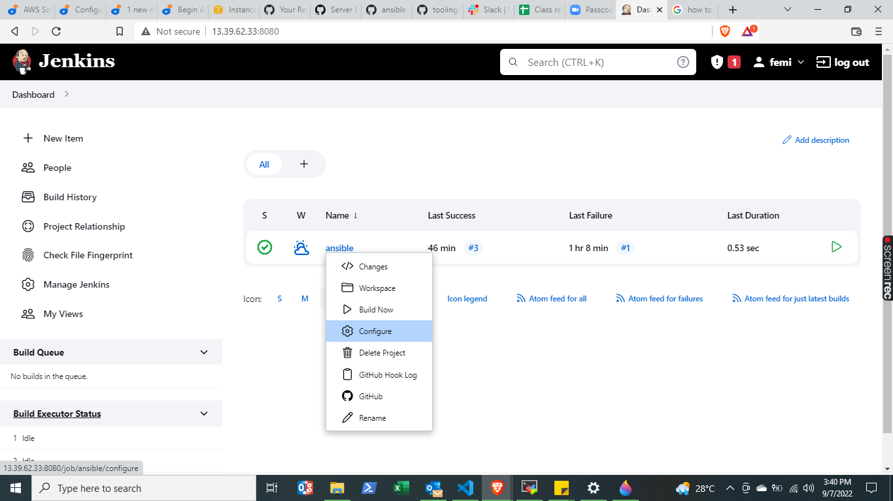
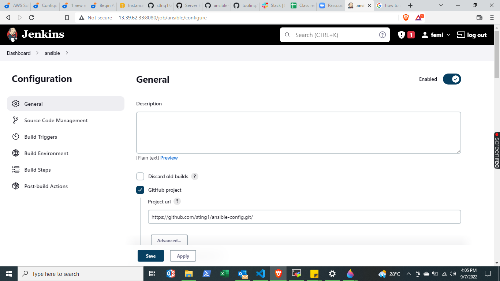
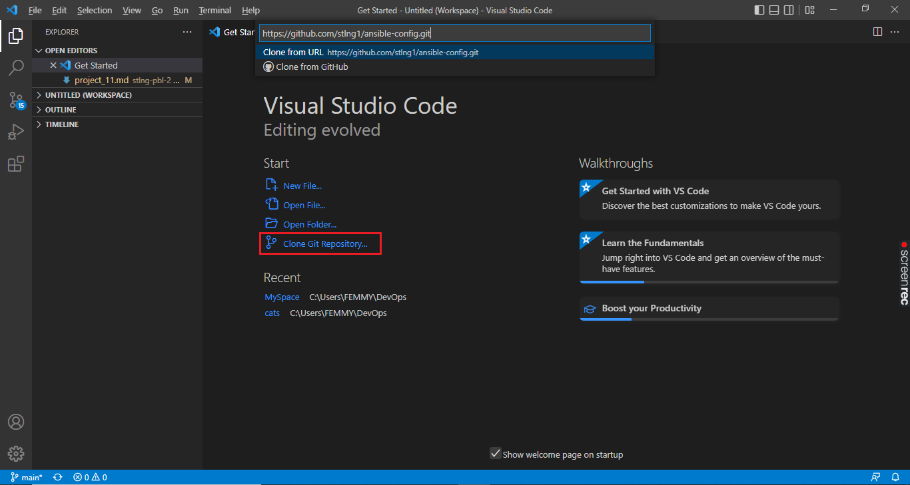

# ANSIBLE CONFIGURATION MANAGEMENT – AUTOMATE PROJECT 7 TO 10

Task
1. Install and configure Ansible client to act as a Jump Server/Bastion Host
2. Create a simple Ansible playbook to automate servers configuration

## INSTALL AND CONFIGURE ANSIBLE ON EC2 INSTANCE

Update Name tag on your Project 9 Jenkins EC2 Instance to **Jenkins-Ansible** and associate an Elastic IP to it. We will use this server to run playbooks.



*Note that Elastic IP is free only when it is being associated to an EC2 Instance, so do not forget to release Elastic IP once you terminate your EC2 Instance.*

In your GitHub account create a new repository and name it *ansible-config*.


Install Ansible 

```sudo apt update```

```sudo apt install ansible```

Check your Ansible version by running 

```sudo ansible --version```


Configure Jenkins build job to save your repository content every time you change it – 

Create a new Freestyle project - *ansible*, in Jenkins


 copy *ansible-config* repository url from GitHub


 
 point your new jenkins project - *ansible* to *ansible-config* repository. Follow the images below as step by step guide.

configure *ansible* project in jenkins



under **General**, paste the repository url copied from GitHub



Under **Source Code Management**, paste again the *repository url* copied from GitHub; Under *Credentials*, and add username and password to your GitHub repository to give jenkins access.


scrolling down a bit, you will find *branches to build*. By default, the *branch specifier* is 'master' but GitHub uses 'main'. Change it to 'main' as shown in the image below.


Next, click on **Build Triggers** tab, check *GitHub hook trigger for GITScm polling* as shown below


Finally, under **Post-build Actions** select *Archive the artifacts* from the drop down menu and add '**' as shown below


click Save to save all the changes made. We are done configuring Jenkins. Next we will configure Webhook in GitHub and it to trigger *ansible* build. To get to webhooks page from *ansible* repository, go to settings > webhooks.

Payload URL

```http://<public-ip of jenkins server>:8080/github-webhook/```


you have just configured Jenkins to automatically trigger a build job everytime you make a change in *ansible-config* repository.

Test your setup by making some change in README.MD file in master branch ('main' in this case) and make sure that builds starts automatically and Jenkins saves the files (build artifacts) in following folder

```ls /var/lib/jenkins/jobs/ansible/builds/<build_number>/archive/```

Below is the console output result for build #3, triggered by 'recent update' modification to README.MD file


and the archive,


# Prepare your development environment using Visual Studio Code

Download and install Visual Studio Code (VSC)

After you have successfully installed VSC, configure it to connect to your newly created GitHub repository and clone down your *ansible-config* repo to VSC.

Copy *ansible-config* repo url from GitHub, launch VSC, click **Clone Git Repository** and paste copied repo url as shown below. (you can also achieve this via **view > command pallete > Git:clone**)



your cloned repo should appear like this


# BEGIN ANSIBLE DEVELOPMENT

Here we will create a new branch that will be used for development of a new feature in *ansible-config* GitHub repository.

Create a new branch and name it 'feature' by using the command pallete (i.e *view > command pallete > Git:Create branch*). 'feature' will appear in the branch indicator at the bottom left of the vsc window as shown below.


In the newly created *feature* branch on your local machine, start building your code and directory structure.

>Create a directory and name it **playbooks** – it will be used to store all your playbook files.

>Create a directory and name it **inventory** – it will be used to keep your hosts organised.

>Within the playbooks folder, create your first playbook, and name it **common.yml**

>Within the inventory folder, create an inventory file (.yml) for each environment (Development, Staging, Testing and Production) **dev, staging, uat,** and **prod** respectively.


## Set up an Ansible Inventory

On your local machine VSC, save the inventory structure below in the *inventory/dev.yml* file to start configuring your development servers. Ensure to replace the IP addresses according to your own setup.

Also notice, that your Load Balancer user is *ubuntu* while user for RHEL-based servers is *ec2-user*.

Update your *inventory/dev.yml* file with this snippet of code:

```
[nfs]
<NFS-Server-Private-IP-Address> ansible_ssh_user='ec2-user'

[webservers]
<Web-Server1-Private-IP-Address> ansible_ssh_user='ec2-user'
<Web-Server2-Private-IP-Address> ansible_ssh_user='ec2-user'

[db]
<Database-Private-IP-Address> ansible_ssh_user='ec2-user' 

[lb]
<Load-Balancer-Private-IP-Address> ansible_ssh_user='ubuntu'
```


*Note: Ansible uses TCP port 22 by default, which means it needs to ssh into target servers from Jenkins-Ansible host; for this, ssh-agent is required*.

Start powershell as administrator on your local machine and ensure that Openssh is installed and running.

To check if OpenSSH is installed on windows local machine, run the following command:

```
Get-WindowsCapability -Online | Where-Object Name -like 'OpenSSH*'
```

Your output should look like the image below if neither openssh client or server is installed (*the State : will be 'present' if it is installed*)

```
Name  : OpenSSH.Client~~~~0.0.1.0
State : NotPresent

Name  : OpenSSH.Server~~~~0.0.1.0
State : NotPresent
```

If OpenSSH is not installed, follow the steps below to install it.

>#Installing OpenSSH Client in windows:
>
> Add-WindowsCapability -Online -Name OpenSSH.Client~~~~0.0.1.0
>
>#Start the sshd service:
>
>Start-Service sshd

With OpenSSH installed, we can now configure our ssh-agent.

Now you need to import your key into ssh-agent:

```
eval `ssh-agent -s`
ssh-add <path-to-private-key>
```

*Note: if you get an error like the image below, you can simply move or copy your private-key to .ssh folder (i.e \user\admin\ .ssh) and run the commands again*.


Confirm the key has been added with the command below, you should see the name of your key

```ssh-add -l```


Now, ssh into your Jenkins-Ansible server using ssh-agent

```ssh -A ubuntu@public-ip```

# Create a Common Playbook

It is time to start giving Ansible the instructions on what you need to be performed on all servers listed in *inventory/dev.yml*

In *common.yml* playbook you will write configuration for repeatable, re-usable, and multi-machine tasks that is common to systems within the infrastructure.

copy the code below into your *playbooks/common.yml* file

```
---
- name: update web, nfs and db servers
  hosts: webservers, nfs, db
  remote_user: ec2-user
  become: yes
  become_user: root
  tasks:
    - name: ensure wireshark is at the latest version
      yum:
        name: wireshark
        state: latest

    - name: add project directory
      file:
        path: /home/ec2-user/project
        state: directory

    - name: create update file
      file:
        path: /home/ec2-user/project/update
        state: touch

    - name: Transfer the webshell.sh script
      copy: src=webshell.sh dest=/home/ec2-user/project mode=0777

    - name: Execute the webshell.sh script
      command: sh /home/ec2-user/project/webshell.sh

- name: update LB server
  hosts: lb
  remote_user: ubuntu
  become: yes
  become_user: root
  tasks:
    - name: Update apt repo
      apt:
        update_cache: yes

    - name: ensure wireshark is at the latest version
      apt:
        name: wireshark
        state: latest

    - name: add project directory
      file:
        path: /home/ubuntu/project
        state: directory

    - name: create update file
      file:
        path: /home/ubuntu/project/update
        state: touch

    - name: Transfer the webshell.sh script
      copy: src=webshell.sh dest=/home/ubuntu/project mode=0777

    - name: Execute the webshell.sh script
      command: sh /home/ubuntu/project/webshell.sh

```

This playbook is divided into two parts, each of them is intended to perform the same task: 

1. Install wireshark utility (or make sure it is updated to the latest version) on your RHEL 8 and Ubuntu servers. 

2. Create a directory, **project** and a file inside it, **update**

3. Run a shell script, **webshell.sh** on remote server. To achieve this, we first copy the script to the remote server before executing it. Our script in this case, **webshell.sh** will simply create a directory, **/home/lexus** directory.

It uses root user to perform this task and respective package manager: yum for RHEL 8 and apt for Ubuntu.

# Update GitHub with the latest code

Now all of your directories, *(inventory, playbooks)* and files, *(dev.yml, common.yml)* are updated on your local machine VSC, you need to push these VSC changes to GitHub repo.

To do this, use the following commands from VSC terminal:

```
git add <selected files>

git commit -m "commit message"

git push
```

your GitHub repo should look like this


Notice that a features branch has been created on the repo and only this branch is updated. The main branch has not yet been updated.

To update the main branch, the *feature* branch will have to be merged with it. To do this we will use the **Compare & pull request** feature on the GitHub repo in the following steps:


Back in VSC, checkout to *main* branch using the command pallete, then *synchronise changes* to update your VSC local machine with GutHub *main* branch.


Once your code changes appear in main branch, Jenkins will do its job and save all the files (build artifacts) to the directory below on Jenkins-Ansible server.

```/var/lib/jenkins/jobs/ansible/builds/<build_number>/archive/``` 


Now all your updated files are available on your jenkins-ansible server as seen in the image above.

# Run first Ansible test

Head back on your terminal connected to jenkins-ansible server and pull down the latest changes from your GitHub repo

```git pull <github repo url>```


Now, it is time to execute ansible-playbook command from your jenkins-ansible server to verify that your playbook actually works:

```cd ansible-config```

```ansible-playbook -i inventory/dev.yml playbooks/common.yml```


You can go to each of the servers and check if wireshark has been installed by check the version running with this command:

```wireshark --version```

Web1 Server


NFS Server


Your updated architecture with ansible now looks like this:


