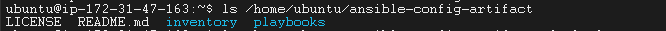
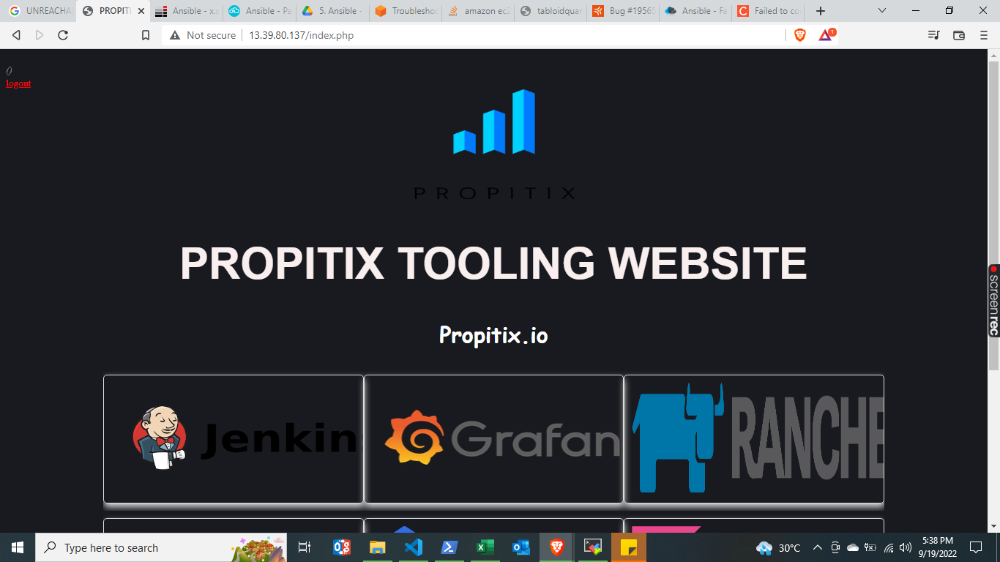

# ANSIBLE REFACTORING AND STATIC ASSIGNMENTS (IMPORTS AND ROLES)

In this project you will continue working with ansible-config repository and make some improvements of your code by refactoring your Ansible code, create assignments, and use the imports functionality. Imports allows effective re-use of previously created playbooks in a new playbook.

In this case, the overall state of the infrastructure remains the same.

# Jenkins Job Enhancement
Every new change in the codes creates a separate directory on Jenkins server, taking up space with each subsequent change. We can improve on this by introducing a new Jenkins project/job based on **Copy Artifact** plugin.

On your Jenkins-Ansible server, create a new directory called ansible-config-artifact – we will store there all artifacts after each build.

```sudo mkdir /home/ubuntu/ansible-config-artifact```

Change permissions to this directory, so Jenkins could save files there

```chmod -R 0777 /home/ubuntu/ansible-config-artifact```

Go to *Jenkins web console -> Manage Jenkins -> Manage Plugins*. On Available tab, search for **Copy Artifact** and install this plugin without restarting Jenkins.

Create a new Freestyle project and name it save_artifacts.


Configure this *save_artifacts* project to be triggered by completion of the existing *ansible* project by the following steps:


Note: You can configure number of builds to keep in order to save space on the server; in this case, we shall only the last 2 build results. 


The main idea of *save_artifacts* project is to save artifacts into */home/ubuntu/ansible-config-artifact* directory. To achieve this, go to *Build step > Copy artifacts from other project*, specify *ansible* as a source project and */home/ubuntu/ansible-config-artifact* as a target directory.


Test your set up by making some change in README.md file inside your *ansible-config* repository on GitHub website.

If both Jenkins jobs have completed one after another – you shall see your files inside */home/ubuntu/ansible-config-artifact* directory and it will be updated with every commit to your master branch.



Now your Jenkins pipeline is more neat and clean.

# Refactor Ansible code by importing other playbooks into site.yml

Before starting to refactor the codes, ensure that you have pulled down the latest code from master (main) branch, and created a new branch, name it *refactor*.

Let see code re-use in action by importing other playbooks.

Within *playbooks* folder, create a new file and name it *site.yml* – This file will now be considered as an entry point into the entire infrastructure configuration, i.e. parent to all other playbooks. Other playbooks will be included here as a reference. 

Create a new folder in root of the *ansible-config* repository and name it *static-assignments*. The static-assignments folder is where all other children playbooks will be stored. This is merely for easy organization of your work. It is not an Ansible specific concept, therefore you can choose how you want to organize your work. 

Move common.yml file into the newly created static-assignments folder.

Inside site.yml file, import common.yml playbook by inserting the following codes:

```
---
- hosts: all
- import_playbook: ../static-assignments/common.yml
```

The code above uses built-in import_playbook Ansible module.

Your folder structure should look like this;


Run ansible-playbook command against the dev environment.

Since you need to apply some tasks to your dev servers and wireshark is already installed – you can go ahead and create another playbook under static-assignments and name it *common-del.yml*. In this playbook, configure deletion of wireshark utility.

```
---
- name: update web, nfs and db servers
  hosts: webservers, nfs, db
  remote_user: ec2-user
  become: yes
  become_user: root
  tasks:
  - name: delete wireshark
    yum:
      name: wireshark
      state: removed

- name: update LB server
  hosts: lb
  remote_user: ubuntu
  become: yes
  become_user: root
  tasks:
  - name: delete wireshark
    apt:
      name: wireshark-qt
      state: absent
      autoremove: yes
      purge: yes
      autoclean: yes
```

update site.yml with 

```
- import_playbook: ../static-assignments/common-del.yml
```
instead of *common.yml* and run it against dev servers:

```cd /home/ubuntu/ansible-config```

```ansible-playbook -i inventory/dev.yml playbooks/site.yml```

Make sure that wireshark is deleted on all the servers by running wireshark --version

see results from NFS Server and Web1 Server below


Now you have a ready solution to install/delete packages on multiple servers with just one command.

# Configure UAT Webservers with a role ‘Webserver’

We have our nice and clean dev environment, so let us put it aside and configure 2 new Web Servers as UAT. We could write tasks to configure Web Servers in the same playbook, but it would be too messy, instead, we will use a dedicated role to make our configuration reusable.

Launch 2 fresh EC2 instances using RHEL 8 image, we will use them as our uat servers, so give them names accordingly – Web1-UAT and Web2-UAT.


To create a role, you must create a directory called **roles**, relative to the playbook file or in */etc/ansible/* directory.

Since you store all your codes in GitHub, it is recommended to create folders and files there rather than locally on Jenkins-Ansible server.

The entire folder structure should look like below if you created it manually on VSC.


Update your inventory *ansible-config/inventory/uat.yml* file with IP addresses of your 2 UAT Web servers

*NOTE: Ensure you are using ssh-agent to ssh into the Jenkins-Ansible instance just as you have done in project 11*.

```
[uat-webservers]
<Web1-UAT-Server-Private-IP-Address> ansible_ssh_user='ec2-user' 

<Web2-UAT-Server-Private-IP-Address> ansible_ssh_user='ec2-user' 
```


In */etc/ansible/ansible.cfg* file, uncomment roles_path string and provide a full path to your roles directory *roles_path    = /home/ubuntu/ansible-config-mgt/roles*, so Ansible could know where to find configured roles.


It is time to start adding some logic to the webserver role. Go into tasks directory, and within the main.yml file, start writing configuration tasks to do the following:

Install and configure Apache (httpd service)

Clone Tooling website from GitHub https://github.com/<your-name>/tooling.git.

Ensure the tooling website code is deployed to /var/www/html on each of 2 UAT Web servers.

Make sure httpd service is started

Your *main.yml* may consist of following tasks:

```
---
- name: install apache
  become: true
  ansible.builtin.yum:
    name: "httpd"
    state: present

- name: install git
  become: true
  ansible.builtin.yum:
    name: "git"
    state: present

- name: clone a repo
  become: true
  ansible.builtin.git:
    repo: https://github.com/<your-name>/tooling.git
    dest: /var/www/html
    force: yes

- name: copy html content to one level up
  become: true
  command: cp -r /var/www/html/html/ /var/www/

- name: Start service httpd, if not started
  become: true
  ansible.builtin.service:
    name: httpd
    state: started

- name: recursively remove /var/www/html/html/ directory
  become: true
  ansible.builtin.file:
    path: /var/www/html/html
    state: absent
```


# Reference ‘Webserver’ role

Within the *static-assignments* folder, create a new assignment for uat-webservers, *uat-webservers.yml*. This is where you will reference the role.

```
---
- hosts: uat-webservers
  roles:
     - webserver
```

Remember that the entry point to our ansible configuration is the *site.yml* file. Therefore, you need to refer your *uat-webservers.yml* role inside *site.yml*.

So, our *site.yml* file should look like this:

```
---
- hosts: all
- import_playbook: ../static-assignments/common.yml

- hosts: uat-webservers
- import_playbook: ../static-assignments/uat-webservers.yml
```

## Commit & Test

Commit your changes, create a Pull Request and merge them to master branch, make sure webhook triggered two consequent Jenkins jobs, they ran successfully and copied all the files to your Jenkins-Ansible server into /home/ubuntu/ansible-config-artifact/ directory.


Clone down your GitHub *ansible-config* repository. Run the following command from your jenkins-ansible server:

```git clone <GitHub repo url>```


Now run the playbook against your uat inventory and see what happens:

```ansible-playbook -i /home/ubuntu/ansible-config/inventory/uat.yml /home/ubuntu/ansible-config/playbooks/site.yml```


You should be able to see both of your UAT Web servers configured and you can try to reach them from your browser:

Web1-UAT: *http:// 13.39.80.137/index.php*



or

Web2-UAT: *http://15.188.63.183/index.php*


Your Ansible architecture now looks like this:


