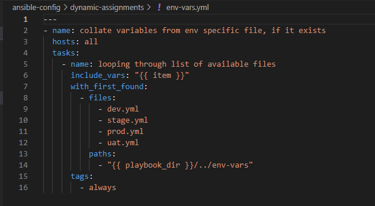
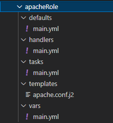
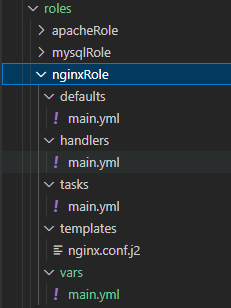
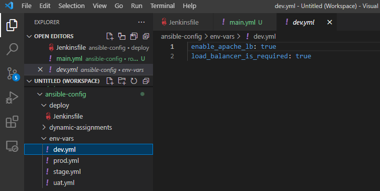
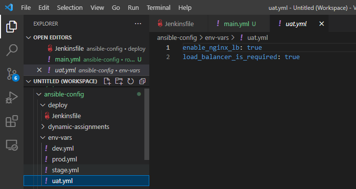

# ANSIBLE DYNAMIC ASSIGNMENTS (INCLUDE) AND COMMUNITY ROLES

## **Project Goals**

1. Introduce Dynamic Assignment (include) into our structure.

2. Get familiar with using community roles


## Dynamic Assignments (Include)
--------

1. In your https://github.com/<your-name>/ansible-config GitHub repository, start a new branch and call it *dynamic-assignments*. (you can do this from VSC, then sychronize with your repository)

2. Create a new folder, name it *dynamic-assignments*. Then inside this folder, create a new file and name it *env-vars.yml*. 

3. Next, create a folder to keep each environment’s variables file named *env-vars*. For each environment, create new YAML files which we will use to set variables.

Your layout should now look like this.


4. Now paste the instruction below into the *env-vars.yml* file.
```
---
- name: collate variables from env specific file, if it exists
  hosts: all
  tasks:
    - name: looping through list of available files
      include_vars: "{{ item }}"
      with_first_found:
        - files:
            - dev.yml
            - stage.yml
            - prod.yml
            - uat.yml
          paths:
            - "{{ playbook_dir }}/../env-vars"
      tags:
        - always
```



Notice 3 things here:

A. We used **include_vars** syntax instead of *include*, this is because Ansible developers decided to separate different features of the module. From Ansible version 2.8, the include module is deprecated and variants of include_* must be used. These are:

include_role

include_tasks

include_vars

In the same version, variants of import were also introduces, such as:

import_role

import_tasks

B. We made use of special variables: 
**{ playbook_dir }** - which helps Ansible to determine the location of the running playbook and from there, navigate to other path on the filesystem. **{ inventory_file }** which dynamically resolve to the name of the inventory file being used, then append *.yml* so that it picks up the required file within the env-vars folder.

C. The **with_first_found** implies that, looping through the list of files, the first one found is used. This is good so that we can always set default values in case an environment specific *env* file does not exist.

## Update site.yml with dynamic assignments
----

Update *site.yml* file to make use of the dynamic assignment. 

```
---
- hosts: all
- name: Include dynamic variables 
  tasks:
  import_playbook: ../static-assignments/common.yml 
  include: ../dynamic-assignments/env-vars.yml
  tags:
    - always

- hosts: webservers
- name: Webserver assignment
  import_playbook: ../static-assignments/webservers.yml
```

## Community Roles
---
We will now create a role that will install MySQL package, create a database and configure users. 

There are tons of roles that have already been developed by other open source engineers out there and we should not need re-invent the wheel. These roles are actually production ready, and dynamic to accomodate most of Linux flavours. With **Ansible Galaxy**, we can simply download a ready to use ansible role from https://galaxy.ansible.com/ and move on.

## Install MySQL from Community Ansible Role
---
Using the search feature on https://galaxy.ansible.com/, you can find available community roles. We will be using a MySQL role developed by Buluma.


open mysql role by buluma (highlighted above), and copy the ansible-galaxy installation code from the developers page as shown below:


Run the copied ansible-galaxy command from inside the *ansible-config* directory on the jenkins-ansible server to create your new MySQL role, saved as *buluma.mysql*


Go to roles directory and rename the directory to mysqlRole

```
cd roles
mv ~/.ansible/roles/buluma.mysql/ ~/ansible-config/roles/mysqlRole
```


Read README.md file, and edit roles configuration to use correct credentials for MySQL required for the tooling website.

### Keeping GitHub repository updated

In order to keep track of our work, we choose to use GitHub. Git is a handy tool to keep your GitHub repository updated with changes made in your jenkins-ansible server. We will configure the jenkins-ansible server to synchronize with your GitHub repo to keep it updated.

Ensure that git is installed on your jenkins-ansible server by running the command:

`git --version`

install **git** if it is not presently installed with the command below:

```
sudo apt update
sudo apt install git
```

Next, we will activate the *ansible-config* directory to connect with GitHub repo and create a new branch in the repo named *roles-feature*. By this configuration, changes in the *ansible-config* directory wil be synchronized to the *roles-feature* branch on GitHub repo.

Go to the *ansible-config* directory

`cd ansible-config`

run the following commands from inside the directory.

```
git init
git pull https://github.com/<your-name>/ansible-config.git
git remote add origin https://github.com/<your-name>/ansible-config.git
git branch roles-feature
git switch roles-feature
```

On VSC, create a new file in static-assignments directory named *db_servers.yml* and paste the following updates. Remember to edit roles configuration to use correct credentials for MySQL required for the tooling website.

```
---
- name: Converge
  hosts: all
  become: yes
  gather_facts: yes

  roles:
    - role: ansible-role-mysql
      mysql_databases:
        - name: my_db
          encoding: utf8
          collation: utf8_bin
      mysql_users:
        - name: my_user
          password: my_pass
          priv: "my_db.*:ALL"
          update_password: on_create
```


The default values for the variables are set in *defaults/main.yml*:

```
---
# defaults file for mysql

# The address mysql should bind to.
mysql_bind_address: "127.0.0.1"

# The password to set for the root user. Also stored in my.cnf
mysql_root_password: "s3Cur31t4."

# The buffer pool size.
mysql_innodb_buffer_pool_size: 1G

# The io capacity.
mysql_innodb_io_capacity: 4000
```


### Uploading changes into your GitHub

From your *ansible-config* directory, run the following commands:

```
git add .
git commit -m "Commit new role files into GitHub"
git push --set-upstream origin roles-feature
```

Now, if you are satisfied with your codes, you can create a Pull Request and merge it to main branch on GitHub. You can follow this [link](https://bit.ly/3SOwgFt) for step by step guide

# LoadBalancer Roles

We want to be able to choose which Load Balancer to use i.e Nginx or Apache, so we need to have two roles installed. This time, we chose to just develop the roles.

## Installing Nginx Role

Our file structures for nginx (nginxRole) will look like this:



Nginx Role: The following files will be created under nginx role

*tasks/main.yml*
```
---
- name: Update hosts
  lineinfile:
    path: /etc/hosts
    state: present
    line: "{{ item }}"
  with_items:
  - '{{ web1 }} web1'
  - '{{ web2 }} web2'

- name: Install nginx webserver
  apt: name=nginx state=latest update_cache=true
  notify: restart nginx

- name: configure nginx for loadbalancing
    template:
      src: ../templates/nginx.conf.j2
      dest: "/etc/nginx/nginx.conf"
    notify: reload nginx
```

*handlers/main.yml*
```
---
  handlers:
  - name: restart nginx
    service: name=nginx state=restarted

  - name: reload nginx
    service: name=nginx state=reloaded
```

*templates/nginx.conf.j2*
```
user www-data;
worker_processes auto;
pid /run/nginx.pid;
include /etc/nginx/modules-enabled/*.conf;

events {
        worker_connections 768;
        # multi_accept on;
}

http {
upstream myproject {
    server web1 weight=5;
    server web2 weight=5;
  }

server {
    listen 80;
    server_name www.{{ your_domain }}.com;
    location / {
      proxy_pass http://myproject;
    }
  }
        ##
        # Basic Settings
        ##

        sendfile on;
        tcp_nopush on;
        tcp_nodelay on;
        keepalive_timeout 65;
        types_hash_max_size 2048;
        # server_tokens off;

        # server_names_hash_bucket_size 64;
        # server_name_in_redirect off;

        include /etc/nginx/mime.types;
        default_type application/octet-stream;

        ##
        # SSL Settings
        ##

        ssl_protocols TLSv1 TLSv1.1 TLSv1.2 TLSv1.3; # Dropping SSLv3, ref: POODLE
        ssl_prefer_server_ciphers on;

        ##
        # Logging Settings
        ##

        access_log /var/log/nginx/access.log;
        error_log /var/log/nginx/error.log;

        ##
        # Gzip Settings
        ##

        gzip on;

        # gzip_vary on;
        # gzip_proxied any;
        # gzip_comp_level 6;
        # gzip_buffers 16 8k;
        # gzip_http_version 1.1;
        # gzip_types text/plain text/css application/json application/javascript text/xml application/xml application/xml+rss text/javascript;

        ##
        # Virtual Host Configs
        ##

        include /etc/nginx/conf.d/*.conf;
        #include /etc/nginx/sites-enabled/*;
}

#mail {
#       # See sample authentication script at:
#       # http://wiki.nginx.org/ImapAuthenticateWithApachePhpScript
#
#       # auth_http localhost/auth.php;
#       # pop3_capabilities "TOP" "USER";
#       # imap_capabilities "IMAP4rev1" "UIDPLUS";
#
#       server {
#               listen     localhost:110;
#               protocol   pop3;
#               proxy      on;
#       }
#
#       server {
#               listen     localhost:143;
#               protocol   imap;
#               proxy      on;
#       }
#}
```

*vars/main.yml*
```
---
app_user: "ubuntu"
http_host: "your_domain"
http_conf: "your_domain.conf"
http_port: "80"
disable_default: true

web1: "<webserver1 private IP>"
web2: "<webserver2 private IP>"
```

*defaults/main.yml*
```
---
enable_nginx_lb: false
load_balancer_is_required: false

#IP mapping for servers
 web1: <webserver1 private IP>
 web2: <webserver2 private IP>
```

## Installing Apache Role

Our file structure under apache (apacheRole) will look like this:



*tasks/main.yml*
```
---
- name: Install prerequisites
  apt: name={{ item }} update_cache=yes state=latest force_apt_get=yes
  loop: [ 'aptitude' ]

- name: Install Apache
  apt: name=apache2 update_cache=yes state=latest

- name: Install apache dependencies
  apt: name=libxml2-dev state=present
  notify: Reload Apache

- name: enable apache dependencies
  apache2_module: name={{ item }} state=present
  with_items:
    - rewrite
    - proxy
    - proxy_balancer
    - proxy_http
    - headers
    - lbmethod_bytraffic
  notify: Reload Apache
  
- name: Create document root
  file:
    path: "/var/www/{{ http_host }}"
    state: directory
    owner: "{{ app_user }}"
    mode: '0755'

- name: Copy index test page
  template:
    src: roles/apacheRole/templates/index.html.j2
    dest: "/var/www/{{ http_host }}/index.html"

- name: Set up Apache virtuahHost
  template:
    src: roles/apacheRole/templates/apache.conf.j2
    dest: "/etc/apache2/sites-available/000-default.conf"
  notify: Reload Apache

- name: "UFW - Allow HTTP on port {{ http_port }}"
  ufw:
    rule: allow
    port: "{{ http_port }}"
    proto: tcp
```

*handlers/main.yml*
```
---
- name: Reload Apache
  service:
    name: apache2
    state: reloaded

- name: Restart Apache
  service:
    name: apache2
    state: restarted
```

*templates/apache.conf.j2*
```
<VirtualHost *:{{ http_port }}>
   ServerAdmin webmaster@localhost
   ServerName {{ http_host }}
   ServerAlias www.{{ http_host }}
   DocumentRoot /var/www/{{ http_host }}
   ErrorLog ${APACHE_LOG_DIR}/error.log
   CustomLog ${APACHE_LOG_DIR}/access.log combined

<Proxy "balancer://mycluster">
               BalancerMember http://{{ web1 }}:80 loadfactor=5 timeout=1
               BalancerMember http://{{ web2 }}:80 loadfactor=5 timeout=1
               ProxySet lbmethod=bytraffic
               # ProxySet lbmethod=byrequests
        </Proxy>

        ProxyPreserveHost On
        ProxyPass / balancer://mycluster/
        ProxyPassReverse / balancer://mycluster/

</VirtualHost>
```

*vars/main.yml*
```
---
app_user: "ubuntu"
http_host: "your_domain"
http_conf: "your_domain.conf"
http_port: "80"
disable_default: true

web1: "<webserver1 private IP>"
web2: "<webserver2 private IP>"
```

*defaults/main.yml*
```
---
enable_nginx_lb: false
load_balancer_is_required: false

#IP mapping for servers
 web1: <webserver1 private IP>
 web2: <webserver2 private IP>
```

## Configuring Load Balancer

Since you cannot use both Nginx and Apache load balancer at the same time, you need to add a condition to enable either one using variables in *defaults/main.yml* file inside the Nginx and Apache roles, all set to *false* as shown above.

Update both assignments and site.yml files respectively

*loadbalancers.yml file*
```
- hosts: lb
  roles:
    - { role: nginx, when: enable_nginx_lb and load_balancer_is_required }
    - { role: apache, when: enable_apache_lb and load_balancer_is_required }
```

*site.yml file*
```
- name: Loadbalancers assignment
  hosts: lb
    - import_playbook: ../static-assignments/loadbalancers.yml
  when: load_balancer_is_required 
```

Now you can make use of *env-vars\uat.yml* file to define which loadbalancer to use in UAT environment by setting respective environmental variable to true. You can switch between the two LBs by setting respective environmental variable to true and other to false.

when apache is enabled:


when nginx is enabled:


To test this, you can update inventory for each environment and run Ansible against each environment.