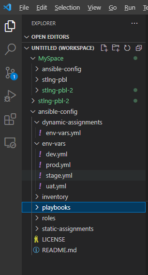

# ANSIBLE DYNAMIC ASSIGNMENTS (INCLUDE) AND COMMUNITY ROLES

# Dynamic Assignments (Include)

Introducing Dynamic Assignment Into Our structure.
1. In your https://github.com/<your-name>/ansible-config GitHub repository, start a new branch and call it *dynamic-assignments*. (you can do this from VSC, then sychronize with your repository)

2. Create a new folder, name it *dynamic-assignments*. Then inside this folder, create a new file and name it *env-vars.yml*. 

3. Next, create a folder to keep each environment’s variables file named *env-vars*. For each environment, create new YAML files which we will use to set variables.

Your layout should now look like this.



4. Now paste the instruction below into the *env-vars.yml* file.
```
---
- name: collate variables from env specific file, if it exists
  hosts: all
  tasks:
    - name: looping through list of available files
      include_vars: "{{ item }}"
      with_first_found:
        - files:
            - dev.yml
            - stage.yml
            - prod.yml
            - uat.yml
          paths:
            - "{{ playbook_dir }}/../env-vars"
      tags:
        - always
```

Notice 3 things to notice here:

A. We used **include_vars** syntax instead of *include*, this is because Ansible developers decided to separate different features of the module. From Ansible version 2.8, the include module is deprecated and variants of include_* must be used. These are:

include_role

include_tasks

include_vars

In the same version, variants of import were also introduces, such as:

import_role

import_tasks

B. We made use of a special variables: 
**{ playbook_dir }** - which helps Ansible to determine the location of the running playbook, and from there navigate to other path on the filesystem. and the **{ inventory_file }** which dynamically resolve to the name of the inventory file being used, then append *.yml* so that it picks up the required file within the env-vars folder.

C. The **with_first_found** implies that, looping through the list of files, the first one found is used. This is good so that we can always set default values in case an environment specific *env* file does not exist.

## Update site.yml with dynamic assignments

Update *site.yml* file to make use of the dynamic assignment. 

```
---
- hosts: all
- name: Include dynamic variables 
  tasks:
  import_playbook: ../static-assignments/common.yml 
  include: ../dynamic-assignments/env-vars.yml
  tags:
    - always

-  hosts: webservers
- name: Webserver assignment
  import_playbook: ../static-assignments/webservers.yml
```

## Download and Install MySQL Ansible Role

Using the search feature on https://galaxy.ansible.com/, you can find available community roles. We will be using a MySQL role developed by Buluma.


open mysql role by buluma (highlighted above), and copy the ansible-galaxy installation code from the developers page as shown below:


Run the copied ansible-galaxy command from inside the *ansible-config* directory on the jenkins-ansible server to create your new MySQL role, saved as *buluma.mysql*


Go to roles directory and rename the directory to mysqlRole

```
cd roles
mv ~/.ansible/roles/buluma.mysql/ ~/ansible-config/roles/mysqlRole
```


Read README.md file, and edit roles configuration to use correct credentials for MySQL required for the tooling website.

### Keeping GitHub repository updated

In order to keep track of our work, we choose to use GitHub. Git is a handy tool to keep your GitHub repository updated with changes made in your jenkins-ansible server. We will configure the jenkins-ansible server to synchronize with your GitHub repo to keep it updated.

Ensure that git is installed on your jenkins-ansible server by running the command:

```git --version```

install git if it is not presently installed with the command below:

```
sudo apt update
sudo apt install git
```

Next, we will activate the *ansible-config* directory to connect with GitHub repo and create a new branch in the repo named *roles-feature*. By this configuration, changes in the *ansible-config* directory wil be synchronized to the *roles-feature* branch on GitHub repo.

Go to the *ansible-config* directory

```cd ansible-config```

run the following commands from inside the directory.

```
git init
git pull https://github.com/<your-name>/ansible-config.git
git remote add origin https://github.com/<your-name>/ansible-config.git
git branch roles-feature
git switch roles-feature
```

## Community Roles

We will now create a role that will install MySQL package, create a database and configure users. 

There are tons of roles that have already been developed by other open source engineers out there and we should not need re-invent the wheel. These roles are actually production ready, and dynamic to accomodate most of Linux flavours. With **Ansible Galaxy**, we can simply download a ready to use ansible role from https://galaxy.ansible.com/ and move on.


### Upload the changes into your GitHub

From your *ansible-config* directory, run the following commands:

```
git add .
git commit -m "Commit new role files into GitHub"
git push --set-upstream origin roles-feature
```

Now, if you are satisfied with your codes, you can create a Pull Request and merge it to main branch on GitHub. You can follow this link for step by step guide https://bit.ly/3SOwgFt

On VSC, create a new file in static-assignments directory named *db_servers.yml* and paste the following updates. Remember to edit roles configuration to use correct credentials for MySQL required for the tooling website.

```
---
- name: Converge
  hosts: all
  become: yes
  gather_facts: yes

  roles:
    - role: ansible-role-mysql
      mysql_databases:
        - name: my_db
          encoding: utf8
          collation: utf8_bin
      mysql_users:
        - name: my_user
          password: my_pass
          priv: "my_db.*:ALL"
          update_password: on_create
```


The default values for the variables are set in *defaults/main.yml*:

```
---
# defaults file for mysql

# The address mysql should bind to.
mysql_bind_address: "127.0.0.1"

# The password to set for the root user. Also stored in my.cnf
mysql_root_password: "s3Cur31t4."

# The buffer pool size.
mysql_innodb_buffer_pool_size: 1G

# The io capacity.
mysql_innodb_io_capacity: 4000
```


# Load Balancer roles

We want to be able to choose which Load Balancer to use i.e Nginx or Apache, so we need to have two roles installed.

Installing Nginx Role
Nginx

Installing Apache Role
Apache


We will install the following from communities and afterwards update both static-assignments directory and site.yml files to refer the roles.


........


Configuring Load Balancer


Since you cannot use both Nginx and Apache load balancer at the same time, you need to add a condition to enable either one – this is where you can make use of variables.

Declare a variable in defaults/main.yml file inside the Nginx and Apache roles. Name each variables enable_nginx_lb and enable_apache_lb respectively.

Set both values to false like this enable_nginx_lb: false and enable_apache_lb: false.

Declare another variable in both roles load_balancer_is_required and set its value to false as well

Update both assignment and site.yml files respectively

loadbalancers.yml file

- hosts: lb
  roles:
    - { role: nginx, when: enable_nginx_lb and load_balancer_is_required }
    - { role: apache, when: enable_apache_lb and load_balancer_is_required }
site.yml file

     - name: Loadbalancers assignment
       hosts: lb
         - import_playbook: ../static-assignments/loadbalancers.yml
        when: load_balancer_is_required 
Now you can make use of env-vars\uat.yml file to define which loadbalancer to use in UAT environment by setting respective environmental variable to true.

You will activate load balancer, and enable nginx by setting these in the respective environment’s env-vars file.

enable_nginx_lb: true
load_balancer_is_required: true
The same must work with apache LB, so you can switch it by setting respective environmental variable to true and other to false.

To test this, you can update inventory for each environment and run Ansible against each environment.