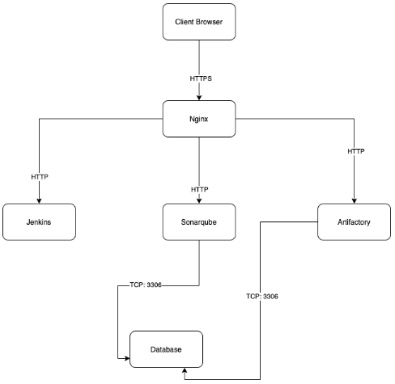

# Continuous Integration with Jenkins, Ansible, Artifactory, Sonarqube, PHP

## **Project Goals**
1. simulate continuous integration and delivery, targeting end to end CI/CD pipeline for a PHP Based Application.


What we want to achieve, is having Nginx to serve as a reverse proxy for our sites and tools. Each environment setup is represented in the below table and diagrams.


CI-Environment



## Ansible Inventory
---
Ansible Inventory should look like this:


**ci** inventory file

```
[jenkins]
<Jenkins-Private-IP-Address>

[nginx]
<Nginx-Private-IP-Address>

[sonarqube]
<SonarQube-Private-IP-Address>

[artifact_repository]
<Artifact_repository-Private-IP-Address>
```


**dev** Inventory file

```
[tooling]
<Tooling-Web-Server-Private-IP-Address>

[todo]
<Todo-Web-Server-Private-IP-Address>

[nginx]
<Nginx-Private-IP-Address>

[db:vars]
ansible_user=ec2-user
ansible_python_interpreter=/usr/bin/python

[db]
<DB-Server-Private-IP-Address>
```


**pentest** inventory file
```
[pentest:children]
pentest-todo
pentest-tooling

[pentest-todo]
<Pentest-for-Todo-Private-IP-Address>

[pentest-tooling]
<Pentest-for-Tooling-Private-IP-Address>

```


## Ansible roles for ci environment:

## Configuring Ansible For Jenkins Deployment
---
1. Install & Open Blue Ocean Jenkins Plugin


2. Create a new pipeline


3. Connect Jenkins with GitHub


click [here](https://www.geeksforgeeks.org/how-to-generate-personal-access-token-in-github/) for step by step guide to generate *access token*.

4. Create new pipeline by choosing github username and repository.


5. click Administration to return to Jenkins


6. Inside the Ansible project (i.e ansible-config directory) Create a new directory *deploy* and a new file *Jenkinsfile* inside the directory. The file structure should look like this..


7. Add the code snippet below to start building the Jenkinsfile gradually. This pipeline currently has just one stage called Build and the only thing we are doing is using the shell script module to echo Building Stage


(*Note: remember to push all updates/changes from vsc to your github repo, using - stage, commit, push*)

8. Go back into the Ansible pipeline in Jenkins, and select 'configure'


This configuration will automatically trigger a build and you will be able to see the effect of our basic *Jenkinsfile* configuration by going through the console output of the build.


9. Next, we create a new git branch and name it *jenkinspipeline-stage*. Currently we only have the Build stage. Let us add another stage called Test and push the new changes to GitHub.


To make your new branch show up in Jenkins, we need to tell Jenkins to scan the repository. Click 'Scan Repository Now', then refresh the page. Both branches will start building automatically. 


You can go into Blue Ocean and see both branches there too.


10. Create a pull request to merge the latest code into the main branch.


After merging the pull request, go back into your terminal and switch into the main branch and pull the latest change.

11. Create a new branch, *jenkinspipeline-package*. 
Add more stages into the Jenkins file to simulate below phases:
   a. Package 


   b. Deploy 


   c. Clean up


12. Verify in Blue Ocean that all the stages are working, then merge your feature branch to the main branch


13. Eventually, your main branch should have a successful pipeline like this in blue ocean


# Running Ansible Playbook From Jenkins

## Install Ansible on Jenkins server

1. Run the following commands to install ansible on ubuntu server.

`sudo apt update`

`sudo apt install ansible`

2. Confirm if ansible is installed on the server by checking for the ansible version

`sudo ansible --version`


## Installing Ansible plugin in Jenkins UI

1. From jenkins dashboard, launch **manage jenkins>manage plugins**


search for ansible and install without restarting


2. Go back to **manage plugins** and update **global tools configurations** in the following steps..


scroll down to **Ansible** section, and make updates as shown below. 


The **Name** can be any name, but to get the **Path to ansible executables directory**, run the command below:

`which ansible`


copy the path highlighted and paste in your ansible configuration as shown above.

## Parameterizing Jenkinsfile For Ansible Deployment
---

To deploy to other environments, we will need to use parameters.

Update **sit** inventory with new servers
```
[tooling]
<SIT-Tooling-Web-Server-Private-IP-Address>

[todo]
<SIT-Todo-Web-Server-Private-IP-Address>

[nginx]
<SIT-Nginx-Private-IP-Address>

[db:vars]
ansible_user=ec2-user
ansible_python_interpreter=/usr/bin/python

[db]
<SIT-DB-Server-Private-IP-Address>
```

Update Jenkinsfile to introduce parameterization. Below is just one parameter. It has a default value in case if no value is specified at execution. It also has a description so that everyone is aware of its purpose.

```
pipeline {
    agent any

    parameters {
      string(name: 'inventory', defaultValue: 'dev',  description: 'This is the inventory file for the environment to deploy configuration')
    }
```

...
In the Ansible execution section, remove the hardcoded inventory/dev and replace with `${inventory}
From now on, each time you hit on execute, it will expect an input.