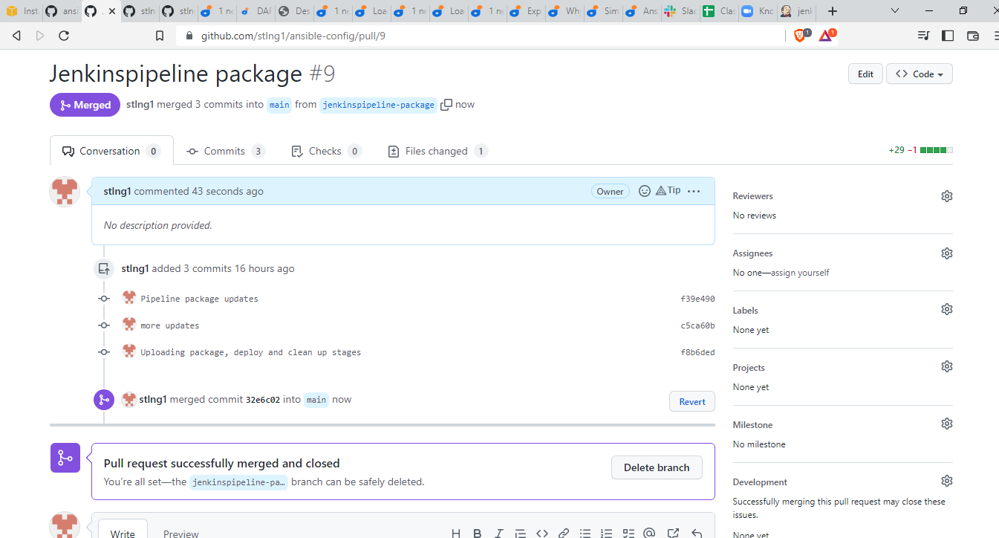
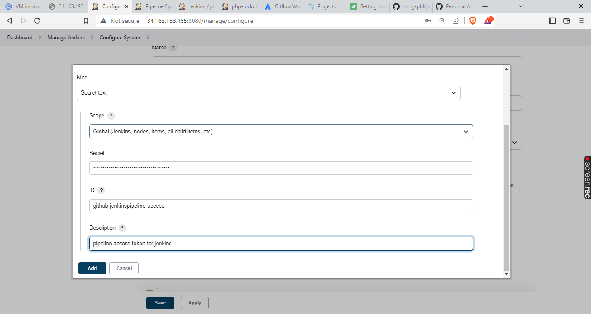

# Continuous Integration with Jenkins, Ansible, Artifactory, Sonarqube, PHP

## **Project Goals**
1. simulate continuous integration and delivery, targeting end to end CI/CD pipeline for a PHP Based Application.


What we want to achieve, is having Nginx to serve as a reverse proxy for our sites and tools. Each environment setup is represented in the below table and diagrams.


CI-Environment


## Ansible Inventory
---
Ansible Inventory should look like this:


**ci** inventory file

```
[jenkins]
<Jenkins-Private-IP-Address>

[nginx]
<Nginx-Private-IP-Address>

[sonarqube]
<SonarQube-Private-IP-Address>

[artifact_repository]
<Artifact_repository-Private-IP-Address>
```


**dev** Inventory file

```
[tooling]
<Tooling-Web-Server-Private-IP-Address>

[todo]
<Todo-Web-Server-Private-IP-Address>

[nginx]
<Nginx-Private-IP-Address>

[db:vars]
ansible_user=ec2-user
ansible_python_interpreter=/usr/bin/python

[db]
<DB-Server-Private-IP-Address>
```


**pentest** inventory file
```
[pentest:children]
pentest-todo
pentest-tooling

[pentest-todo]
<Pentest-for-Todo-Private-IP-Address>

[pentest-tooling]
<Pentest-for-Tooling-Private-IP-Address>

```


## Ansible roles for ci environment:

## Configuring Ansible For Jenkins Deployment
---
1. Install & Open Blue Ocean Jenkins Plugin


2. Create a new pipeline


3. Connect Jenkins with GitHub


click [here](https://www.geeksforgeeks.org/how-to-generate-personal-access-token-in-github/) for step by step guide to generate *access token*.

4. Create new pipeline by choosing github username and repository.


5. click Administration to return to Jenkins


6. Inside the Ansible project (i.e ansible-config directory) Create a new directory *deploy* and a new file *Jenkinsfile* inside the directory. The file structure should look like this..


7. Add the code snippet below to start building the Jenkinsfile gradually. This pipeline currently has just one stage called Build and the only thing we are doing is using the shell script module to echo Building Stage


(*Note: remember to push all updates/changes from vsc to your github repo, using - stage, commit, push*)

8. Go back into the Ansible pipeline in Jenkins, and select 'configure'


This configuration will automatically trigger a build and you will be able to see the effect of our basic *Jenkinsfile* configuration by going through the console output of the build.


9. Next, we create a new git branch and name it *jenkinspipeline-stage*. Currently we only have the Build stage. Let us add another stage called Test and push the new changes to GitHub.


To make your new branch show up in Jenkins, we need to tell Jenkins to scan the repository. Click 'Scan Repository Now', then refresh the page. Both branches will start building automatically. 


You can go into Blue Ocean and see both branches there too.


10. Create a pull request to merge the latest code into the main branch.


After merging the pull request, go back into your terminal and switch into the main branch and pull the latest change.

11. Create a new branch, *jenkinspipeline-package*. 
Add more stages into the Jenkins file to simulate below phases:
   a. Package 


   b. Deploy 


   c. Clean up


12. Verify in Blue Ocean that all the stages are working, then merge your feature branch to the main branch



13. Eventually, your main branch should have a successful pipeline like this in blue ocean


# Running Ansible Playbook From Jenkins

## Install Ansible on Jenkins server

1. Run the following commands to install ansible on ubuntu server.

`sudo apt update`

`sudo apt install ansible`

2. Confirm if ansible is installed on the server by checking for the ansible version

`sudo ansible --version`


## Installing Ansible plugin in Jenkins UI

1. From jenkins dashboard, launch **manage jenkins>manage plugins**


search for ansible and install without restarting


2. Go back to **manage plugins** and update **global tools configurations** in the following steps..


scroll down to **Ansible** section, and make updates as shown below. 


The **Name** can be any name, but to get the **Path to ansible executables directory**, run the command below:

`which ansible`


copy the path highlighted and paste in your ansible configuration as shown above.

## Creating Jenkinsfile from scratch to run Project-13 on Jenkins.

1. create new branch - **jenkinsfile-p13**

2. with the aid of *pipeline syntax*, new Jenkinsfile is created from scratch. 


commit the changes to update your github repo.
Go to Jenkins *ansible-config* job, click *scan repository now*


job was succesful!


create pull request and merge *jenkinsfile-p13* branch with *main*, then click *scan repository now* again.


run the job again for the main branch


## Parameterizing Jenkinsfile For Ansible Deployment

From this point, I'll be working from Google Cloud. 

Spin new VM instances RHEL instances for **tooling, todo, artifactory and db servers**. Also spin ubuntu instances for **nginx and jenkins**

Note: artifactory server hardware specifications are above the basic provided on most cloud services. size your server appropriately to prevent it from hanging or freezing during installation.


---

To deploy to other environments, we will need to use parameters.

1. create a new branch - *jenkinsfile-parameterize*

2. Update **sit** inventory with new servers
```
[tooling]
<SIT-Tooling-Web-Server-Private-IP-Address>

[todo]
<SIT-Todo-Web-Server-Private-IP-Address>

[nginx]
<SIT-Nginx-Private-IP-Address>

[db:vars]
ansible_user=ec2-user
ansible_python_interpreter=/usr/bin/python

[db]
<SIT-DB-Server-Private-IP-Address>
```


3. Update **Jenkinsfile** to introduce parameterization. Below is just one parameter. It has a default value in case if no value is specified at execution. It also has a description so that everyone is aware of its purpose.

```
pipeline {
    agent any

    parameters {
      string(name: 'inventory', defaultValue: 'dev',  description: 'This is the inventory file for the environment to deploy configuration')
    }
```
4. In the *Execute Ansible Playbook* stage, remove the hardcoded inventory/dev and replace with ${inventory}. 


From now on, each time you hit on execute, it will expect an input.


Pull request & merge to main branch


Notice that the default value loads up, but we can now specify which environment we want to deploy the configuration to. Simply type **sit** and hit Run


# CI/CD PIPELINE FOR TODO APPLICATION

## Step 1 – Prepare Artifactory Server

1. download ansible role for Artifactory to install on newly spun artifactory server. 

2. Next, Set JAVA_HOME environment variable with the following command:

```
echo "export JAVA_HOME=/usr/lib/jvm/java-1.8.0-openjdk-1.8.0.191.b12-1.el7_6.x86_64" >> /etc/profile
. /etc/profile
env | grep JAVA
JAVA_HOME=/usr/lib/jvm/java-1.8.0-openjdk-1.8.0.191.b12-1.el7_6.x86_64`
```

3. Next, add the JFrog Artifactory repository with the following command:

`echo "deb https://jfrog.bintray.com/artifactory-debs bionic main" | tee /etc/apt/sources.list.d/jfrog.list`

4. Once the repository is added, update the repository and install JFrog Artifactory with the following command:

`apt-get update -y`

`apt-get install jfrog-artifactory-oss -y`

5. Next, start the Artifactory service and enable it to start at system reboot with the following command:

`systemctl start artifactory`

`systemctl enable artifactory`

6. Next, verify the status of Artifactory service using the following command:

`systemctl status artifactory`

## Step 2: Prepare Jenkins Server

1. Fork the repository below into your GitHub account
`https://github.com/darey-devops/php-todo.git`

2. On your Jenkins server, install PHP, its dependencies and Composer tool 

```
sudo apt update
sudo apt install php-cli unzip
cd ~
curl -sS https://getcomposer.org/installer -o /tmp/composer-setup.php

HASH=`curl -sS https://composer.github.io/installer.sig`

php -r "if (hash_file('SHA384', '/tmp/composer-setup.php') === '$HASH') { echo 'Installer verified'; } else { echo 'Installer corrupt'; unlink('composer-setup.php'); } echo PHP_EOL;"

# Note: If the output says **Installer corrupt** you’ll need to repeat the process again. When your output says **Installer verified**, you can continue.

# To install composer globally, 

sudo php /tmp/composer-setup.php --install-dir=/usr/local/bin --filename=composer

# To test your installation, run:

composer
```

3. Install Jenkins plugins

    - Plot plugin
    
    - Artifactory plugin


4. In Jenkins UI configure Artifactory
Configure the server ID, URL and Credentials, run Test Connection.


**Plot plugin** will display tests reports, and code coverage information.
**Artifactory plugin** will be used to easily upload code artifacts into an Artifactory server.


## Step 3: – Integrate Artifactory repository with Jenkins

1. create a new branch - *jenkinsfilepipeline-todo*

2. Create a dummy Jenkinsfile in the repository

3. Using Blue Ocean, create a multibranch Jenkins pipeline, **php-todo**


4. On the database server, create database and user

```
Create database homestead;
CREATE USER 'homestead'@'%' IDENTIFIED BY 'sePret^i';
GRANT ALL PRIVILEGES ON * . * TO 'homestead'@'%';
```


5. Update the database connectivity requirements in the file .env.sample


6. Update Jenkinsfile with proper pipeline configuration

```
pipeline {
    agent any

  stages {

     stage("Initial cleanup") {
          steps {
            dir("${WORKSPACE}") {
              deleteDir()
            }
          }
        }

    stage('Checkout SCM') {
      steps {
            git branch: 'main', url: 'https://github.com/darey-devops/php-todo.git'
      }
    }

    stage('Prepare Dependencies') {
      steps {
             sh 'mv .env.sample .env'
             sh 'composer install'
             sh 'php artisan migrate'
             sh 'php artisan db:seed'
             sh 'php artisan key:generate'
      }
    }
  }
}
```
Note: remember to update 'git branch' with your repo url.

7. Update the Jenkinsfile to include Unit tests step

```
    stage('Execute Unit Tests') {
      steps {
             sh './vendor/bin/phpunit'
      } 
```

8. run pipeline


## Step 4: Code Quality Analysis

The data produced by **phploc** can be ploted onto graphs in Jenkins.

1. Add the code analysis step in **Jenkinsfile**. The data output will be saved in **build/logs/phploc.csv** file.
```
stage('Code Analysis') {
  steps {
        sh 'phploc app/ --log-csv build/logs/phploc.csv'

  }
}
```
2. Plot the data using plot Jenkins plugin. Add the stage below to your Jenkinsfile. At the completion of each build, the plots’ data series latest values are pulled from the CSV file generated by phploc.
```
    stage('Plot Code Coverage Report') {
      steps {

            plot csvFileName: 'plot-396c4a6b-b573-41e5-85d8-73613b2ffffb.csv', csvSeries: [[displayTableFlag: false, exclusionValues: 'Lines of Code (LOC),Comment Lines of Code (CLOC),Non-Comment Lines of Code (NCLOC),Logical Lines of Code (LLOC)                          ', file: 'build/logs/phploc.csv', inclusionFlag: 'INCLUDE_BY_STRING', url: '']], group: 'phploc', numBuilds: '100', style: 'line', title: 'A - Lines of code', yaxis: 'Lines of Code'
            plot csvFileName: 'plot-396c4a6b-b573-41e5-85d8-73613b2ffffb.csv', csvSeries: [[displayTableFlag: false, exclusionValues: 'Directories,Files,Namespaces', file: 'build/logs/phploc.csv', inclusionFlag: 'INCLUDE_BY_STRING', url: '']], group: 'phploc', numBuilds: '100', style: 'line', title: 'B - Structures Containers', yaxis: 'Count'
            plot csvFileName: 'plot-396c4a6b-b573-41e5-85d8-73613b2ffffb.csv', csvSeries: [[displayTableFlag: false, exclusionValues: 'Average Class Length (LLOC),Average Method Length (LLOC),Average Function Length (LLOC)', file: 'build/logs/phploc.csv', inclusionFlag: 'INCLUDE_BY_STRING', url: '']], group: 'phploc', numBuilds: '100', style: 'line', title: 'C - Average Length', yaxis: 'Average Lines of Code'
            plot csvFileName: 'plot-396c4a6b-b573-41e5-85d8-73613b2ffffb.csv', csvSeries: [[displayTableFlag: false, exclusionValues: 'Cyclomatic Complexity / Lines of Code,Cyclomatic Complexity / Number of Methods ', file: 'build/logs/phploc.csv', inclusionFlag: 'INCLUDE_BY_STRING', url: '']], group: 'phploc', numBuilds: '100', style: 'line', title: 'D - Relative Cyclomatic Complexity', yaxis: 'Cyclomatic Complexity by Structure'      
            plot csvFileName: 'plot-396c4a6b-b573-41e5-85d8-73613b2ffffb.csv', csvSeries: [[displayTableFlag: false, exclusionValues: 'Classes,Abstract Classes,Concrete Classes', file: 'build/logs/phploc.csv', inclusionFlag: 'INCLUDE_BY_STRING', url: '']], group: 'phploc', numBuilds: '100', style: 'line', title: 'E - Types of Classes', yaxis: 'Count'
            plot csvFileName: 'plot-396c4a6b-b573-41e5-85d8-73613b2ffffb.csv', csvSeries: [[displayTableFlag: false, exclusionValues: 'Methods,Non-Static Methods,Static Methods,Public Methods,Non-Public Methods', file: 'build/logs/phploc.csv', inclusionFlag: 'INCLUDE_BY_STRING', url: '']], group: 'phploc', numBuilds: '100', style: 'line', title: 'F - Types of Methods', yaxis: 'Count'
            plot csvFileName: 'plot-396c4a6b-b573-41e5-85d8-73613b2ffffb.csv', csvSeries: [[displayTableFlag: false, exclusionValues: 'Constants,Global Constants,Class Constants', file: 'build/logs/phploc.csv', inclusionFlag: 'INCLUDE_BY_STRING', url: '']], group: 'phploc', numBuilds: '100', style: 'line', title: 'G - Types of Constants', yaxis: 'Count'
            plot csvFileName: 'plot-396c4a6b-b573-41e5-85d8-73613b2ffffb.csv', csvSeries: [[displayTableFlag: false, exclusionValues: 'Test Classes,Test Methods', file: 'build/logs/phploc.csv', inclusionFlag: 'INCLUDE_BY_STRING', url: '']], group: 'phploc', numBuilds: '100', style: 'line', title: 'I - Testing', yaxis: 'Count'
            plot csvFileName: 'plot-396c4a6b-b573-41e5-85d8-73613b2ffffb.csv', csvSeries: [[displayTableFlag: false, exclusionValues: 'Logical Lines of Code (LLOC),Classes Length (LLOC),Functions Length (LLOC),LLOC outside functions or classes ', file: 'build/logs/phploc.csv', inclusionFlag: 'INCLUDE_BY_STRING', url: '']], group: 'phploc', numBuilds: '100', style: 'line', title: 'AB - Code Structure by Logical Lines of Code', yaxis: 'Logical Lines of Code'
            plot csvFileName: 'plot-396c4a6b-b573-41e5-85d8-73613b2ffffb.csv', csvSeries: [[displayTableFlag: false, exclusionValues: 'Functions,Named Functions,Anonymous Functions', file: 'build/logs/phploc.csv', inclusionFlag: 'INCLUDE_BY_STRING', url: '']], group: 'phploc', numBuilds: '100', style: 'line', title: 'H - Types of Functions', yaxis: 'Count'
            plot csvFileName: 'plot-396c4a6b-b573-41e5-85d8-73613b2ffffb.csv', csvSeries: [[displayTableFlag: false, exclusionValues: 'Interfaces,Traits,Classes,Methods,Functions,Constants', file: 'build/logs/phploc.csv', inclusionFlag: 'INCLUDE_BY_STRING', url: '']], group: 'phploc', numBuilds: '100', style: 'line', title: 'BB - Structure Objects', yaxis: 'Count'

      }
    }
```

You should now see a Plot menu item on the left menu. 


3. Bundle the application code into an artifact (archived package) and upload to Artifactory
```
stage ('Package Artifact') {
    steps {
            sh 'zip -qr php-todo.zip ${WORKSPACE}/*'
     }
    }
Publish the resulted artifact into Artifactory
stage ('Upload Artifact to Artifactory') {
          steps {
            script { 
                 def server = Artifactory.server 'artifactory-server'                 
                 def uploadSpec = """{
                    "files": [
                      {
                       "pattern": "php-todo.zip",
                       "target": "<name-of-artifact-repository>/php-todo",
                       "props": "type=zip;status=ready"

                       }
                    ]
                 }""" 

                 server.upload spec: uploadSpec
               }
            }

        }
```

4. Deploy the application to the dev environment by launching Ansible pipeline
```
stage ('Deploy to Dev Environment') {
    steps {
    build job: 'ansible-project/main', parameters: [[$class: 'StringParameterValue', name: 'env', value: 'dev']], propagate: false, wait: true
    }
  }
```

The build job used in this step tells Jenkins to start another job. In this case it is the ansible-project job (remember to use your repo name here), and we are targeting the main branch. Hence, we have ansible-project/main. Since the Ansible project requires parameters to be passed in, we have included this by specifying the parameters section. The name of the parameter is env and its value is dev. Meaning, deploy to the Development environment.


##  Step 5: Implement Quality Gate - SonarQube

Next, we implement Quality Gate to ensure that ONLY code with the required code coverage, and other quality standards make it through to the environments. For this, we need to configure SonarQube – An open-source platform developed by SonarSource for continuous inspection of code quality to perform automatic reviews with static analysis of code to detect bugs, code smells, and security vulnerabilities.

Below is a step by step guide how to install SonarQube 7.9.3 version. It has a strong prerequisite to have Java installed since the tool is Java-based. MySQL support for SonarQube is deprecated, therefore we will be using PostgreSQL.

## Install SonarQube dependencies

1. Linux Kernel: We will make some Linux Kernel configuration changes to ensure optimal performance of the tool – we will increase *vm.max_map_count, file discriptor* and *ulimit.*

*Tune Linux Kernel*: This can be achieved by making session changes which does not persist beyond the current session terminal.

```
sudo sysctl -w vm.max_map_count=262144
sudo sysctl -w fs.file-max=65536
ulimit -n 65536
ulimit -u 4096
```
To make a permanent change, edit the file */etc/security/limits.conf* and append the below

```
sonarqube   -   nofile   65536
sonarqube   -   nproc    4096
```


2. Before installing, let us update and upgrade system packages:

```
sudo apt-get update
sudo apt-get upgrade
```
3. Install wget and unzip packages

`sudo apt-get install wget unzip -y`

4. Install OpenJDK and Java Runtime Environment (JRE) 11
```
sudo apt-get install openjdk-11-jdk -y
sudo apt-get install openjdk-11-jre -y
```

Set default JDK – To set default JDK or switch to OpenJDK enter below command:

`sudo update-alternatives --config java`

If you have multiple versions of Java installed, set the version by typing the number against it.

To verify the set JAVA Version:

`java -version`

## Install Database for SonarQube

5. Install and Setup PostgreSQL 10 Database for SonarQube

6. The command below will add PostgreSQL repo to the repo list:

`sudo sh -c 'echo "deb http://apt.postgresql.org/pub/repos/apt/ `lsb_release -cs`-pgdg main" >> /etc/apt/sources.list.d/pgdg.list'`

7. Download PostgreSQL software

`wget -q https://www.postgresql.org/media/keys/ACCC4CF8.asc -O - | sudo apt-key add -`

8. Install PostgreSQL Database Server

`sudo apt-get -y install postgresql postgresql-contrib`

9. Start PostgreSQL Database Server

`sudo systemctl start postgresql`

10. Enable it to start automatically at boot time

`sudo systemctl enable postgresql`

11. Change the password for default *postgres* user (Put in the password you intend to use, and remember to save it somewhere)

`sudo passwd postgres`

12. Switch to the postgres user

`su - postgres`

13. Create a new user by typing

`createuser sonar`

14. Switch to the PostgreSQL shell

`psql`

15. Set a password for the newly created user for SonarQube database

`ALTER USER sonar WITH ENCRYPTED password 'sonar';`

16. Create a new database for PostgreSQL database by running:

`CREATE DATABASE sonarqube OWNER sonar;`

17. Grant all privileges to sonar user on sonarqube Database.

`grant all privileges on DATABASE sonarqube to sonar;`

18. Exit from the psql shell:

`\q`

19. Switch back to the sudo user by running the exit command.

`exit`

## Install SonarQube on Ubuntu 20.04 LTS

20. Navigate to the tmp directory to temporarily download the installation files

`cd /tmp && sudo wget https://binaries.sonarsource.com/Distribution/sonarqube/sonarqube-7.9.3.zip`

21. Unzip the archive setup to /opt directory

`sudo unzip sonarqube-7.9.3.zip -d /opt`

22. Move extracted setup to /opt/sonarqube directory

`sudo mv /opt/sonarqube-7.9.3 /opt/sonarqube`

## Configure SonarQube

We cannot run SonarQube as a root user, if you run using root user it will stop automatically. The ideal approach will be to create a separate group and a user to run SonarQube

23. Create a group sonar

`sudo groupadd sonar`

24. Now add a user with control over the */opt/sonarqube* directory
```
sudo useradd -c "user to run SonarQube" -d /opt/sonarqube -g sonar sonar 
sudo chown sonar:sonar /opt/sonarqube -R
```
25. Open SonarQube configuration file using your favourite text editor (e.g., nano or vim)

`sudo vi /opt/sonarqube/conf/sonar.properties`

Find the following lines:

#sonar.jdbc.username=

#sonar.jdbc.password=

Uncomment them and provide the values of PostgreSQL Database username and password:
```
#--------------------------------------------------------------------------------------------------

# DATABASE

#

# IMPORTANT:

# - The embedded H2 database is used by default. It is recommended for tests but not for

#   production use. Supported databases are Oracle, PostgreSQL and Microsoft SQLServer.

# - Changes to database connection URL (sonar.jdbc.url) can affect SonarSource licensed products.

# User credentials.

# Permissions to create tables, indices and triggers must be granted to JDBC user.

# The schema must be created first.

sonar.jdbc.username=sonar
sonar.jdbc.password=sonar
sonar.jdbc.url=jdbc:postgresql://localhost:5432/sonarqube
```


26. Edit the sonar script file and set RUN_AS_USER

`sudo nano /opt/sonarqube/bin/linux-x86-64/sonar.sh`
```
# If specified, the Wrapper will be run as the specified user.

# IMPORTANT - Make sure that the user has the required privileges to write

#  the PID file and wrapper.log files.  Failure to be able to write the log

#  file will cause the Wrapper to exit without any way to write out an error

#  message.

# NOTE - This will set the user which is used to run the Wrapper as well as

#  the JVM and is not useful in situations where a privileged resource or

#  port needs to be allocated prior to the user being changed.

RUN_AS_USER=sonar
```

27. Now, to start SonarQube we need to do following:

Switch to sonar user

`sudo su sonar`

Move to the script directory

`cd /opt/sonarqube/bin/linux-x86-64/`

Run the script to start SonarQube

`./sonar.sh start`

Check SonarQube running status:

`./sonar.sh status`

To check SonarQube logs, navigate to 

`cd /opt/sonarqube/logs/sonar.log directory`

`tail /opt/sonarqube/logs/sonar.log`


You can see that SonarQube is up and running

28. Configure SonarQube to run as a systemd service

Stop the currently running SonarQube service

`cd /opt/sonarqube/bin/linux-x86-64/`

Run the script to start SonarQube

`./sonar.sh stop`

Create a *systemd* service file for SonarQube to run as System Startup.

`sudo nano /etc/systemd/system/sonar.service`

Add the configuration below for *systemd* to determine how to start, stop, check status, or restart the SonarQube service.
```
[Unit]
Description=SonarQube service
After=syslog.target network.target

[Service]
Type=forking

ExecStart=/opt/sonarqube/bin/linux-x86-64/sonar.sh start
ExecStop=/opt/sonarqube/bin/linux-x86-64/sonar.sh stop

User=sonar
Group=sonar
Restart=always

LimitNOFILE=65536
LimitNPROC=4096

[Install]
WantedBy=multi-user.target
```

Save the file and control the service with *systemctl*

```
sudo systemctl start sonar
sudo systemctl enable sonar
sudo systemctl status sonar
```


## Access SonarQube
To access SonarQube using browser, type server’s IP address followed by port 9000

http://server_IP:9000 OR http://localhost:9000
Login to SonarQube with default administrator username and password – admin


Now, when SonarQube is up and running, it is time to setup our Quality gate in Jenkins.

## CONFIGURE SONARQUBE AND JENKINS FOR QUALITY GATE

1. In Jenkins, install **SonarScanner** plugin

2. Navigate to configure system in Jenkins. Add SonarQube server as shown below:

  Manage Jenkins > Configure System


3. Generate authentication token in SonarQube

 User > My Account > Security > Generate Tokens


4. Configure Quality Gate Jenkins Webhook in SonarQube – The URL should point to your Jenkins server http://{JENKINS_HOST}/sonarqube-webhook/

Administration > Configuration > Webhooks > Create


5. Setup SonarQube scanner from Jenkins – Global Tool Configuration

Manage Jenkins > Global Tool Configuration


6. Update Jenkins Pipeline to include SonarQube scanning and Quality Gate
Below is the snippet for a *Quality Gate* stage in **Jenkinsfile**.
```
    stage('SonarQube Quality Gate') {
        environment {
            scannerHome = tool 'SonarQubeScanner'
        }
        steps {
            withSonarQubeEnv('sonarqube') {
                sh "${scannerHome}/bin/sonar-scanner"
            }

        }
    }
```

NOTE: The above step will fail because we have not updated `sonar-scanner.properties

7. Configure sonar-scanner.properties – 

`cd /var/lib/jenkins/tools/hudson.plugins.sonar.SonarRunnerInstallation/SonarQubeScanner/conf/`

Open sonar-scanner.properties file

`sudo vi sonar-scanner.properties`

Add configuration related to php-todo project
```
sonar.host.url=http://<SonarQube-Server-IP-address>:9000
sonar.projectKey=php-todo
#----- Default source code encoding
sonar.sourceEncoding=UTF-8
sonar.php.exclusions=**/vendor/**
sonar.php.coverage.reportPaths=build/logs/clover.xml
sonar.php.tests.reportPath=build/logs/junit.xml
```


## End-to-End Pipeline Overview
We should have a view like below:


The quality gate we just included has no effect because we just pushed a poor-quality code onto the development environment.

Navigate to php-todo project in SonarQube


There are bugs, and there is 0.0% code coverage. (code coverage is a percentage of unit tests added by developers to test functions and objects in the code)

If you click on php-todo project for further analysis, you will see that there is 6 hours’ worth of technical debt, code smells and security issues in the code.


In the development environment, this is acceptable as developers will need to keep iterating over their code towards perfection. But as a DevOps engineer working on the pipeline, we must ensure that the quality gate step causes the pipeline to fail if the conditions for quality are not met.

## Conditionally deploy to higher environments

Assuming a basic gitflow implementation restricts only the develop branch to deploy code to Integration environment like **sit**.

Let us update our Jenkinsfile to implement this:

1. We will include a *When* condition to run Quality Gate whenever the running branch is either *develop, hotfix, release, main, or master*

`when { branch pattern: "^develop*|^hotfix*|^release*|^main*", comparator: "REGEXP"}`

2. Then we add a timeout step to wait for SonarQube to complete analysis and successfully finish the pipeline only when code quality is acceptable.

```
    timeout(time: 1, unit: 'MINUTES') {
        waitForQualityGate abortPipeline: true
    }
```

3. The complete stage will now look like this:
```
    stage('SonarQube Quality Gate') {
      when { branch pattern: "^develop*|^hotfix*|^release*|^main*", comparator: "REGEXP"}
        environment {
            scannerHome = tool 'SonarQubeScanner'
        }
        steps {
            withSonarQubeEnv('sonarqube') {
                sh "${scannerHome}/bin/sonar-scanner -Dproject.settings=sonar-project.properties"
            }
            timeout(time: 1, unit: 'MINUTES') {
                waitForQualityGate abortPipeline: true
            }
        }
    }
```

To test, create different branches and push to GitHub. You will realise that only branches other than develop, hotfix, release, main, or master will be able to deploy the code.

If everything goes well, you should be able to see something like this:


Notice that with the current state of the code, it cannot be deployed to Integration environments due to its quality. In the real world, DevOps engineers will push this back to developers to work on the code further, based on SonarQube quality report. Once everything is good with code quality, the pipeline will pass and proceed with sipping the codes further to a higher environment.

## Configure Jenkins to run its pipeline jobs randomly on any available slave nodes

1. Add 2 more VM instances ubuntu servers to be used as Jenkins slaves.


2. Make sure java is installed on the 2 VM instances.

to check is java is present

`java --version`

to install java 
```
sudo apt-get install openjdk-11-jdk -y
sudo apt-get install openjdk-11-jre -y
```

3. Configure the new VM instances as Jenkins slaves

In Jenkins, open 
Dashboard > Manage Jenkins > 


Repeat the same configuration for the jenkins-slave2 server


## Run pipeline jobs randomly on any available slave nodes

Notice that the LabelName in the "Label" section is the same for both nodes. The idea is to group all the nodes under one labelName - *random-slaves* so that Jenkins randomly assigns the build job to any available node with that labelName.

4. Now that our master and slave nodes are ready, next we modify our pipeline script on **Jenkinsfile** by replacing the line below 
```
pipeline {
    agent any
```

with 

```
node('labelName'){
```


test our configuration with our script by clicking 'Build Now' at least twice consecutively. Below are console outputs from jobs #5 and #6.


On the console output page, we can see the jenkins-slave1 and jenkins-slave2 server excuting the job.

Note: This task was don on AWS

## Configure webhook between Jenkins and GitHub to automatically run the pipeline when there is a code push.

5. For this task, we need Github plugin on Jenkins. If Github plugin is not installed on your Jenkins server, this should be the first thing to do.

Dashboard > Manage Jenkins > Manage Plugins > 

6. Next we need to generate a *personal access token* from our GitHub account.

login to your github account


Go to Settings > Developer settings > Personal access tokens > tokens (classic) > Generate new token > Generate new token (classic)


click *Generate token* button at the bottom of the page.


Copy and save your *personal access token* in a safe place.

7. Go back to Jenkins to configure Github plugin.

Dashboard > Manage Jenkins > Configure System >


scroll down to GitHub and fill the parameters as shown below:


Paste your *personal access token* under **secret** as shown below



Click **Add** and **Test connection**, Check **Manage hooks** and save.


8. Next, goto your GitHub repository > settings > webhooks
and Add Webhooks:


9. The next step is to edit our pipeline script on Jenkinsfile to run whenever Jenkins receive push notifications from GitHub by adding the following script in the first line.

`properties([pipelineTriggers([githubPush()])])`


