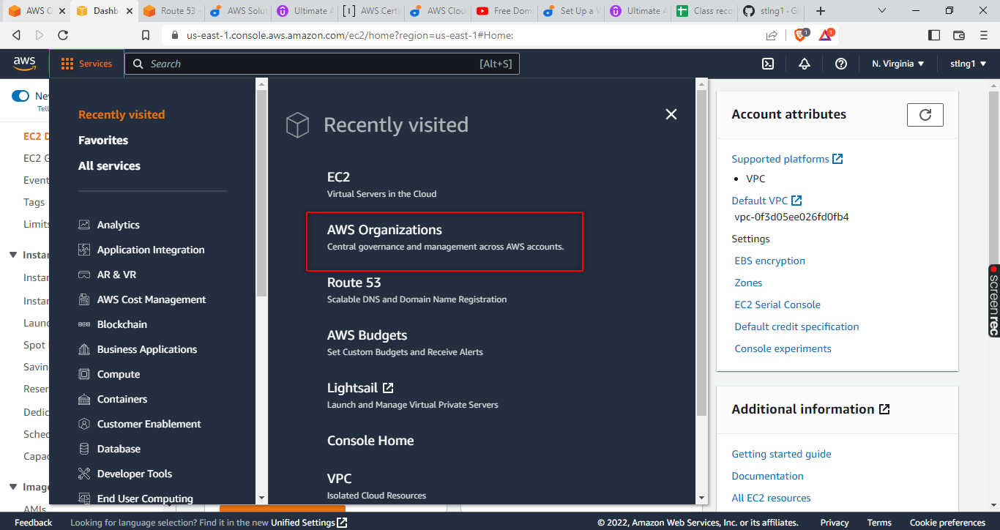
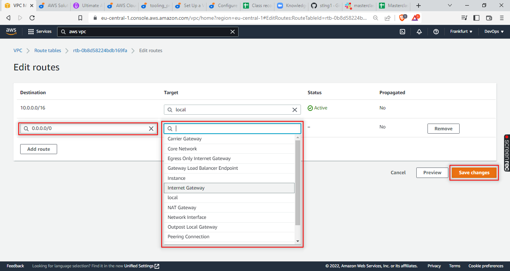
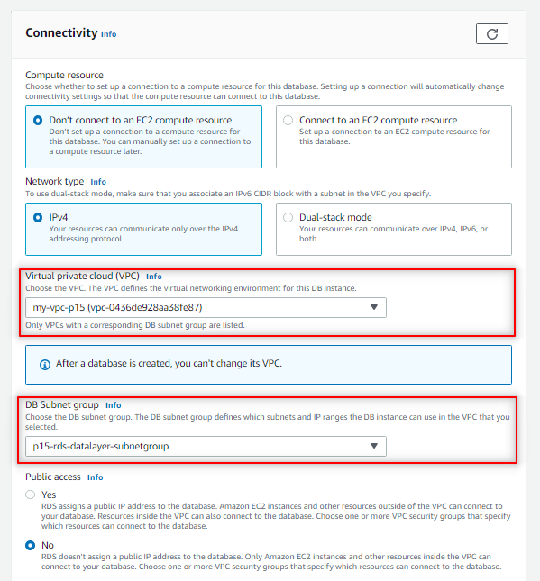
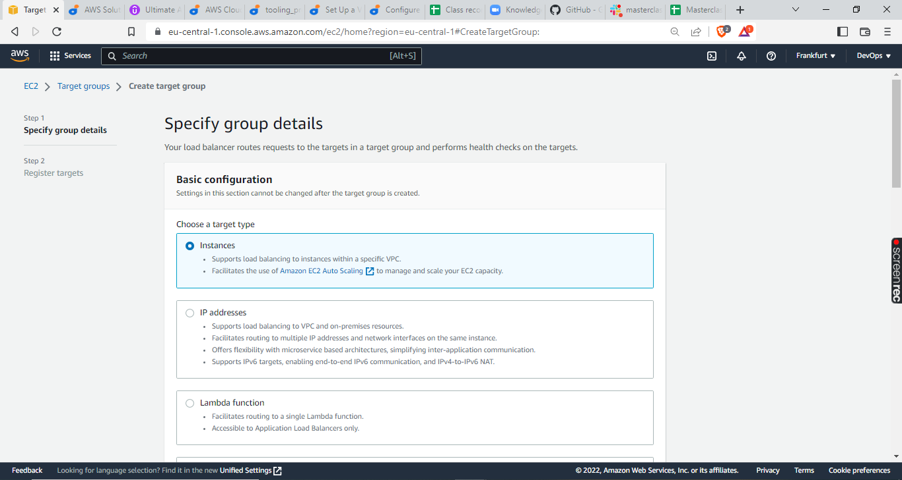
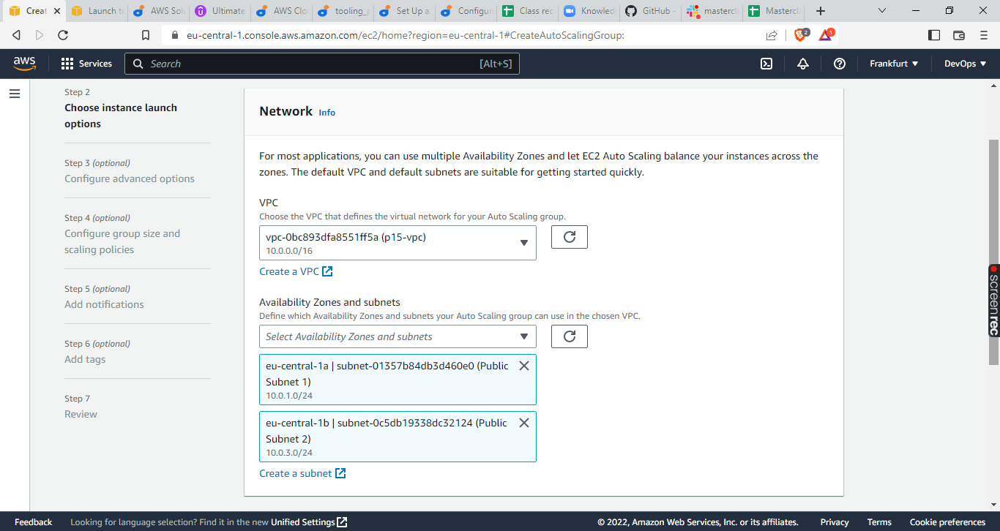

AWS CLOUD SOLUTION FOR 2 COMPANY WEBSITES USING A REVERSE PROXY TECHNOLOGY

 

## Configure AWS Account

1. Login to your AWS account.
2. Go to services


then click **AWS Organizations**



3. Create an AWS Master account by clicking on the **create an AWS organization** button


4. Within the Root account, create a sub-account and name it DevOps. 


5. Within the Root account, create an AWS Organization Unit (OU). Name it Dev.


6. Move the DevOps account into the Dev OU.


7. Login to the newly created AWS account using the new email address.

## Register Domain Name

1. Register domain name for this project from a domain registrar


2. Create a hosted zone in AWS, and map it to your free domain from registrar.


## Get TLS Certificates From Amazon Certificate Manager (ACM)
	
1. request a public wildcard certificate *.orieja.com.ng


2. use DNS to validate the domain name

3. Tag the resource


## Set Up a Virtual Private Network (VPC)

1. Create a VPC


2. Create subnets as shown in the architecture


3. Create a route table and associate it with public subnets


4. Edit subnet settings to Enable auto-assign public IPv4 address


Repeat the process for **Public Subnet 2** and remember to **save**

5. Create a route table and associate it with private subnets
*(follow directions in step 3 above)*


6. Create an Internet Gateway
Create internet gateway and attach to vpc


7. Edit a route in public route table, and associate it with the Internet Gateway. (This is what allows a public subnet to be accesible from the Internet)





8. Create 3 Elastic IPs


9. Create a Nat Gateway and assign one of the Elastic IPs (*The other 2 will be used by Bastion hosts)


10. Edit a route in private route table, and associate it with the NAT Gateway. (This is what allows a private subnet have access to the Internet)


## Create KMS key
p15-kms


## Create a Security Groups:

	- Nginx Servers:         nginx-sg	 	    - allow ALB on https=443, ssh=22
	- Bastion Servers:       bastions-sg		- allow my workstation ssh=22
	- Webservers:            webservers-sg 	    - allow nginx on https=443, ssh=22, NFS=2049
	- Public Load Balancer:  publicALB-sg	    - allow all https=443
	- Private Load balancer: privateALB-sg	    - allow nginx https=443
	- EFS datalayer:         efs-datalayer-sg 	- allow nginx and webservers NFS=2049
	- RDS datalayer:         rds-datalayer-sg 	- allow webservers only MySQL=3306


## Create an EFS storage

1. open EFS page and create file system, **my-efs-p15**


leave setting at defaults

2. set an EFS mount target per AZ, associate it with both PrivateSubnets 3 and 4 dedicated for data layer and set security group - efs-datalayer-sg


3. create an EFS access point - public


Name the access point **public** and leave other settings at default


## Create RDS - for MySQL 
	- create a subnet group, name it **datalayer** and add private subnets 3 and 4
	- create an RDS Instance for mysql 8.*.*
	- select either Dev/Test
	- configure VPC, subnet
	- rds-datalayer-sg
	- configure backups and retention
	- encrypt the database using the KMS key created earlier
	- enable CloudWatch monitoring and export Error and Slow Query logs (for production, also include Audit)





## Create Amazon Machine Images (AMI)

1. launch RHEL EC2 instance with the **user data** below (base.sh):
```
#!/usr/bin/bash
sudo yum update -y
sudo yum install python3 -y
sudo dnf install chrony
sudo yum -y install net-tools
sudo yum install vim-enhanced -y
sudo yum install wget -y
sudo yum install telnet -y 
sudo yum install https://dl.fedoraproject.org/pub/epel/epel-release-latest-8.noarch.rpm -y
sudo yum install htop -y
sudo dnf install nfs-utils nfs4-acl-tools -y
```

2. create an image from this instance and name it **baseAMI**

3. launch RHEL EC2 instance using **baseAMI** with the **user data** below (webserver.sh):
```
#!/usr/bin/bash
sudo yum update -y
sudo yum install git -y
sudo yum install https://dl.fedoraproject.org/pub/epel/epel-release-latest-8.noarch.rpm
sudo yum install yum-utils http://rpms.remirepo.net/enterprise/remi-release-8.rpm
sudo yum module list php
sudo yum module reset php
sudo yum module enable php:remi-7.4
sudo yum install php php-opcache php-gd php-curl php-mysqlnd -y
sudo systemctl start php-fpm
sudo systemctl enable php-fpm
sudo setsebool -P httpd_execmem 1
```

2. create an image from this instance and name it **webserverAMI**


## Create Launch Templates

Remember to update the template version *user data* with current IPs, and set updated versions as default.

1. **bastionTP**

Create bastion launch template from  baseAMI + user data below (bastion.sh)
```
#!/usr/bin/bash
sudo yum update -y
sudo yum install git -y
sudo yum install ansible -y
```

2. **nginxTP**

Create nginx launch template from baseAMI + user data below (nginx-reverse-proxy.sh)
```
#!/usr/bin/bash
##Installing Nginx
sudo su
sudo yum update -y
sudo yum install nginx -y
##Modifying Nginx Server Configuration for reverse proxy
##create conf files for tooling and wordpress servers respectively
sudo cat > /etc/nginx/conf.d/wordpress.conf <<EOL
server {
    listen 80;
    server_name wordpress.orieja.com.ng;
    location / {
        proxy_pass http://<wordpress-server-ip>:8080;
    }
}
EOL

sudo cat > /etc/nginx/conf.d/tooling.conf <<EOL
server {
    listen 80;
    server_name tooling.orieja.com.ng;
    location / {
        proxy_pass http://<tooling-server-ip>:8081;
    }
}
EOL
##Starting Nginx Services
sudo systemctl enable nginx
sudo systemctl start nginx
sudo chkconfig nginx on
sudo setsebool -P httpd_can_network_connect 1
```

3. **wordpressTP**	

Create wordpress launch template from webserverAMI + user data below (wordpress.sh)
```
#!/usr/bin/bash
##install httpd webserver
sudo su
sudo yum update -y
sudo yum install mysql -y
sudo yum install httpd -y
sudo systemctl enable httpd
##configure httpd
sudo sed -i -e 's/Listen 80/Listen 8080/g' /etc/httpd/conf/httpd.conf
cat > /etc/httpd/conf.d/vhosts.conf <<EOL
<VirtualHost *:8080>
    DocumentRoot /var/www/html/wordpress/
    ServerName wordpress.orieja.com.ng
    ErrorLog logs/wordpress.orieja.com.ng-error_log
    CustomLog logs/wordpress.orieja.com.ng-access_log common
</VirtualHost>
EOL
sudo systemctl start httpd
sudo chkconfig httpd on
##mount efs on server
cd /var/www
sudo mount -t nfs4 -o nfsvers=4.1,rsize=1048576,wsize=1048576,hard,timeo=600,retrans=2,noresvport < efs-ip >:/ html
##install wordpress
cd html
sudo wget http://wordpress.org/latest.tar.gz
sudo tar xzvf latest.tar.gz
sudo rm -rf latest.tar.gz
sudo cp wordpress/wp-config-sample.php wordpress/wp-config.php
sudo chown -R ec2-user:ec2-user /var/www/html/wordpress
sudo setsebool -P httpd_can_network_connect=1
##set database details with perl find and replace
sed -e "s/database_name_here/wordpress/" /var/www/html/wordpress/wp-config.php
sed -e "s/username_here/admin/g" /var/www/html/wordpress/wp-config.php
sed “"/password_here/PassWord/g" /var/www/html/wordpress/wp-config.php
sed “"/localhost/< rds-end-point-here >/g" /var/www/html/wordpress/wp-config.php
```

4. **toolingTP**	

Create tooling launch template from webserverAMI + user data below (tooling.sh)

```
#!/usr/bin/bash
##install httpd webserver
sudo su
sudo yum update -y
sudo yum install mysql -y
sudo yum install httpd -y
sudo systemctl enable httpd
##configure httpd
sudo sed -i -e 's/Listen 80/Listen 8081/g' /etc/httpd/conf/httpd.conf
cat > /etc/httpd/conf.d/vhosts.conf <<EOL
<VirtualHost *:8081>
    DocumentRoot /var/www/html/tooling/
    ServerName tooling.orieja.com.ng
    ErrorLog logs/tooling.orieja.com.ng-error_log
    CustomLog logs/tooling.orieja.com.ng-access_log common
</VirtualHost>
EOL
##Configure SELinux allow http to listen on TCP ports 8081
sudo yum -y install policycoreutils-python-utils
sudo semanage port -m -t http_port_t -p tcp 8081
##Starting httpd Services
sudo systemctl start httpd
sudo chkconfig httpd on
##mount efs on server
cd /var/www
sudo mount -t nfs4 -o nfsvers=4.1,rsize=1048576,wsize=1048576,hard,timeo=600,retrans=2,noresvport <efs-ip>:/ html
##install tooling
cd html
sudo git clone https://github.com/stlng1/tooling.git
sudo mv tooling/html/* tooling/.
sudo chown -R ec2-user:ec2-user /var/www/html/tooling
sudo setsebool -P httpd_can_network_connect 1
##connect database to webserver configuration details with perl find and replace
sed -e "s/'mysql.tooling.svc.cluster.local', 'admin', 'admin', 'tooling/'< rds-end-point-here >', 'admin', 'PassWord', 'tooling/" /var/www/html/tooling/functions.php
```

## Launch EC2 templates

ZoneA:
1.	- wordpressTP	- PrivateSubnet1
2.	- toolingTP		- PrivateSubnet1
3.	- nginxTP		- PublicSubnet1
4.	- bastionTP		- PublicSubnet1 (associate elastic IP)

ZoneB:
5.	- wordpressTP	- PrivateSubnet2
6.	- toolingTP		- PrivateSubnet2
7.	- nginxTP		- PublicSubnet2
8.	- bastionTP 	- PublicSubnet2 (associate elastic IP)

## Configure Target Groups

1. Create nginxTG
	- select Instances as the target type
	- ensure the protocol HTTP on TCP port 80
	- ensure that the health check path is /healthstatus
	- register Nginx Instances as targets
	- ensure that health check passes for the target group

2. Create bastionTG
	- select Instances as the target type
	- ensure the protocol is TCP on port 22
	- register Bastion Instances as targets
	- ensure that health check passes for the target group

3. Create wordpressTG
	- select Instances as the target type
	- ensure the protocol HTTP on TCP port 8080
	- ensure that the health check path is /healthstatus
	- register wordpress Instances as targets
	- ensure that health check passes for the target group

4. Create toolingTG
	- select Instances as the target type
	- ensure the protocol HTTP on TCP port 8081
	- ensure that the health check path is /healthstatus
	- register tooling Instances as targets
	- ensure that health check passes for the target group

## Configure Application Load Balancer

1. Create an Internet facing ALB - publicALB
	- listens on HTTPS protocol (TCP port 443)
	- create within my-vps-p15, eu-xxx AZ, PublicSubnets 1 and 2
	- certificate from ACM
	- publicALB Security Group
	- nginxTG target group


2. Create an Internal ALB - privateALB
	- listens on HTTPS protocol (TCP port 443)
	- create within project15VPC, eu-xxx AZ, PrivateSubnets 1 and 2
	- certificate from ACM
	- privateALB Security Group
	- wordpressTG and toolingTG target groups
	- ensure health check passes for the target groups

## Configure Auto Scaling Groups
	Create nginxASG
	- select nginxTP launch template
	- select the VPC
	- select both public subnets
	- enable Application Load Balancer for the AutoScalingGroup (ASG)
	- select the nginxTG target group
	- ensure that you have health checks for both EC2 and ALB
		desired capacity is 2
		minimum capacity is 2
		maximum capacity is 4
	- set scale out if CPU utilization reaches 90%
	- ensure there is an SNS topic to send scaling notifications

	Create bastionASG
	- select bastionTP launch template
	- select the VPC
	- select both public subnets
	- enable Application Load Balancer for the AutoScalingGroup (ASG)
	- select the bastionTG target group
	- ensure that you have health checks for both EC2 and ALB
		desired capacity is 2
		minimum capacity is 2
		maximum capacity is 4
	- set scale out if CPU utilization reaches 90%
	- ensure there is an SNS topic to send scaling notifications

	Create wordpressASG
	- select wordpressTP launch template
	- select the VPC
	- select private subnets 1 & 2
	- enable Application Load Balancer for the AutoScalingGroup (ASG)
	- select wordpressTG target group
	- ensure that you have health checks for both EC2 and ALB
		desired capacity is 2
		minimum capacity is 2
		maximum capacity is 4
	- set scale out if CPU utilization reaches 90%
	- ensure there is an SNS topic to send scaling notifications

	Create toolingASG
	- select toolingTP launch template
	- select the VPC
	- select private subnets 1 & 2
	- enable Application Load Balancer for the AutoScalingGroup (ASG)
	- select toolingTG target group
	- ensure that you have health checks for both EC2 and ALB
		desired capacity is 2
		minimum capacity is 2
		maximum capacity is 4
	- set scale out if CPU utilization reaches 90%
	- ensure there is an SNS topic to send scaling notifications

## Configuring DNS with Route53
	- create other records such as CNAME, alias and A records.
	- create an alias record for the root domain and direct its traffic to the ALB DNS name.
	- create an alias record for tooling.<yourdomain>.com and direct its traffic to the ALB DNS name.


## Set Up Compute Resources

## Provision EC2 Instances for Nginx

1. Create an EC2 Instance based on CentOS Amazon Machine Image (AMI) in any 2 Availability Zones (AZ) in any AWS Region (it is recommended to use the Region that is closest to your customers). Use EC2 instance of T2 family (e.g. t2.micro or similar)

2. Ensure that it has the following software installed:
python
ntp
net-tools
vim
wget
telnet
epel-release
htop

3. Create an AMI out of the EC2 instance


## Prepare Launch Template For Nginx (One Per Subnet)

1. Make use of the AMI to set up a launch template


2. Ensure the Instances are launched into a public subnet 

3. Assign appropriate security group


4. Configure Userdata to update yum package repository and install nginx


## Configure Target Groups

1. Select Instances as the target type



2. Ensure the protocol HTTPS on secure TLS port 443


3. Ensure that the health check path is /healthstatus
4. Register Nginx Instances as targets
5. Ensure that health check passes for the target group


## Configure Autoscaling For Nginx

1. Select the right launch template


2. Select the VPC


3. Select both public subnets



4. Enable Application Load Balancer for the AutoScalingGroup (ASG)


5. Select the target group you created before


6. Ensure that you have health checks for both EC2 and ALB


7. The desired capacity is 2
8. Minimum capacity is 2
9. Maximum capacity is 4


10. Set scale out if CPU utilization reaches 90%


11. Ensure there is an SNS topic to send scaling notifications


## Set Up Compute Resources for Bastion

## Prepare Launch Template For Bastion (One per subnet)
1. Make use of the nginx - AMI as template to set up a launch Instances for bastion into a public subnet

2. Assign appropriate security group

3. Configure Userdata to update yum package repository and install Ansible and git


4. Associate an Elastic IP with each of the Bastion EC2 Instances


## Configure Target Groups
1. Select Instances as the target type
2. Ensure the protocol is TCP on port 22
3. Register Bastion Instances as targets
4. Ensure that health check passes for the target group


## Configure Autoscaling For Bastion
1. Select the right launch template


2. Select the VPC
3. Select both public subnets


4. Enable Application Load Balancer for the AutoScalingGroup (ASG)


5. Select the target group you created before
6. Ensure that you have health checks for both EC2 and ALB
7. The desired capacity is 2
8. Minimum capacity is 2
9. Maximum capacity is 4


10. Set scale out if CPU utilization reaches 90%
11. Ensure there is an SNS topic to send scaling notifications


## Set Up Compute Resources for Webservers
1. Provision the EC2 Instances for Webservers
Now, you will need to create 2 separate launch templates for both the WordPress and Tooling websites

Create an EC2 Instance (Centos) each for WordPress and Tooling websites per Availability Zone (in the same Region).

Ensure that it has the following software installed

python
ntp
net-tools
vim
wget
telnet
epel-release
htop
php
Create an AMI out of the EC2 instance

## Prepare Launch Template For Webservers (One per subnet)
1. Make use of the AMI to set up a launch template
2. Ensure the Instances are launched into a public subnet
3. Assign appropriate security group
4. Configure Userdata to update yum package repository and install wordpress (Only required on the WordPress launch template)

## TLS Certificates From Amazon Certificate Manager (ACM)
You will need TLS certificates to handle secured connectivity to your Application Load Balancers (ALB).

1. Navigate to AWS ACM
2. Request a public wildcard certificate for the domain name you registered in Freenom
3. Use DNS to validate the domain name
4. Tag the resource


## CONFIGURE APPLICATION LOAD BALANCER (ALB)
## Application Load Balancer To Route Traffic To NGINX
Nginx EC2 Instances will have configurations that accepts incoming traffic only from Load Balancers. No request should go directly to Nginx servers. With this kind of setup, we will benefit from intelligent routing of requests from the ALB to Nginx servers across the 2 Availability Zones. We will also be able to offload SSL/TLS certificates on the ALB instead of Nginx. Therefore, Nginx will be able to perform faster since it will not require extra compute resources to validate certificates for every request.

Create an Internet facing ALB
Ensure that it listens on HTTPS protocol (TCP port 443)
Ensure the ALB is created within the appropriate VPC | AZ | Subnets
Choose the Certificate from ACM
Select Security Group
Select Nginx Instances as the target group
Application Load Balancer To Route Traffic To Web Servers
Since the webservers are configured for auto-scaling, there is going to be a problem if servers get dynamically scalled out or in. Nginx will not know about the new IP addresses, or the ones that get removed. Hence, Nginx will not know where to direct the traffic.

To solve this problem, we must use a load balancer. But this time, it will be an internal load balancer. Not Internet facing since the webservers are within a private subnet, and we do not want direct access to them.

Create an Internal ALB
Ensure that it listens on HTTPS protocol (TCP port 443)
Ensure the ALB is created within the appropriate VPC | AZ | Subnets
Choose the Certificate from ACM
Select Security Group
Select webserver Instances as the target group
Ensure that health check passes for the target group
NOTE: This process must be repeated for both WordPress and Tooling websites.

## Setup EFS
In this project, we will utulize EFS service and mount filesystems on both Nginx and Webservers to store data.

1. Create an EFS filesystem
2. Create an EFS mount target per AZ in the VPC, associate it with both subnets dedicated for data layer
3. Associate the Security groups created earlier for data layer.
4. Create an EFS access point. (Give it a name and leave all other settings as default)


## Setup RDS
Pre-requisite: Create a KMS key from Key Management Service (KMS) to be used to encrypt the database instance.

To configure RDS, follow steps below:

Create a subnet group and add 2 private subnets (data Layer)
Create an RDS Instance for mysql 8.*.*
To satisfy our architectural diagram, you will need to select either Dev/Test or Production Sample Template. But to minimize AWS cost, you can select the Do not create a standby instance option under Availability & durability sample template (The production template will enable Multi-AZ deployment)
Configure other settings accordingly (For test purposes, most of the default settings are good to go). In the real world, you will need to size the database appropriately. You will need to get some information about the usage. If it is a highly transactional database that grows at 10GB weekly, you must bear that in mind while configuring the initial storage allocation, storage autoscaling, and maximum storage threshold.
Configure VPC and security (ensure the database is not available from the Internet)
Configure backups and retention
Encrypt the database using the KMS key created earlier
Enable CloudWatch monitoring and export Error and Slow Query logs (for production, also include Audit)
Note This service is an expensinve one. Ensure to review the monthly cost before creating. (DO NOT LEAVE ANY SERVICE RUNNING FOR LONG)

Configuring DNS with Route53
Earlier in this project you registered a free domain with Freenom and configured a hosted zone in Route53. But that is not all that needs to be done as far as DNS configuration is concerned.

You need to ensure that the main domain for the WordPress website can be reached, and the subdomain for Tooling website can also be reached using a browser.

Create other records such as CNAME, alias and A records.

NOTE: You can use either CNAME or alias records to achieve the same thing. But alias record has better functionality because it is a faster to resolve DNS record, and can coexist with other records on that name. Read here to get to know more about the differences.

Create an alias record for the root domain and direct its traffic to the ALB DNS name.
Create an alias record for tooling.<yourdomain>.com and direct its traffic to the ALB DNS name.


Congratulations!