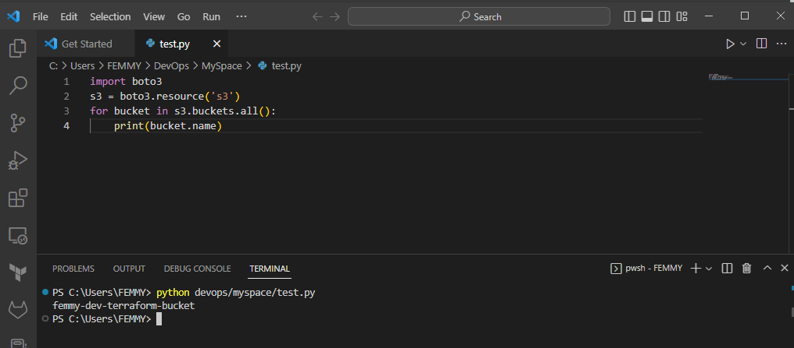

# AUTOMATE INFRASTRUCTURE WITH IAC USING TERRAFORM

## Automating AWS infrastructure for 2 websites.

### PREREQUISITES

## Install Python on Windows

1. download [python installer](https://www.python.org/downloads/) for windows and run


note: make sure to check *Add python.exe to PATH*

2. restart your system and run the command below to display version number. This verifies installation was completed successfully.

``
python -V
``


## Install boto3 on Windows

3. install boto3 with pip on windows

``
pip install boto3
``

## Create and configure IAM user

4. Create an IAM user, name it **terraform** (ensure that the user has only programatic access to your AWS account) and grant this user **AdministratorAccess** permissions.


5. create access key


6. configure IAM user authentication using git bash terminal. Ensure that AWS CLI is pre-installed, then run the command below and provide access keys created in the step above:

``
aws console
``


## Create S3 bucket

7. Create an S3 bucket to store terraform state file, named -  **femmy-dev-terraform-bucket**


8. to ensure you can programmatically access your AWS account by running following code in >python

```
import boto3
s3 = boto3.resource('s3')
for bucket in s3.buckets.all():
    print(bucket.name)
```

you should get the name of your newly created s3 bucket as output - *femmy-dev-terraform-bucket*



# VPC | Subnets | Security Groups

1. create a directory structure. In Visual Studio Code (VSC), Create a folder called **TERRAFORM-PROJECTS** and Create a file in the folder called **main.tf**

## First Iteration - 

2. **main.tf**

```
terraform {
  required_providers {
    aws = {
      source  = "hashicorp/aws"
      version = "~> 4.0"
    }
  }
}

# Configure the AWS Provider
provider "aws" {
  region = "eu-west-3"
}


# Create VPC
resource "aws_vpc" "main" {
  cidr_block                     = "10.0.0.0/16"
  enable_dns_support             = true
  enable_dns_hostnames           = true
  enable_classiclink             = false
  enable_classiclink_dns_support = false
  tags = {
    Name            = "main-vpc"
  }
}

# Create public subnets
resource "aws_subnet" "PublicSubnet-1" {
  vpc_id                  = aws_vpc.main.id
  cidr_block              = "10.0.1.0/24"
  map_public_ip_on_launch = true
  availability_zone       = "eu-west-3a"
  tags = {
    Name            = "PublicSubnet-1"
  }
}

resource "aws_subnet" "PublicSubnet-2" {
  vpc_id                  = aws_vpc.main.id
  cidr_block              = "10.0.2.0/24"
  map_public_ip_on_launch = true
  availability_zone       = "eu-west-3a"
  tags = {
    Name            = "PublicSubnet-2"
  }
}

# Create private subnets
resource "aws_subnet" "PrivateSubnet-1" {
  vpc_id                  = aws_vpc.main.id
  cidr_block              = "10.0.3.0/24"
  map_public_ip_on_launch = false
  availability_zone       = "eu-west-3a"

  tags = {
    Name            = "PrivateSubnet-1"
  }
}

resource "aws_subnet" "PrivateSubnet-2" {
  vpc_id                  = aws_vpc.main.id
  cidr_block              = "10.0.4.0/24"
  map_public_ip_on_launch = false
  availability_zone       = "eu-west-3a"

  tags = {
    Name            = "PrivateSubnet-2"
  }
}

resource "aws_subnet" "PrivateSubnet-3" {
  vpc_id                  = aws_vpc.main.id
  cidr_block              = "10.0.5.0/24"
  map_public_ip_on_launch = false
  availability_zone       = "eu-west-3a"

  tags = {
    Name            = "PrivateSubnet-3"
  }
}

resource "aws_subnet" "PrivateSubnet-4" {
  vpc_id                  = aws_vpc.main.id
  cidr_block              = "10.0.6.0/24"
  map_public_ip_on_launch = false
  availability_zone       = "eu-west-3a"

  tags = {
    Name            = "PrivateSubnet-4"
  }
}
```

## Second Iteration - 

3. **main.tf**

```
terraform {
  required_providers {
    aws = {
      source  = "hashicorp/aws"
      version = "~> 4.0"
    }
  }
}

# Configure the AWS Provider
provider "aws" {
  region = var.region
}

# Create a VPC
resource "aws_vpc" "main" {
  cidr_block                     = var.vpc_cidr
  enable_dns_support             = var.enable_dns_support
  enable_dns_hostnames           = var.enable_dns_hostnames
  # #enable_classiclink             = var.enable_classiclink
  # enable_classiclink_dns_support = var.enable_classiclink_dns_support

  tags = {
    Name = "main-vpc"
  }
}

# Get list of availability zones
data "aws_availability_zones" "available" {
  state = "available"
}

# create public subnets
resource "aws_subnet" "PublicSubnet" {
  count                   = length(var.public_subnets)
  vpc_id                  = aws_vpc.main.id
  cidr_block              = var.public_subnets[count.index]
  map_public_ip_on_launch = true
  availability_zone       = data.aws_availability_zones.available.names[count.index]

  tags = {
    Name = "${format("PublicSubnet-%02d", count.index + 1)}"
  }
}

# create private compute subnets
resource "aws_subnet" "Compute_PrivateSubnet" {
  count                   = length(var.compute_private_subnets)
  vpc_id                  = aws_vpc.main.id
  cidr_block              = var.compute_private_subnets[count.index]
  map_public_ip_on_launch = false
  availability_zone       = data.aws_availability_zones.available.names[count.index]

  tags = {
    Name = "${format("ComputePrivateSubnet-%02d", count.index + 1)}"
  }
}

# create private datalayer subnets
resource "aws_subnet" "Data_PrivateSubnet" {
  count                   = length(var.data_private_subnets)
  vpc_id                  = aws_vpc.main.id
  cidr_block              = var.data_private_subnets[count.index]
  map_public_ip_on_launch = false
  availability_zone       = data.aws_availability_zones.available.names[count.index]

  tags = {
    Name = "${format("DataPrivateSubnet-%02d", count.index + 1)}"
  }
}
```

4. **variables.tf**
```
variable "region" {
  type = string
}

variable "vpc_cidr" {
  type = string
}

variable "enable_dns_support" {
  type = bool
}

variable "enable_dns_hostnames" {
  type = bool
}

# variable "enable_classiclink" {
#   type = bool
# }

# variable "enable_classiclink_dns_support" {
#   type = bool
# }

variable "public_subnets" {
  type = list(any)
}

variable "compute_private_subnets" {
  type = list(any)
}

variable "data_private_subnets" {
  type = list(any)
}
```

5. **terraform.tfvars**
```
region                         = "eu-west-3"
vpc_cidr                       = "10.0.0.0/16"
enable_dns_support             = "true"
enable_dns_hostnames           = "true"
# enable_classiclink             = "false"
# enable_classiclink_dns_support = "false"
public_subnets                 = ["10.0.1.0/24", "10.0.2.0/24"]
compute_private_subnets        = ["10.0.3.0/24", "10.0.4.0/24"]
data_private_subnets           = ["10.0.5.0/24", "10.0.6.0/24"]
```


