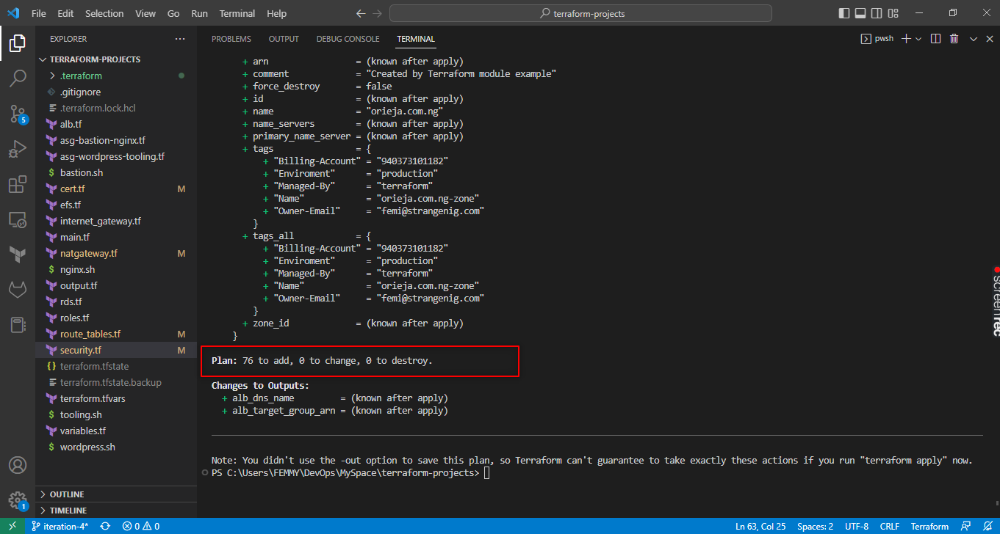

# AUTOMATE INFRASTRUCTURE WITH IAC USING TERRAFORM - PT2

## Automating AWS infrastructure for 2 websites - contd

## PROJECT 17 REPORTS

Kindly find the terrraform files in my repository below:

https://github.com/stlng1/terraform-projects/tree/iteration-4

## Additional tasks

1. IP Address  - unique address used to identify devices on a network

2. Subnets     - sub-division of networks or a smaller network within a bigger network 

3. CIDR Notation - a way of allocating or restrciting blocks of ip addresses; creating subnets with them

4. IP Routing  - Network traffic management

5. Internet Gateways - access point to the internet from a private network

6. NAT         - it's like a local dns service that routes traffic between a private and public network

7. OSI model - depicts the whole communication structure involved in a network, from the physical layers to the software layers.

8. TCP/IP - is a transport protocol that moves packets of data from point to point in an network

9. Assume role policy - simply put in my understanding, this is trust delegated to an entity/service to assume your role or function in a role according to the policies you have set. It provides protection/restriction at role level.

10. Role policy - permissions granted to a role by admin