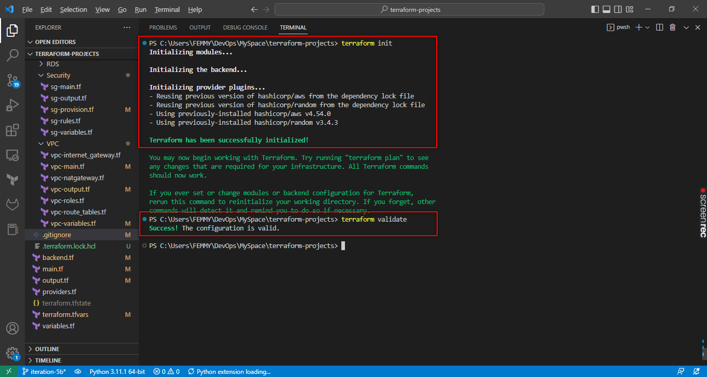
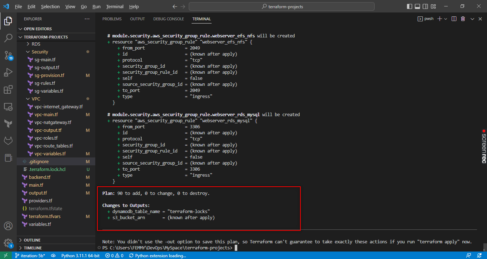

# Automate Infrastructure with IaC using Terraform - Part 3

## Refactoring Codes

Find link to repository for refactored codes below:

https://github.com/stlng1/terraform-projects.git


Run the following commands:

```
terraform init
```

```
terraform validate
```



```
terraform plan
```

