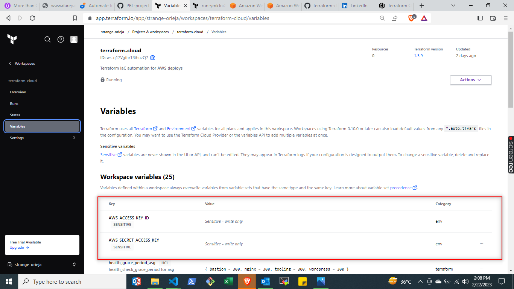

# Automate Infrastructure With IaC using Terraform Cloud

This report describes the automation with codes for deploying 2 company websites, using terraform for deploying infrastructure and ansible for applications. Kindly refer to the repository below for all codes/files related to this project.

**https://github.com/stlng1/terraform-cloud/tree/dev**

## Pre-requisites
---

1. Install the following pre-requisites:

        a. packer

        b. ansible

        c. AWS CLI

        d. graphviz and run

```terraform graph | dot -Tsvg > graph.svg```


1. Create a Terraform Cloud account


2. Create an organization


3. Configure a workspace


5. Configure variables


Set two environment variables: AWS_ACCESS_KEY_ID and AWS_SECRET_ACCESS_KEY




# Action Plan for project 19
---

## Build images using packer
---

1. Export credentials

The AMI credentials is required to launch an EC2 Instance.

```export AWS_ACCESS_KEY_ID=AK************IEVXQ```

```export AWS_SECRET_ACCESS_KEY=gbaIbK*********************iwN0dGfS```

2. List the Latest Available RHEL Amazon Machine Images (AMIs)

 To obtain the RHEL AMIs list, we open our terminal and type the following command to list all RHEL-8 images that start with from the owner 309956199498 (RedHat).

```
aws ec2 describe-images --owners 309956199498 --query 'sort_by(Images, &CreationDate)[*].[CreationDate,Name,ImageId]' --filters "Name=name,Values=RHEL-9*" --region eu-west-3 --output table
```

and this is the result:


3. update filters in **bastion.pkr.hcl** file with the name of the base image to start with, copied from step 2 above.

```
variable "region" {
  type    = string
  default = "eu-west-3"
}

locals {
  timestamp = regex_replace(timestamp(), "[- TZ:]", "")
}


# source blocks are generated from your builders; a source can be referenced in
# build blocks. A build block runs provisioners and post-processors on a
# source.
source "amazon-ebs" "ami-bastion-prj-19" {
  ami_name      = "ami-bastion-prj-19-${local.timestamp}"
  instance_type = "t2.micro"
  region        = var.region
  source_ami_filter {
    filters = {
      name                = "RHEL-8.7.0_HVM-20221101-x86_64-0-Hourly2-GP2"
      root-device-type    = "ebs"
      virtualization-type = "hvm"
    }
    most_recent = true
    owners      = ["309956199498"]
  }
  ssh_username = "ec2-user"
  tag {
    key   = "Name"
    value = "ami-bastion-prj-19"
  }
}

# a build block invokes sources and runs provisioning steps on them.
build {
  sources = ["source.amazon-ebs.ami-bastion-prj-19"]

  provisioner "shell" {
    script = "bastion.sh"
  }
}
```

4. from the command line, run:

```packer build bastion.pkr.hcl```


5. repeat steps 3 and 4 to create RHEL 8 images for the other packer files in the AMI directory - nginx.pkr.hcl and web.pkr.hcl.


For ubuntu.pkr.hcl, we have to repeat step 2 to retrieve the ubuntu base image for packer to create our image.


## Confirm the AMIs in the console
---

6. Log into yor AWS account to see the newly created images.


## Create branches and workspaces 
---

7. create - dev, test and prod branches from main branch in github. you can create the branches in vscode and push to github.


8. create - DEV workspace on terraform cloud


9. Configure terraform to trigger runs automatically only for dev environment


10. update variables by creating **variable sets** from tfvar files; 
*note: check 'HCL' for map string variables and other values returned error before editing your codes*
 create 3 variable sets as follows:

 a. environment_var_set: for environmental variables

 b. general_var_set: for general variables

 c. network_var_set: for network/compute variables


11. apply the variable set to your workspace


12. repeat steps 8 and 11 above to create - **TEST** and **PROD** workspaces on terraform cloud


## Trigger New Run

13. update new ami IDs generated from packer build above in the network_var_set variable set on terraform cloud. copy the ami_ids from AWS console.


14. commit and push codes to github to trigger a new run 


## Create an Email and Slack Notifications for All Events
---

15. create email notifications from terraform cloud


## update ansible script with values from terraform output

16. copy the values from AWS console and paste on Ansible in vscode
      a. RDS endpoints for wordpress and tooling
      b. Database name, password and username for wordpress and tooling
      c. Access point ID for wordpress and tooling
      d. PrivateALB DNS for nginx reverse proxy


17. push the updated Ansible codes to github repository.

18. Ensure OpenSSH is installed on your local computer. configure ssh agent on your local computer from your vscode terminal. Use the following commands:

```
eval `ssh-agent`
```

```
ssh-add <path>/<keypair>.pem
```

19. Login to the newly created bastion sever on your terminal. Get the public ip from AWS console

```
ssh -A ec2-user@<server public_ip>
```

20. clone down your github repository *(dev branch)* into the bastion

```
git clone -b dev https://<repository url>
```

21. configure **ansible.cfg**. got to the ansible folder and update the roles_path to the current path on your bastion. (you can know your current path by typing **pwd** command)

open you ansible.cfg file with your prefered line editor

```
vi ansible.cfg
```


then export the configuration with the command below:

```
export ANSIBLE_CONFIG=<path to config file>/ansible.cfg
```

22. Configure the bastion to access your AWS account by providing your access key. Ansible requires this access for dynamic inventory updates. Use the following command

```
aws configure
```

23. Test access for updated aws inventory: 

```
ansible-inventory -i inventory/aws_ec2.yml --graph
```

output should be similar to this


24. run ansible script: 

```
ansible-playbook -i inventory/aws_ec2.yml playbooks/site.yml 
```


25. check the website


26. Apply destroy from Terraform Cloud web console


## TASK 2 - Working with Private repository

## Create a repository

1. to create a repository from a simple Terraform repository, fork repository - https://github.com/hashicorp/learn-private-module-aws-s3-webapp.git

2. In the newly forked repository, goto *settings* and check *Template repository* 


3. get back to the code page and create new repository (private) as shown below:


## Configuring GitHub.com Access (OAuth)

4. Terraform Private Registry requires permissions, (OAuth verification) to access GitHub. To get required information for this access from terraform, follow the images below:


Leave this page open 

5. On Github, we are going to input the information opened in step 5. follow the images below:

open profile settings from top right hand corner of the page


goto **settings --> developer settings --> OAuth Apps**


6. upload terraform logo on the page and keep it open still..

7. generate client secret on the page and keep it open still..


8. get back to the Terraform page an input **client ID and Client Secret** on the page


Click "Connect and continue."

9. Finally, Authorize as shown below


## Import the module into your private registry

10. tag a release


11. import the module


notice the Usage Instructions section. You will use these as the building blocks for your workspace configuration

## Create a configuration that uses the module

12. created new configuration files to stored in public repository to utilize modules created earlier stored in private repository.

https://github.com/stlng1/hashi-tutorial-2.git

## Create a workspace for the configuration

13. create workspace and variables on terraform cloud


## Deploy the infrastructure


## Destroy your deployment


