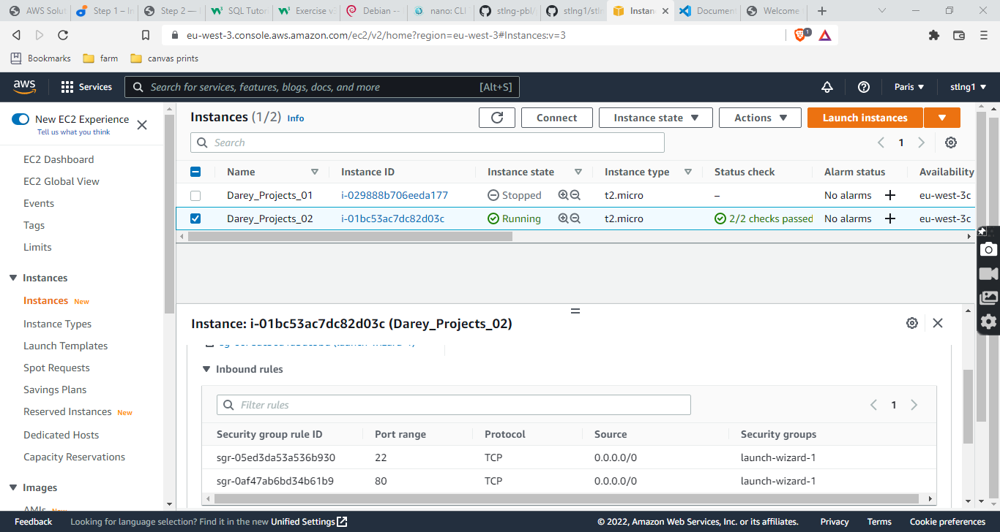
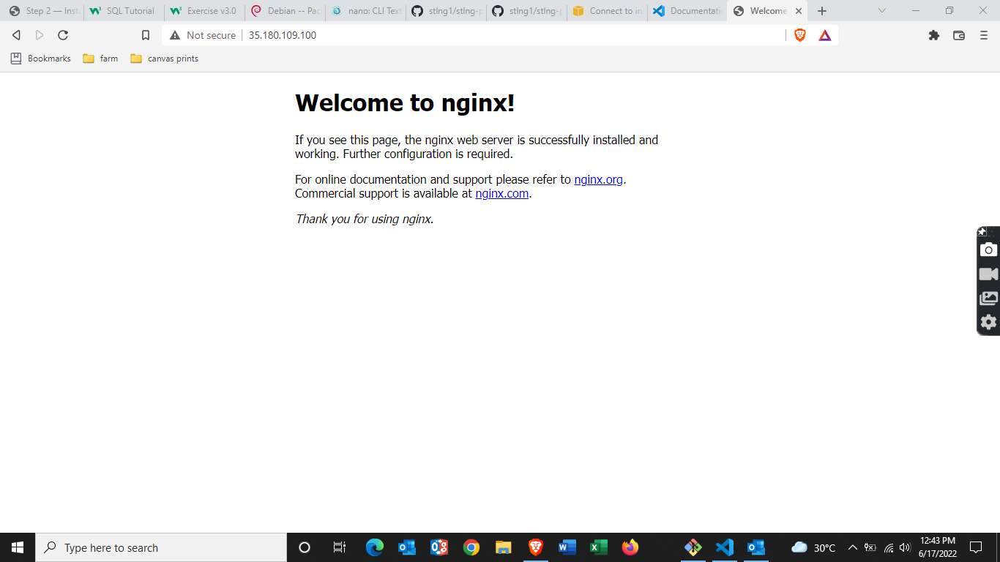
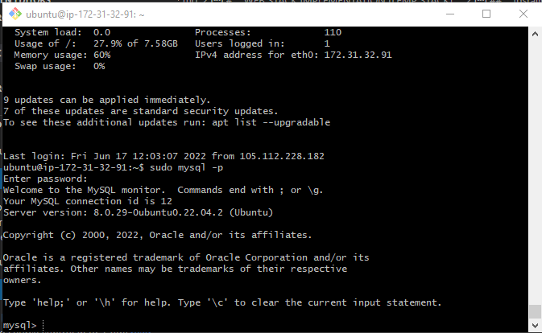
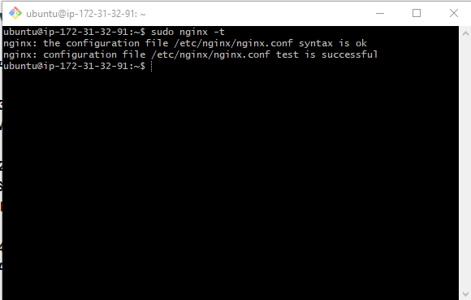
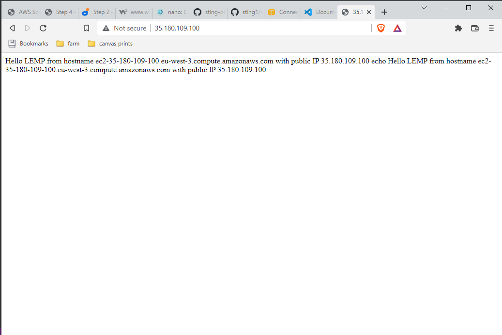
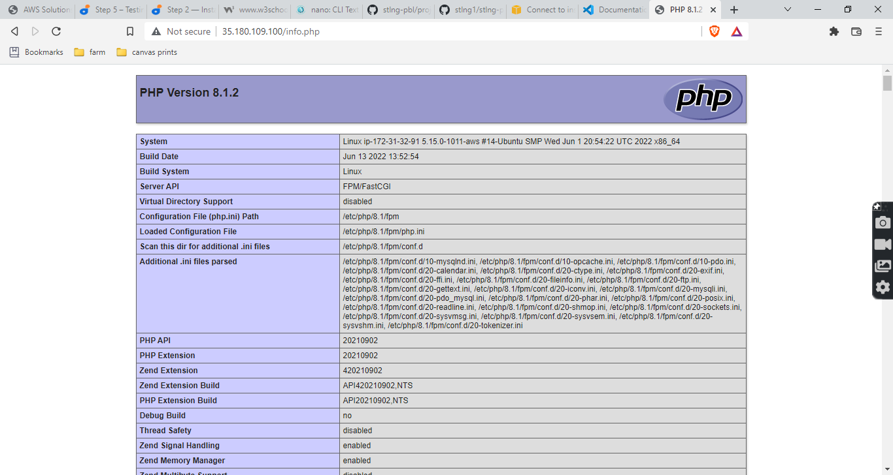
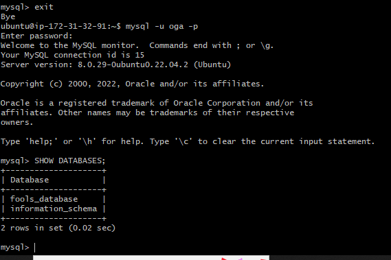
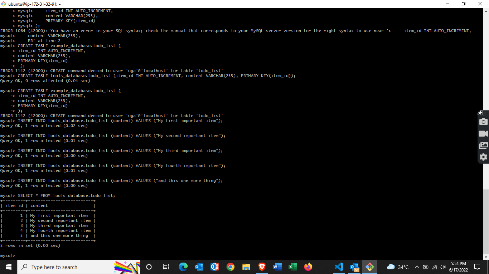
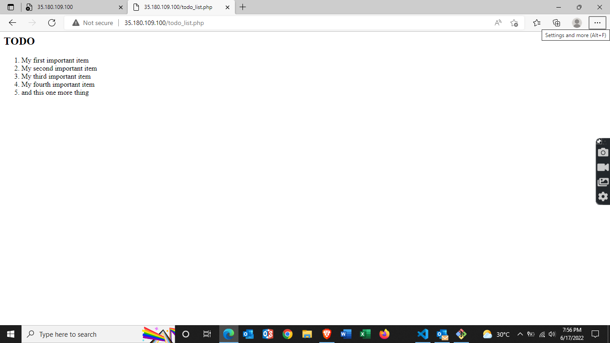

# **WEB STACK IMPLEMENTATION (LEMP STACK)**

## AWS account setup and Provisioning and Ubuntu Server

> 1. Create **Darey_Projects_02** instance of ubuntu server
> 2. use exisitng keypair
> 3. use existing security group **launch-wizard-1**



## **Connecting to EC2 terminal**

Connect to EC2 terminal using the git bash terminal from folder containing my private key

```ssh -i "femmy_EC2.pem" ubuntu@ec2-15-188-63-24.eu-west-3.compute.amazonaws.com```

## **Installing the Nginx Web Server**

Start off by updating your server’s package index

```sudo apt update```

Get Nginx installed

```sudo apt install nginx```

To verify that nginx was successfully installed and is running as a service in Ubuntu, run:

```sudo systemctl status nginx```

check access to nginx server locally in our Ubuntu shell, run:

```
curl http://localhost:80

or

curl http://127.0.0.1:80
```

Test how our nginx HTTP server respond to requests from the Internet browser

```http://<public-ip-address>```

If you see following page, then your web server is now correctly installed and accessible through your firewall.



## **Installing MySQL**

Get MySQL server installed

```sudo apt install mysql-server```

Log in to the MySQL console

```sudo mysql```

Set a password for the root user, using mysql_native_password as default authentication method

```ALTER USER 'root'@'localhost' IDENTIFIED WITH mysql_native_password BY 'PassWord.1';```

Exit the MySQL shell

```exit```

Run a security script to remove some insecure default settings and lock down access to your database system

```sudo mysql_secure_installation```

Test if you’re able to log in to the MySQL console

```sudo mysql -p```



Exit the MySQL console

```exit```

## **Installing PHP**

While Apache embeds the PHP interpreter in each request, Nginx requires an external program to handle PHP processing and act as a bridge between the PHP interpreter itself and the web server. This allows for a better overall performance in most PHP-based websites, but it requires additional configuration. You’ll need to install php-fpm, which stands for “PHP fastCGI process manager”, and tell Nginx to pass PHP requests to this software for processing. Additionally, you’ll need php-mysql, a PHP module that allows PHP to communicate with MySQL-based databases. Core PHP packages will automatically be installed as dependencies

To install these 2 packages at once, run:

```sudo apt install php-fpm php-mysql```

## **Configuring Nginx to Use PHP Processor**

On Ubuntu 20.04, Nginx has one server block enabled by default and is configured to serve documents out of a directory at /var/www/html. While this works well for a single site, it can become difficult to manage if you are hosting multiple sites. Instead of modifying /var/www/html, we’ll create a directory structure within /var/www for the your_domain website, leaving /var/www/html in place as the default directory to be served if a client request does not match any other sites.

Create the root web directory for your_domain (projectLEMP) as follows:

```sudo mkdir /var/www/projectLEMP```

Next, assign ownership of the directory with the $USER environment variable, which will reference your current system user:

```sudo chown -R $USER:$USER /var/www/projectLEMP```

Then, open a new configuration file in Nginx’s sites-available directory using nano command-line editor:

```sudo nano /etc/nginx/sites-available/projectLEMP```

This will create a new blank file. Paste in the following bare-bones configuration:

```
#/etc/nginx/sites-available/projectLEMP

server {
    listen 80;
    server_name projectLEMP www.projectLEMP;
    root /var/www/projectLEMP;

    index index.html index.htm index.php;

    location / {
        try_files $uri $uri/ =404;
    }

    location ~ \.php$ {
        include snippets/fastcgi-php.conf;
        fastcgi_pass unix:/var/run/php/php8.1-fpm.sock;
     }

    location ~ /\.ht {
        deny all;
    }

}
```

When you’re done editing, save and close the file. 

```CTRL+X and then y and ENTER to confirm```

Activate your configuration by linking to the config file from Nginx’s sites-enabled directory. This will tell Nginx to use the configuration next time it is reloaded:

```sudo ln -s /etc/nginx/sites-available/projectLEMP /etc/nginx/sites-enabled/```

Test your configuration for syntax errors by typing:

```sudo nginx -t```

You shall see following message:



We also need to disable default Nginx host that is currently configured to listen on port 80:

```sudo unlink /etc/nginx/sites-enabled/default```

Reload Nginx to apply the changes:

```sudo systemctl reload nginx```

Your new website is now active, but the web root /var/www/projectLEMP is still empty. Create an index.html file in that location so that we can test that your new server block works as expected:

```sudo echo 'Hello LEMP from hostname' $(curl -s http://169.254.169.254/latest/meta-data/public-hostname) 'with public IP' $(curl -s http://169.254.169.254/latest/meta-data/public-ipv4) > /var/www/projectLEMP/index.html```

Now go to your browser and try to open your website URL using IP address:

```http://<Public-IP-Address>:80```



You can also access your website in your browser by public DNS name and the result must be the same (port is optional)

```http://<Public-DNS-Name>:80```

## **Testing PHP with Nginx**

Rename the index.html file from your document root to index.xtml, as it would take precedence over an index.php file by default

```sudo mv /var/www/projectLEMP/index.html /var/www/projectLEMP/index.xtml```

Open a new file called info.php within your document root in your nano text editor:

```sudo nano /var/www/projectLEMP/info.php```

Type or paste the following lines into the new file. This is valid PHP code that will return information about your server:
```
<?php
phpinfo();
```

When you’re done editing, save and close the file. 

```CTRL+X and then y and ENTER to confirm```

You can now access this page in your web browser by visiting the domain name or public IP address you’ve set up in your Nginx configuration file, followed by /info.php:

```http://`server_domain_or_IP`/info.php```



After checking the relevant information about your PHP server through that page, it’s best to remove the file you created as it contains sensitive information about your PHP environment and your Ubuntu server. You can always regenerate this file if you need it later

```sudo rm /var/www/your_domain/info.php```

## **Retrieving data from MySQL database with PHP**

In this step you will create a test database (DB) with simple "To do list" and configure access to it, so the Nginx website would be able to query data from the DB and display it.

At the time of this writing, the native MySQL PHP library mysqlnd doesn’t support caching_sha2_authentication, the default authentication method for MySQL 8. We’ll need to create a new user with the mysql_native_password authentication method in order to be able to connect to the MySQL database from PHP.

We will create a database named **fools_database** and a user named **oga**

First, connect to the MySQL console using the root account:

```sudo mysql```

To create a new database, run the following command from your MySQL console:

```CREATE DATABASE fools_database;```

Now you can create a new user and grant him full privileges on the database you have just created.

The following command creates a new user named **oga**, using mysql_native_password as default authentication method. We’re defining this user’s password as 'password', but you should replace this value with a secure password of your own choosing.

```CREATE USER oga@'%' IDENTIFIED WITH mysql_native_password BY 'password';```

This user permission will give the **oga** user full privileges over the **fools_database** database, while preventing this user from creating or modifying other databases on your server.

```GRANT ALL ON fools_database.* TO oga@'%';```

Now exit the MySQL shell with:

```exit```

You can test if the new user has the proper permissions by logging in to the MySQL console again, this time using the custom user credentials:

```mysql -u oga -p```

Notice the -p flag in this command, which will prompt you for the password used when creating the oga user. After logging in to the MySQL console, confirm that you have access to the fools_database database:

```SHOW DATABASES;```



Next, we’ll create a test table named **todo_list**. From the MySQL console, run the following statement:

```
CREATE TABLE fools_database.todo_list (
mysql>     item_id INT AUTO_INCREMENT,
mysql>     content VARCHAR(255),
mysql>     PRIMARY KEY(item_id)
mysql> );
```
or 

```CREATE TABLE fools_database.todo_list (item_id INT AUTO_INCREMENT, content VARCHAR(255), PRIMARY KEY(item_id));```

Insert a few rows of content in the test table. You might want to repeat the next command a few times, using different VALUES:

```INSERT INTO fools_database.todo_list (content) VALUES ("My first important item");```

```INSERT INTO fools_database.todo_list (content) VALUES ("My second important item");```

```INSERT INTO fools_database.todo_list (content) VALUES ("My third important item");```

```INSERT INTO fools_database.todo_list (content) VALUES ("My fourth important item");```

```INSERT INTO fools_database.todo_list (content) VALUES ("and this one more thing");```

To confirm that the data was successfully saved to your table, run:

```SELECT * FROM fools_database.todo_list;```

You’ll see the following output:



After confirming that you have valid data in your test table, you can exit the MySQL console:

```exit```

The following PHP script connects to the MySQL database and queries for the content of the **todo_list table**, displays the results in a list. If there is a problem with the database connection, it will throw an exception.

Create a new PHP file named **todo_list.php** in your custom web root directory using vim editor:

```sudo vi /var/www/projectLEMP/todo_list.php```

This will create a new empty todo_list.php file. Copy this content into your todo_list.php script by hitting on i on the keyboard to enter the insert mode, and paste the text:

```
<?php
$user = "oga";
$password = "password";
$database = "fools_database";
$table = "todo_list";

try {
  $db = new PDO("mysql:host=localhost;dbname=$database", $user, $password);
  echo "<h2>TODO</h2><ol>";
  foreach($db->query("SELECT content FROM $table") as $row) {
    echo "<li>" . $row['content'] . "</li>";
  }
  echo "</ol>";
} catch (PDOException $e) {
    print "Error!: " . $e->getMessage() . "<br/>";
    die();
}
```
To save and close the file, simply follow the steps below:

> 1. Hit the **esc** button on the keyboard
> 2. Type **:**
> 3. Type **wq**. **w** for write and **q** for quit
> 4. Hit **ENTER** to save the file


You can now access this page in your web browser by visiting the domain name or public IP address configured for your website, followed by /todo_list.php:

```http://<Public_domain_or_IP>/todo_list.php```



Your PHP environment is ready to connect and interact with your MySQL server.
