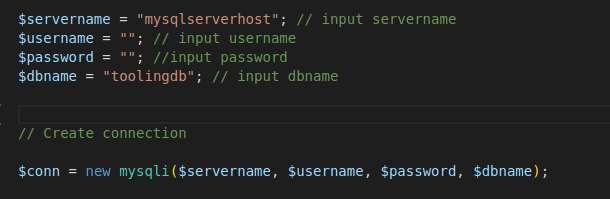

# MIGRATION TO THE СLOUD WITH CONTAINERIZATION: DOCKER & DOCKER COMPOSE

1. create a network

```sudo docker network create --subnet=10.18.0.0/24 tooling_app_network```

2. create an environment variable to store the root password

```export MYSQL_PW=root```

3. verify the environment variable is created

```echo $MYSQL_PW```


4. pull the image and run the container, all in one command:

```
docker run --network tooling_app_network -h mysqlserverhost --name=mysql-server -e MYSQL_ROOT_PASSWORD=$MYSQL_PW  -d mysql/mysql-server:latest 
```


5. Verify the container is running:
   
```docker ps -a```


6. Create a file and name it **create_user.sql** and add the below code in the file:

```CREATE USER ''@'%' IDENTIFIED BY ''; GRANT ALL PRIVILEGES ON * . * TO ''@'%';```

7. Run the script below from the directory where *create_user.sql* file is located:

```sudo docker exec -i mysql-server mysql -uroot -p$MYSQL_PW < create_user.sql ```

8. Connect to MySQL server from a second container running the MySQL client utility:

Run the MySQL Client Container:

```sudo docker run --network tooling_app_network --name mysql-client -it --rm mysql mysql -h mysqlserverhost -u  -p ```


## Prepare database schema

9. Clone the Tooling-app repository:
   
```sudo git clone https://github.com/darey-devops/tooling.git```

10. On your terminal, export the location of the SQL file
    
``` export tooling_db_schema=/home/femmy/workspace/docker/tooling/html/tooling_db_schema.sql ```

*note: You can find the tooling_db_schema.sql in the tooling/html/tooling_db_schema.sql folder of cloned repo.*

11. Verify that the path is exported

``` echo $tooling_db_schema ```


12. create database and prepare the schema using the *tooling_db_schema.sql* script. With the docker exec command, you can execute a command in a running container.
 
``` sudo docker exec -i mysql-server mysql -u -p$MYSQL_PW < $tooling_db_schema ```


13. Update the **.env** file with connection details to the database
The .env file is a hidden file located in the path *tooling/html/.env* 

open the file with your favorite line editor

```sudo vi tooling/html/.env```

```
MYSQL_IP=mysqlserverhost
MYSQL_USER=username
MYSQL_PASS=client-secret-password
MYSQL_DBNAME=toolingdb
```

Flags used:

MYSQL_IP mysql ip address "leave as mysqlserverhost"
MYSQL_USER mysql username for user, export as environment variable
MYSQL_PASS mysql password for user, export as environment varaible
MYSQL_DBNAME mysql database name, "toolingdb"

14. update the **db_conn.php** file with connection details to the database. The file is located in the path *tooling/html/*.




## Containerization of Tooling App

The cloned repository has an already built *Dockerfile* for this purpose.

15. building your image: Ensure you are inside the "tooling" directory that has the *Dockerfile*, then execute the following command:

```sudo docker build -t tooling:0.0.1 . ```

In the above command, we specify a parameter -t, so that the image can be tagged tooling"0.0.1 - Also, you have to notice the . at the end. This is important as that tells Docker to locate the Dockerfile in the current directory you are running the command. Otherwise, you would need to specify the absolute path to the Dockerfile.

16.  Run your image to create container
    
``` sudo docker run --network tooling_app_network -p 8085:80 -it tooling:0.0.1 ```

17. Verify the container is running:
   
```docker ps -a```


18.  open your browser and type http://localhost:8085


