# MIGRATION TO THE СLOUD WITH CONTAINERIZATION: DOCKER & DOCKER COMPOSE

### Repository for this project: https://github.com/stlng1/tooling.git


1. create a network

```docker network create --subnet=10.18.0.0/24 tooling_app_network```

2. create an environment variable to store the root password

```export MYSQL_PW=root```

3. verify the environment variable is created

```echo $MYSQL_PW```

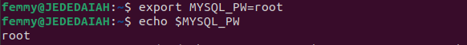

4. pull the image and run the container, all in one command:

```
docker run --network tooling_app_network -h mysqlserverhost --name=mysql-server -e MYSQL_ROOT_PASSWORD=$MYSQL_PW  -d mysql/mysql-server:latest 
```

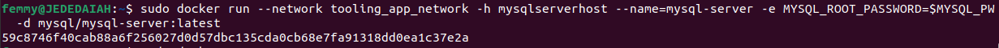

5. Verify the container is running:
   
```docker ps -a```

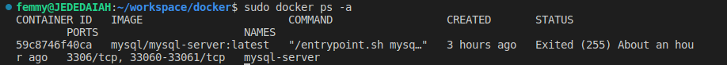

6. Create a file and name it **create_user.sql** and add the below code in the file:

```CREATE USER ''@'%' IDENTIFIED BY ''; GRANT ALL PRIVILEGES ON * . * TO ''@'%';```

7. Run the script below from the directory where *create_user.sql* file is located to create new user and assign priviledges:

```docker exec -i mysql-server mysql -uroot -p$MYSQL_PW<create_user.sql```

8. Connect to MySQL server from a second container running the MySQL client utility:

Run the MySQL Client Container:

```docker run --network tooling_app_network --name mysql-client -it --rm mysql mysql -h mysqlserverhost -u  -p ```

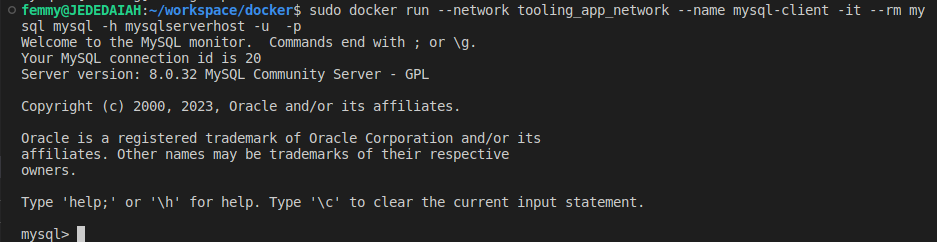

## Prepare database schema

9. Clone the Tooling-app repository:
   
```sudo git clone https://github.com/darey-devops/tooling.git```

10. On your terminal, export the location of the SQL file
    
```
export tooling_db_schema=<PATH>/tooling/html/tooling_db_schema.sql
```
 *export tooling_db_schema=/home/femmy/workspace/tooling/html/tooling_db_schema.sql*


note: You can find the tooling_db_schema.sql in the tooling/html/tooling_db_schema.sql folder of cloned repo.

11. Verify that the path is exported

``` echo $tooling_db_schema ```

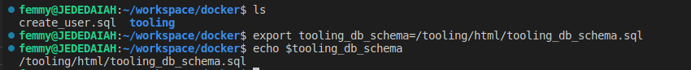

12. create database and prepare the schema using the *tooling_db_schema.sql* script. With the docker exec command, you can execute a command in a running container.
 
``` docker exec -i mysql-server mysql -u -p$MYSQL_PW < $tooling_db_schema ```


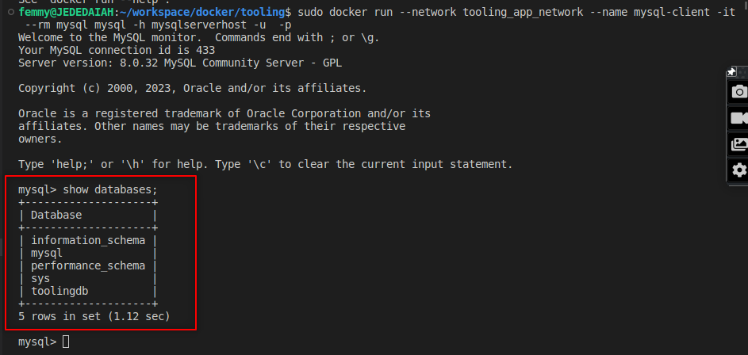

13. Create and Update the **.env** file with connection details to the database
    
The .env file is a hidden file located in the path *tooling/html/.env* 

open the file with your favorite line editor

```sudo vi tooling/html/.env```

```
MYSQL_IP=mysqlserverhost
MYSQL_USER=
MYSQL_PASS=
MYSQL_DBNAME=toolingdb
```

Flags used:

MYSQL_IP mysql ip address "leave as mysqlserverhost"
MYSQL_USER mysql username for user, export as environment variable
MYSQL_PASS mysql password for user, export as environment varaible
MYSQL_DBNAME mysql database name, "toolingdb"


## Containerization of Tooling App

The cloned repository has an already built *Dockerfile* for this purpose.

14. building your image: Ensure you are inside the "tooling" directory that has the *Dockerfile*, then execute the following command:

```docker build -t tooling:0.0.1 . ```

In the above command, we specify a parameter -t, so that the image can be tagged tooling:0.0.1 - Also, you have to notice the . at the end. This is important as that tells Docker to locate the Dockerfile in the current directory you are running the command. Otherwise, you would need to specify the absolute path to the Dockerfile.

15.  Run your image to create container with the command below..
    
``` docker run --network tooling_app_network --env-file ./html/.env -p 8085:80 -it tooling:0.0.1 ```

*note: this command should be run from the directory containing the Dockerfile.*

16. Verify the container is running:
   
```docker ps -a```

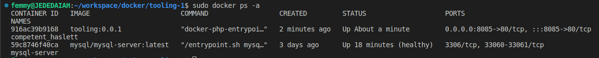

17.  open your browser and type http://localhost:8085

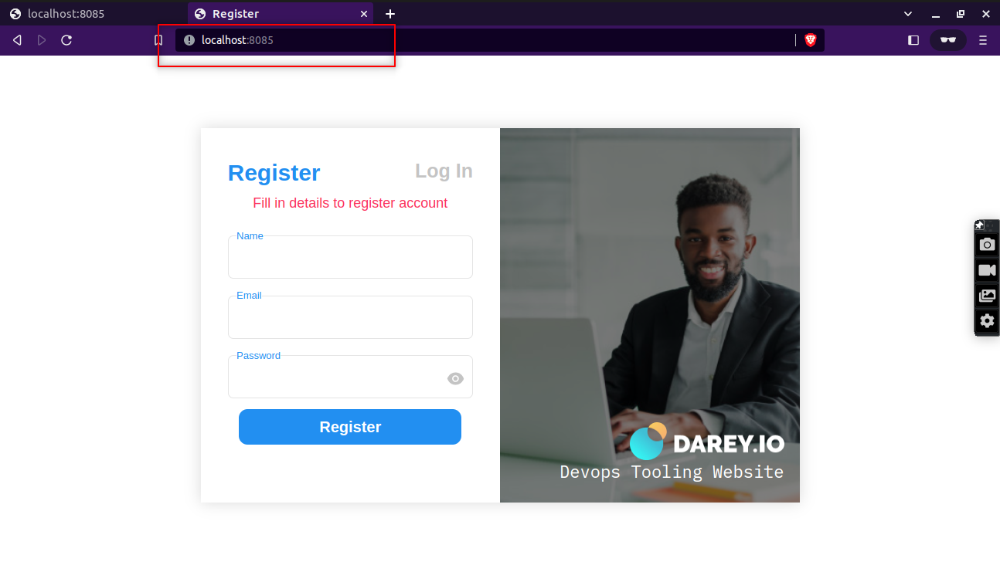


# PRACTICE TASK

# Practice Task №1 – Implement a POC to migrate the PHP-Todo app into a containerized application.

Repository for this task: https://github.com/stlng1/php-todo.git

## **Part 1**

**1. Write a Dockerfile for the TODO app**

```
Dockerfile:

FROM php:7.4 as php

RUN apt-get update -y
RUN apt-get install -y unzip libpq-dev libcurl4-gnutls-dev
RUN docker-php-ext-install pdo pdo_mysql bcmath

RUN pecl install -o -f redis \
    && rm -rf /tmp/pear \
    && docker-php-ext-enable redis

# WORKDIR /var/www
# COPY . .
COPY --from=composer:2.3.5 /usr/bin/composer /usr/bin/composer

ENV PORT=8000

WORKDIR /var/www
COPY . .
RUN chmod +x /var/www/entrypoint.sh
ENTRYPOINT [ "/var/www/entrypoint.sh" ]

```

```
entrypoint.sh:

#!/bin/bash

if [ ! -f "vendor/autoload.php" ]; then
    composer install --no-progress --no-interaction
fi

if [ ! -f ".env" ]; then
    echo "Creating env file for env $APP_ENV"
    cp .env.example .env
else
    echo "env file exists."
fi

role=${CONTAINER_ROLE:-app}

if [ "$role" = "app" ]; then
    php artisan migrate
    php artisan key:generate
    php artisan cache:clear
    php artisan config:clear
    php artisan route:clear
    php artisan serve --port=$PORT --host=0.0.0.0 --env=.env
    exec docker-php-entrypoint "$@"
fi

```

**2. Run both database and app on your laptop Docker Engine**

- **database:** for this task we create new database - homestead on the exhisting mysql server created earlier.

  a. Create a file and name it **create_user2.sql** and add the below code in the file: This code will create a new user -homestead and a new database -homestead.

```CREATE USER 'homestead'@'%' IDENTIFIED BY 'sePret^i'; GRANT ALL PRIVILEGES ON * . * TO 'homestead'@'%'; CREATE DATABASE homestead; FLUSH PRIVILEGES;```

  b. Run the script below from the directory where *create_user2.sql* file is located to create new user and assign priviledges:

```sudo docker exec -i mysql-server mysql -uroot -p$MYSQL_PW < create_user2.sql```

  c. connect to MySQL server from a second container running the MySQL client utility:

```sudo docker run --network tooling_app_network --name mysql-client -it --rm mysql mysql -h mysqlserverhost -u homestead  -p```

  d. display databases

  ```SHOW DATABASES;```

  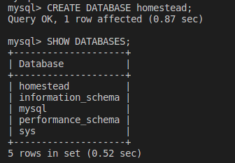

  **- app:** build php-todo app image and run in docker container
    
  e. build image using the following command. run from inside php-todo directory.

```sudo docker build -t php-todo:0.0.1 .```

  f. create **.env** file from **.env.sample** file and update values as shown below:

  ```cp .env.sample .env```
  
  ```
  APP_ENV=local
  APP_DEBUG=true
  APP_KEY=SomeRandomString
  APP_URL=http://localhost

  DB_HOST=mysqlserverhost
  DB_DATABASE=homestead
  DB_USERNAME=homestead
  DB_PASSWORD="sePret^i"

  CACHE_DRIVER=file
  SESSION_DRIVER=file
  QUEUE_DRIVER=sync

  REDIS_HOST=127.0.0.1
  REDIS_PASSWORD=null
  REDIS_PORT=6379

  MAIL_DRIVER=smtp
  MAIL_HOST=mailtrap.io
  MAIL_PORT=2525
  MAIL_USERNAME=null
  MAIL_PASSWORD=null
  MAIL_ENCRYPTION=null
  ```
  
  g. create *webserver* container

```sudo docker run -d --network tooling_app_network --name webserver --env-file .env -p 8085:8000 -it php-todo:0.0.1```

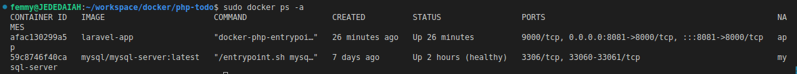


**3. Access the application from the browser**

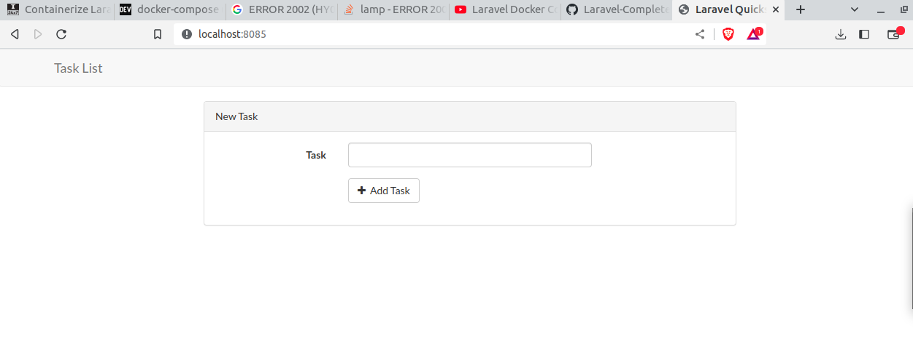


# Part 2

1. Create an account in Docker Hub

2. Create a new Docker Hub repository

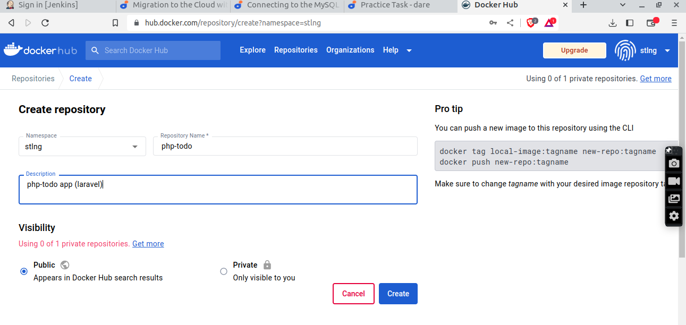

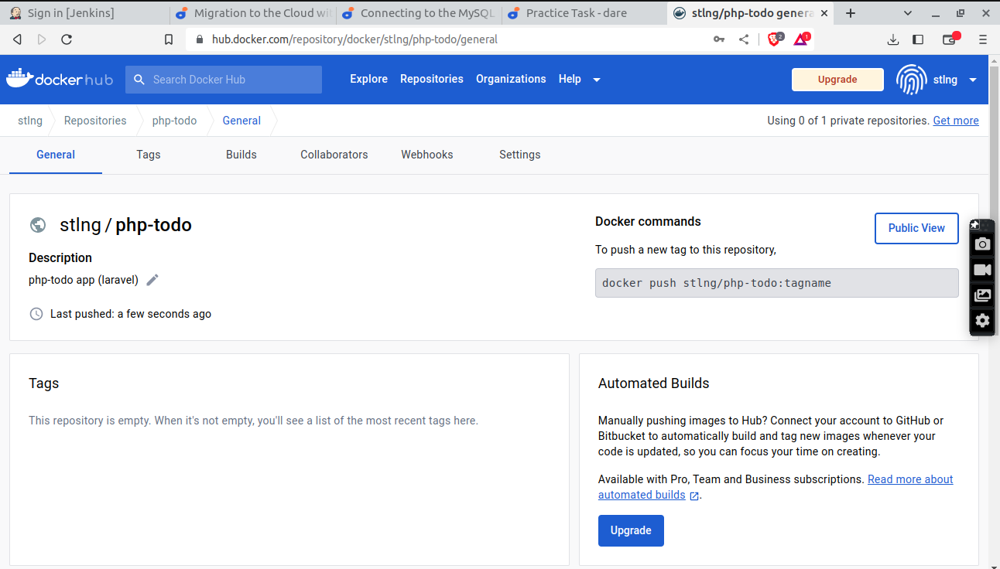

3. Push the docker images from your PC to the repository

- list available images on your local system and identify the image to be pushed to docker hub

```sudo docker image ls```

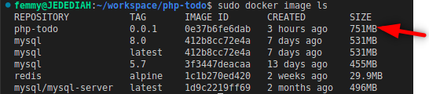

- tag the image to be pushed to docker hub 

```sudo docker tag php-todo:0.0.1 stlng/php-todo```

- see the latest image tagged

```sudo docker image ls```

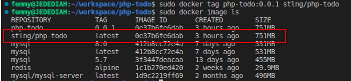

- login to docker hub with the command below. you will be promted for username and password

```sudo docker login```

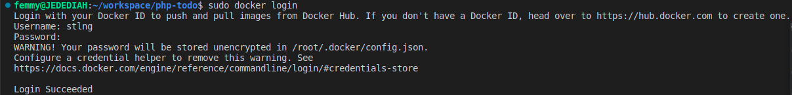

- push tagged image to dockerhub repository

```sudo docker push stlng/php-todo:latest```

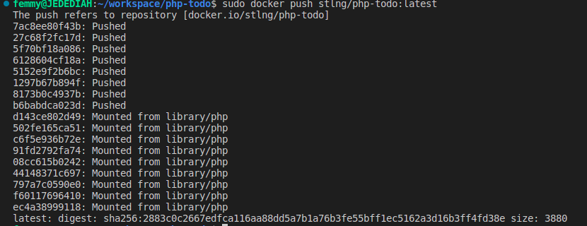

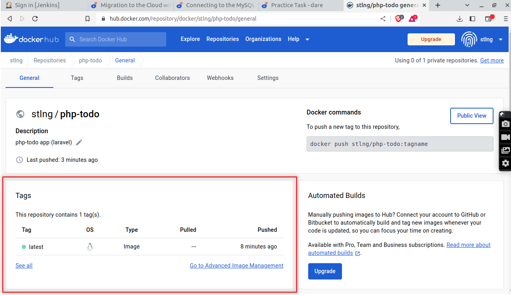

## **Part 3**

1. Write a Jenkinsfile that will simulate a Docker Build and a Docker Push to the registry

```
pipeline {
  agent any
  options {
    buildDiscarder(logRotator(numToKeepStr: '5'))
  }
  environment {
    DOCKERHUB_CREDENTIALS = credentials('dockerhub')
  }
  stages {
    stage('Build image for php-todo-app') {
      steps {
        sh 'docker build -t stlng/php-todo-master:0.0.1 .'
      }
    }
    stage('Login to docker hub') {
      steps {
        sh 'echo $DOCKERHUB_CREDENTIALS_PSW | docker login -u $DOCKERHUB_CREDENTIALS_USR --password-stdin'
      }
    }
    stage('Push docker image to docker hub registry') {
      steps {
        sh 'docker push stlng/php-todo-master:0.0.1'
      }
    }
  }
  post {
    always {
      sh 'docker logout'
    }
  }
}
```

2. Connect your repo to Jenkins

- go to docker hub and follow the illustrations below:

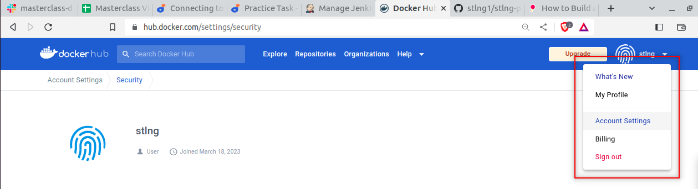

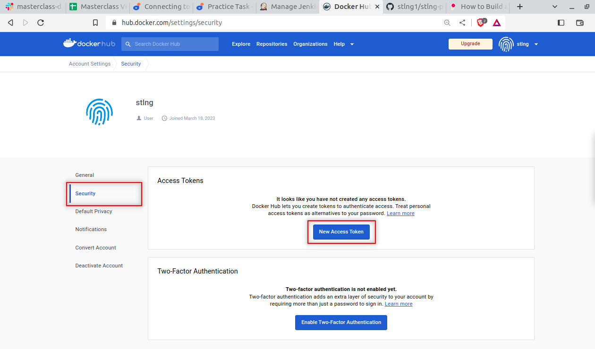

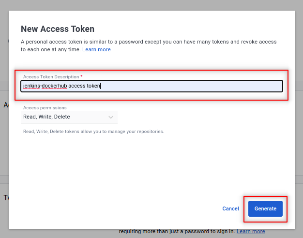

- copy the access token generated, got to Jenkins, open **Dashboard > Manage Jenkins > Credentials > System > Global credentials (unrestricted)**
follow the diagrams below to create credential for docker hub. Paste the access token copied from docker hub as password:

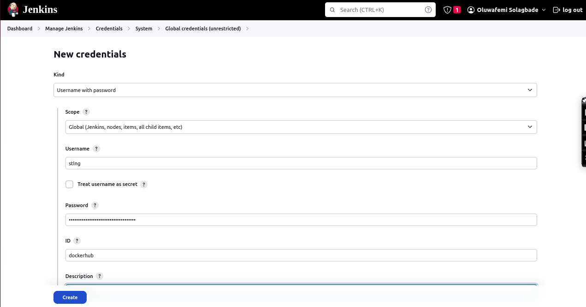

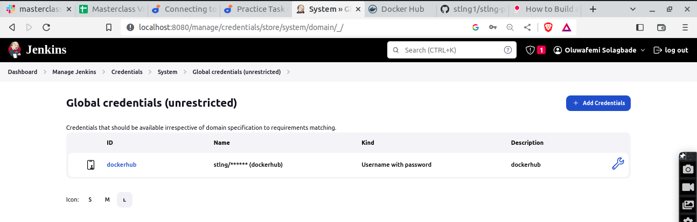

- create another credential for github following the same process. use your github username and password this time, and the the ID section blank. Jenkins will automatically generate the ID when you create it.

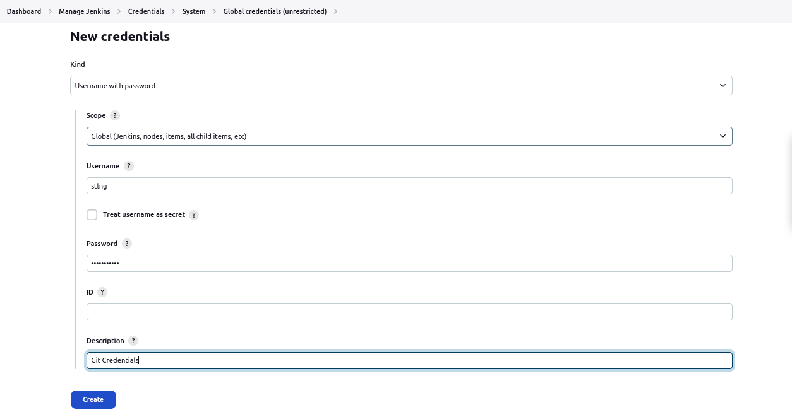

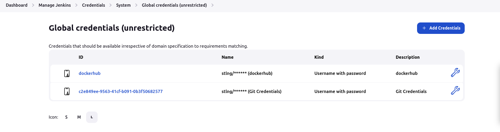

3. update images from Jenkinsfile have a prefix that suggests which branch the image was pushed from. For master branch, we have php-todo-master:0.0.1 while for features branch, we have php-todo-features:0.0.1. Push branches to github after updating.

4. Create a multi-branch pipeline

- Go back to the Jenkins dashboard and click **Create a job**

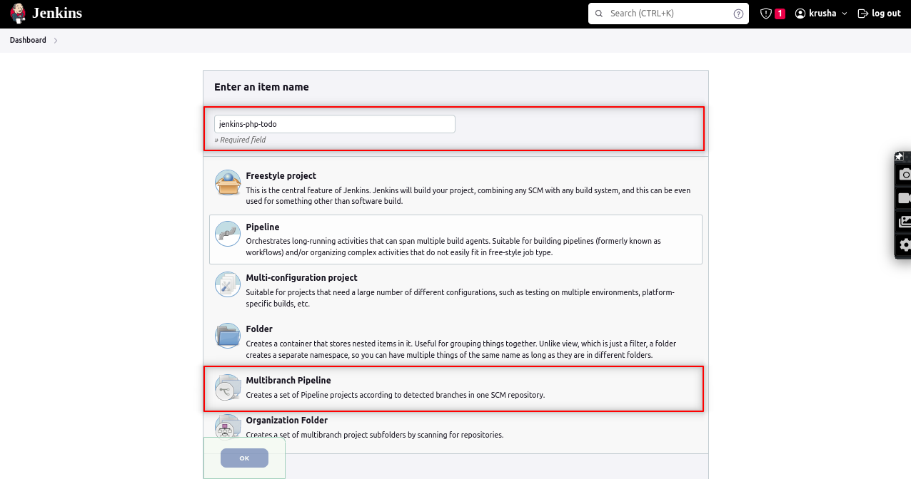

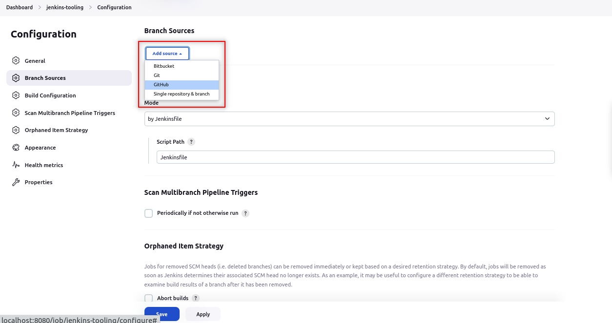

copy git url from you github repository

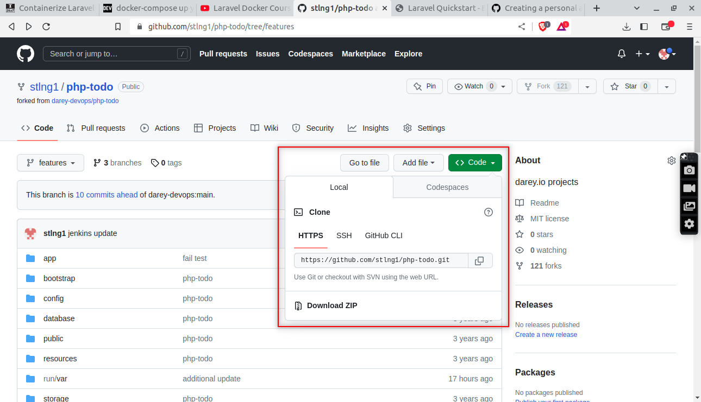

back to jenkins, select credential and paste *git url* and *validate*

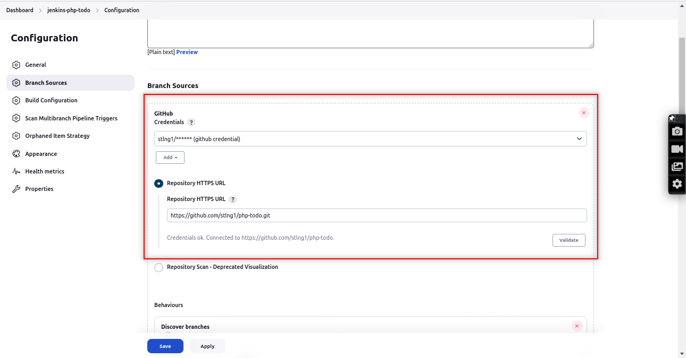

As soon as you save the configuration, jenkins starts scanning the repository until it finds a *Jenkinsfiles* as shown below

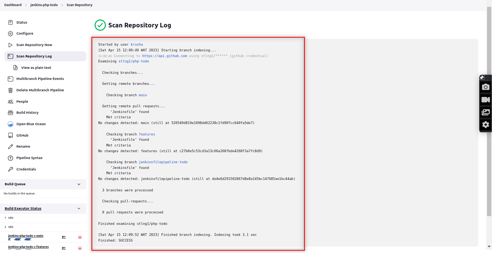

5. Simulate a CI pipeline from a features and master branch using previously created Jenkinsfile

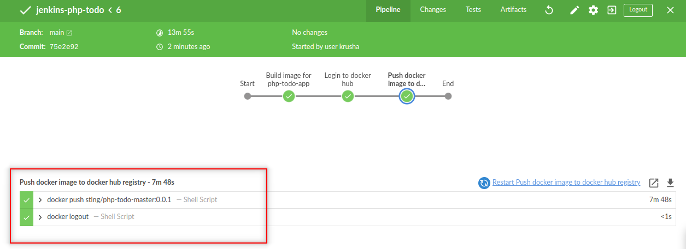


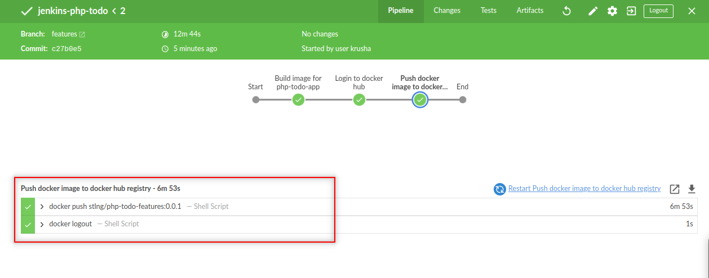


6. Verify that the images pushed from the CI can be found at the registry.

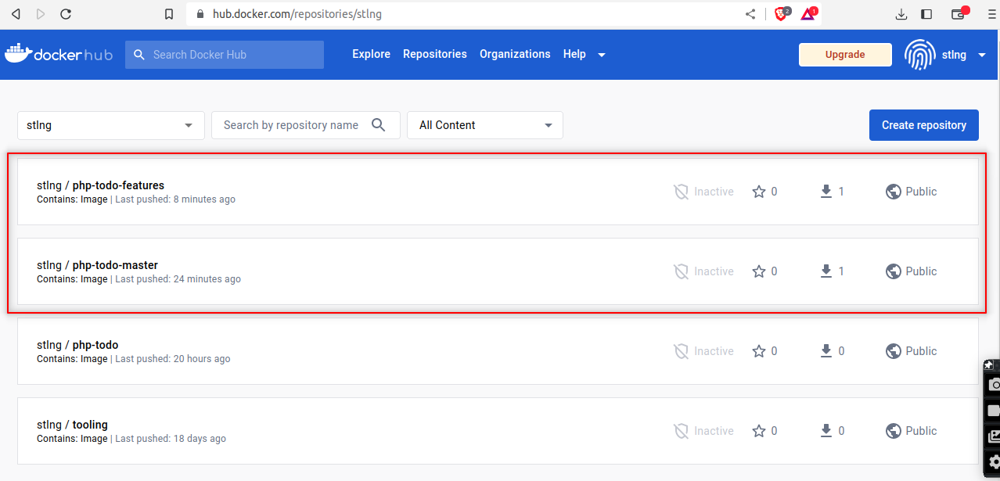


# Deployment with Docker Compose

1. create **tooling.yml** file and paste the codes below:
   
```
version: "3.9"
services:
  tooling_frontend:
    build: .
    ports:
      - "5000:80"
    volumes:
      - tooling_frontend:/var/www/html
    links:
      - db
  db:
    image: mysql:5.7
    restart: always
    environment:
      MYSQL_DATABASE: '${MYSQL_DBNAME}'
      MYSQL_USER: '${MYSQL_USER}'
      MYSQL_PASSWORD: '${MYSQL_PASS}'
      MYSQL_RANDOM_ROOT_PASSWORD: '1'
    volumes:
      - db:/var/lib/mysql
volumes:
  tooling_frontend:
  db:
  ```

2. create containers by running the command below:
   
   ```docker compose -f tooling.yml  up -d ```

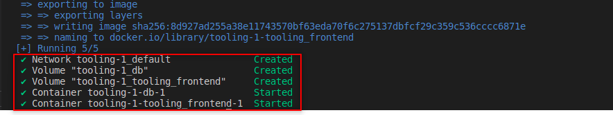

3. Verify that the compose is in the running status:

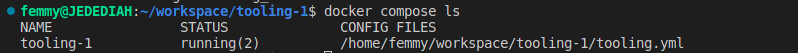


# Practice Task №2 – Complete Continuous Integration With A Test Stage

1. Document your understanding of all the fields specified in the Docker Compose file tooling.yml
2. Update your Jenkinsfile with a test stage before pushing the image to the registry.
3. What you will be testing here is to ensure that the tooling site http endpoint is able to return status code 200. Any other code will be determined a stage failure.
4. Implement a similar pipeline for the PHP-todo app.
5. Ensure that both pipelines have a clean-up stage where all the images are deleted on the Jenkins server.