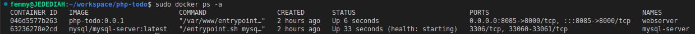

# MIGRATION TO THE СLOUD WITH CONTAINERIZATION: DOCKER & DOCKER COMPOSE

### Repository for this project: https://github.com/stlng1/tooling.git


1. create a network

```sudo docker network create --subnet=10.18.0.0/24 tooling_app_network```

2. create an environment variable to store the root password

```export MYSQL_PW=root```

3. verify the environment variable is created

```echo $MYSQL_PW```


4. pull the image and run the container, all in one command:

```
docker run --network tooling_app_network -h mysqlserverhost --name=mysql-server -e MYSQL_ROOT_PASSWORD=$MYSQL_PW  -d mysql/mysql-server:latest 
```


5. Verify the container is running:
   
```docker ps -a```


6. Create a file and name it **create_user.sql** and add the below code in the file:

```CREATE USER ''@'%' IDENTIFIED BY ''; GRANT ALL PRIVILEGES ON * . * TO ''@'%';```

7. Run the script below from the directory where *create_user.sql* file is located:

```sudo docker exec -i mysql-server mysql -uroot -p$MYSQL_PW < ./create_user.sql ```

8. Connect to MySQL server from a second container running the MySQL client utility:

Run the MySQL Client Container:

```sudo docker run --network tooling_app_network --name mysql-client -it --rm mysql mysql -h mysqlserverhost -u  -p ```


## Prepare database schema

9. Clone the Tooling-app repository:
   
```sudo git clone https://github.com/darey-devops/tooling.git```

10. On your terminal, export the location of the SQL file
    
``` export tooling_db_schema=./home/femmy/workspace/docker/tooling/html/tooling_db_schema.sql ```

*note: You can find the tooling_db_schema.sql in the tooling/html/tooling_db_schema.sql folder of cloned repo.*

11. Verify that the path is exported

``` echo $tooling_db_schema ```


12. create database and prepare the schema using the *tooling_db_schema.sql* script. With the docker exec command, you can execute a command in a running container.
 
``` sudo docker exec -i mysql-server mysql -u -p$MYSQL_PW < $tooling_db_schema ```


13. Update the **.env** file with connection details to the database
    
The .env file is a hidden file located in the path *tooling/html/.env* 

open the file with your favorite line editor

```sudo vi tooling/html/.env```

```
MYSQL_IP=mysqlserverhost
MYSQL_USER=
MYSQL_PASS=
MYSQL_DBNAME=toolingdb
```

Flags used:

MYSQL_IP mysql ip address "leave as mysqlserverhost"
MYSQL_USER mysql username for user, export as environment variable
MYSQL_PASS mysql password for user, export as environment varaible
MYSQL_DBNAME mysql database name, "toolingdb"


## Containerization of Tooling App

The cloned repository has an already built *Dockerfile* for this purpose.

14. building your image: Ensure you are inside the "tooling" directory that has the *Dockerfile*, then execute the following command:

```sudo docker build -t tooling:0.0.1 . ```

In the above command, we specify a parameter -t, so that the image can be tagged tooling"0.0.1 - Also, you have to notice the . at the end. This is important as that tells Docker to locate the Dockerfile in the current directory you are running the command. Otherwise, you would need to specify the absolute path to the Dockerfile.

15.  Run your image to create container with the command below..
    
``` sudo docker run --network tooling_app_network --env-file ./html/.env -p 8085:80 -it tooling:0.0.1 ```

*note: this command should be run from the directory containing the Dockerfile.*

16. Verify the container is running:
   
```docker ps -a```


17.  open your browser and type http://localhost:8085


# PRACTICE TASK

## Practice Task №1 – Implement a POC to migrate the PHP-Todo app into a containerized application.

### Repository for this task: https://github.com/stlng1/php-todo.git

## **Part 1**

1. Write a Dockerfile for the TODO app

```
FROM php:7-fpm-alpine3.16

# environment variable defining default port
ENV PORT=8000

# define the working directory for any subsequent commands on the container
WORKDIR /var/www/


RUN apk update 

# composer is required to download app dependencies. here we download and install composer
RUN curl -sS https://getcomposer.org/installer | php -- --version=2.4.3 --install-dir=/usr/local/bin --filename=composer

# copy all the files from the host's current directory into the container working directory
COPY . .

# install the app dependencies with composer
RUN composer install --ignore-platform-reqs

# ensures that the web server listens to all available IP addresses, 
# which is required for Docker to map a port on the host into the container
CMD ["php","artisan","serve","--host=0.0.0.0"]
```

2. Run both database and app on your laptop Docker Engine

- for this task we same mysql database created earlier - mysql-server

- build php-todo image using the following command. run from inside php-todo directory.

```sudo docker build -t laravel-app .```

- create todo-app container

```sudo docker run -d --network tooling_app_network --name webserver -p 8085:8000 -it laravel-app```



3. Access the application from the browser


## **Part 2**

1. Create an account in Docker Hub

2. Create a new Docker Hub repository


3. Push the docker images from your PC to the repository

- list available images on your local system and identify the image to be pushed to docker hub

```sudo docker image ls```


- tag the image to be pushed to docker hub 

```sudo docker tag tooling:0.0.1 stlng/tooling```

- see the latest image tagged

```sudo docker image ls```


- login to docker hub with the command below. you will be promted for username and password

```sudo docker login```


- push tagged image to dockerhub repository

```sudo docker push stlng/tooling:latest```


## **Part 3**

1. Write a Jenkinsfile that will simulate a Docker Build and a Docker Push to the registry

```
pipeline {
  agent any
  options {
    buildDiscarder(logRotator(numToKeepStr: '5'))
  }
  environment {
    DOCKERHUB_CREDENTIALS = credentials('dockerhub')
  }
  stages {
    stage('Build image for toolng-app') {
      steps {
        sh 'docker build -t stlng/tooling-feature:0.0.1 .'
      }
    }
    stage('Login to docker hub') {
      steps {
        sh 'echo $DOCKERHUB_CREDENTIALS_PSW | docker login -u $DOCKERHUB_CREDENTIALS_USR --password-stdin'
      }
    }
    stage('Push docker image to docker hub registry') {
      steps {
        sh 'docker push stlng/tooling-feature:0.0.1'
      }
    }
  }
  post {
    always {
      sh 'docker logout'
    }
  }
}
```

2. Connect your repo to Jenkins

- go to docker hub and follow the illustrations below:


- copy the access token generated, got to Jenkins, open **Dashboard > Manage Jenkins > Credentials > System > Global credentials (unrestricted)**
follow the diagrams below to create credential for docker hub. Paste the access token copied from docker hub as password:


- create another credential for github following the same process. use your github username and password this time, and the the ID section blank. Jenkins will automatically generate the ID when you create it.


3. update images from Jenkinsfile have a prefix that suggests which branch the image was pushed from. For master branch, we have tooling-master:0.0.1 while for feature branch, we have tooling-feature:0.0.1. Push branches to github after updating.

4. Create a multi-branch pipeline

- Go back to the Jenkins dashboard and click **Create a job**


copy git url from you github repository


back to jenkins, select credential and paste *git url* and *validate*


As soon as you save the configuration, jenkins starts scanning the repository until it finds a *Jenkinsfiles* as shown below


5. Simulate a CI pipeline from a feature and master branch using previously created Jenkinsfile


6. Verify that the images pushed from the CI can be found at the registry.


. 
11. create nginx Dockerfile and create server image. Change to nginx directory and run the following command from there.

```sudo docker build -t nginx-webserver .```

2. back to php-todo directory. create *create_database.sql* file

vi create_database.sql

paste the following code in it save and exit

CREATE DATABASE todo_db;

3.  Run the script below from the directory where *create_database.sql* file is located to create todo_db database:

```sudo docker exec -i mysql-server mysql -uroot -p$MYSQL_PW < ./create_database.sql ```

4. build nginx image. run from inside nginx sub directory.
 
```sudo docker build -t nginx-todo:0.0.1 .```

5. build php-todo image using the following command. run from inside php-todo directory.

```sudo docker build -t php-todo:0.0.1 .```

6. create php-todo container

```sudo docker run --network tooling_app_network --name app --env-file ./.env -it php-todo:0.0.1 ```

7. create nginx-todo container

```sudo docker run --network tooling_app_network --name webserver -p 8085:80 -it nginx-todo:0.0.1```
