# Setup github ACTIONS PIPELINE FOR  DEPLOYING KUBERNETES CLUSTERS

## Objectives

Deploy monolith website in aws hosted elastic kubernetes service -eks in the following steps:

1. create docker image of monolith website and push to dockerhub repository.

2. package monolith website in chart for kubernetes release using helm package manager and store in aws s3 repository.

3. deploy to aws eks


For this project, refer to this repository - https://github.com/stlng1/liveclass-pipeline-walkthrough


1. create new *liveclass-pipeline-walkthrough* repo on github

2. clone repo to vscode


3. create **.github** hidden folder in repo


4. create **workflows** folder in the .github folder. This is where you have your yaml files stored.


## Create Docker build and push images pipeline
---

5. copy **html** folder containing *monolith-website* codes into repo root folder.

6. create *Dockerfile* with the codes below to build monolith-website image in repo root folder


```
# Use the official Nginx image as the base image
FROM nginx

# Copy the HTML files and assets to the Nginx default HTML directory
COPY html /usr/share/nginx/html

# Expose port 80 for Nginx
EXPOSE 80

# Start Nginx when the container is run. The daemon off configuration option is used to run Nginx in the 
# foreground instead of as a background daemon process. By setting daemon off, Nginx will start as the main 
# process within the Docker container and stay in the foreground, which allows the container to remain 
# running and prevents it from exiting immediately

CMD ["nginx", "-g", "daemon off;"]
```

7. update environment secret (dockerhub login details) on github 

**actions --> settings --> secrets and variables --> actions **

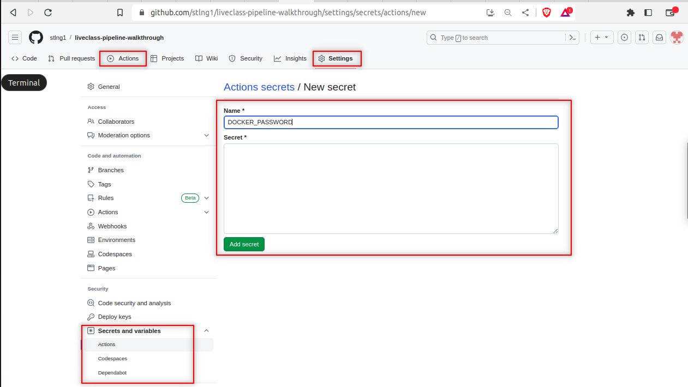

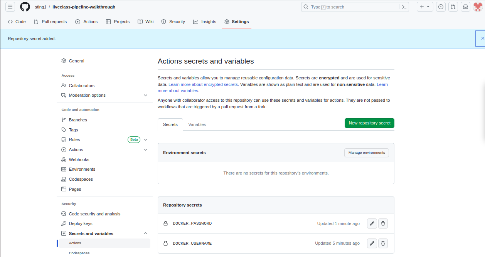

8. create git actions pipeline, *build_and_push_images.yaml* file in the *workflows* folder to create the docker image, and push to dockerhub using the codes below.

```
name: Build and Push Docker Images

# Trigger events https://docs.github.com/en/actions/using-workflows/triggering-a-workflow
on:
  push:
    branches:
      - main
  pull_request:
    branches: [ "main" ]

env:
  DOCKER_USERNAME: ${{ secrets.DOCKER_USERNAME }}
  DOCKER_PASSWORD: ${{ secrets.DOCKER_PASSWORD }}
  appVersion: 1.0.0

jobs:
  build-and-push:
    runs-on: ubuntu-latest

# Actions from the GitHub Marketplace are pre-built, reusable components that you can use in your GitHub Actions workflows. They are created and shared by the community and provide specific functionality to automate different tasks in your software development workflows.
#  https://github.com/marketplace?type=actions.
    steps:
      - name: Checkout repository
        uses: actions/checkout@v3

# https://github.com/marketplace/actions/docker-login
      - name: Login to Docker Hub
        uses: docker/login-action@v2
        with:
          username: ${{ env.DOCKER_USERNAME }}
          password: ${{ env.DOCKER_PASSWORD }}

      - name: Build and push monolith Docker image
        run: |
          docker build -t stlng/monolith-app:${{ env.appVersion }} .
          docker push stlng/monolith-app:${{ env.appVersion }}
```

9. commit and push codes to trigger the PIPELINE

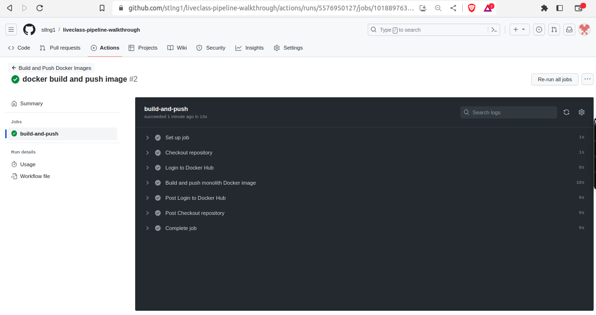

## Publish Helm Chart
---

1. create helm folder in repo root folder

```
mkdir helm && cd helm
```

2. create helm chart directory along with the common files and directories used in a chart. 

```
helm create monolith-website
```

For this project aws s3 will be used as helm repository. The following steps will configure s3 as helm repo.
   
**Create IAM user with a custom policy**

3. create an IAM user for uploading charts to helm s3 repository
   
4. update environment secret (IAM Access_Key and Secret) on github.

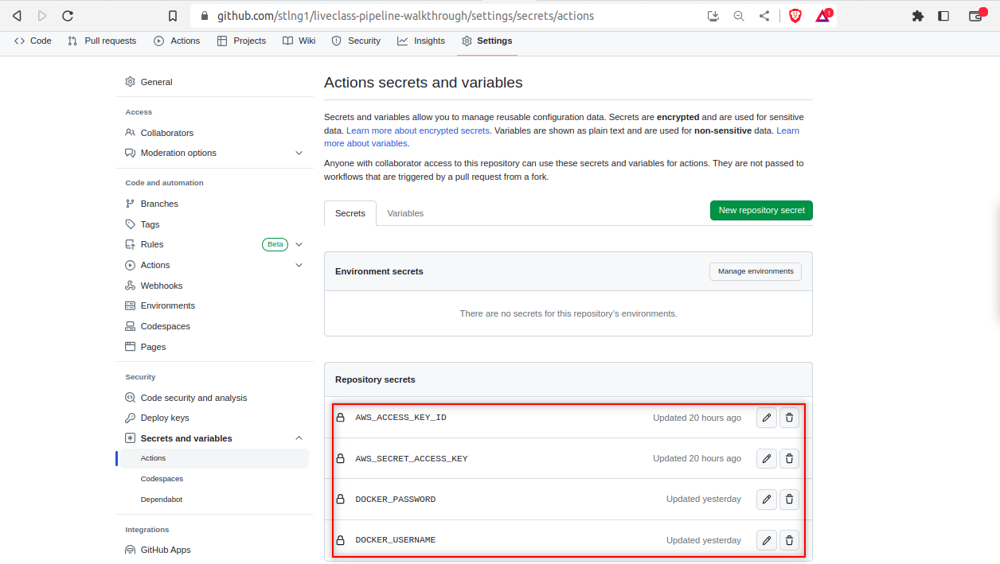
   
**Create S3 Bucket**

5. create aws s3 bucket (from console or terraform)

```
aws s3api create-bucket --bucket strange-liveclass-helm-repo --region eu-west-3 --create-bucket-configuration LocationConstraint=eu-west-3
```

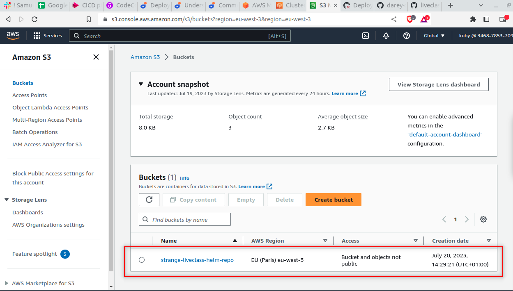


6.  Create helm release pipeline

create *dynamic_deploy_helm_release.yaml* file in workflows folder with the codes below to automate the dynamic helm release pipeline.

```
name: Publish Helm Chart (Dynamic version)

on:
  workflow_run:
    workflows:
      - "Build and Push Docker Images"
    types:
      - completed

jobs:
  publish:
    runs-on: ubuntu-latest

    env:
      AWS_ACCESS_KEY_ID: ${{ secrets.AWS_ACCESS_KEY_ID }}
      AWS_SECRET_ACCESS_KEY: ${{ secrets.AWS_SECRET_ACCESS_KEY }}
      AWS_DEFAULT_REGION: "eu-west-3"
      S3_BUCKET_NAME: strange-liveclass-helm-repo

    steps:
      - name: Checkout code
        uses: actions/checkout@v2

      - name: Configure AWS credentials
        uses: aws-actions/configure-aws-credentials@v1
        with:
          aws-access-key-id: ${{ secrets.AWS_ACCESS_KEY_ID }}
          aws-secret-access-key: ${{ secrets.AWS_SECRET_ACCESS_KEY }}
          aws-region: ${{ env.AWS_DEFAULT_REGION }}

      - name: Package Helm Chart
        run: |
            cd helm
            rm -f *.tgz
            helm package monolith-website

# The command ::set-output name=path::$(find helm -name '*.tgz') is not a standard bash command. It's a syntax used in GitHub Actions workflows to set an output value for use in subsequent steps.
# The syntax ::set-output name=<name>::<value> is used to set the value of an output variable.
# In the specific example you mentioned, the command ::set-output name=path::$(find helm -name '*.tgz') sets the output variable named path to the result of the find command, which searches for files with the .tgz extension in the helm directory.
# This syntax is specific to GitHub Actions workflows and cannot be directly used in a regular bash shell.

      - name: Determine Helm Chart TGZ Path
        id: helm-chart-path
        run: echo "::set-output name=helmchart_tgz_path::$(find helm -name '*.tgz')"

      - name: Retrieve Helm Chart Filename
        id: helm-chart-filename
        run: echo "::set-output name=helmchart_tgz_file::$(basename ${{ steps.helm-chart-path.outputs.helmchart_tgz_path }})"

      - name: Upload Helm Chart to S3
        run: aws s3 cp ${{ steps.helm-chart-path.outputs.helmchart_tgz_path }} s3://${{ env.S3_BUCKET_NAME }}/${{ steps.helm-chart-filename.outputs.helmchart_tgz_file }}

      - name: Generate or Update Helm Chart Index
        run: helm repo index --url s3://${{ env.S3_BUCKET_NAME }}/charts/ .

      - name: Upload Index.yaml to S3
        run: aws s3 cp index.yaml s3://${{ env.S3_BUCKET_NAME }}/charts/index.yaml

      - name: Install the Helm S3 plugin
        run: helm plugin install https://github.com/hypnoglow/helm-s3.git

      - name: Configure Helm Repository
        run: helm repo add monolith-website s3://${{ env.S3_BUCKET_NAME }}/charts

      - name: Push Helm Chart to S3 Repository
        run: helm s3 push --force ${{ steps.helm-chart-path.outputs.helmchart_tgz_path }} monolith-website
```

## Create AWS EKS cluster
---

**eksctl** is a simple CLI tool for creating and managing clusters on EKS - Amazon's managed Kubernetes service for EC2.

1. Download and extract the latest release of eksctl on your local machine:

```
curl --silent --location "https://github.com/weaveworks/eksctl/releases/latest/download/eksctl_$(uname -s)_amd64.tar.gz" | tar xz -C /tmp
```


2. Move the extracted binary to /usr/local/bin:

```
sudo mv /tmp/eksctl /usr/local/bin
```

3. Test that your installation was successful with the following command:

```
eksctl version
```

4. Create *aws* folder in repo

```
mkdir aws && cd aws
```

5. copy codes below into *eks_cluster.yaml* file to be created in the aws folder. This yaml file contains configurations for creating eks cluster.

```
apiVersion: eksctl.io/v1alpha5
kind: ClusterConfig

metadata:
  name: nonprod-dev
  region: eu-west-3

nodeGroups:
  - name: monolith-node-groups
    instanceType: t2.micro
    desiredCapacity: 2
```

6. To create **nonprod-dev** eks cluster on aws cloud, run the following command from repo.

```
eksctl create cluster -f aws/eks_cluster.yaml
```

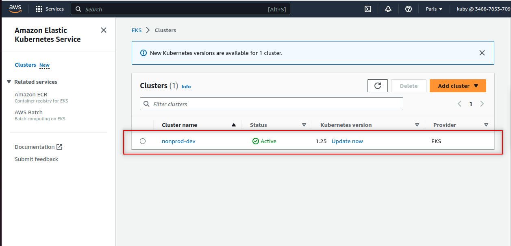


## Deploy to Amazon EKS
---

1. create git actions pipeline, *release_app_to_kubernetes.yaml* file in the *workflows* folder to release monolith-website into kubernetes cluster using the codes below.

```
name: Deploy to Amazon EKS

on:
  workflow_run:
    workflows:
      - "Publish Helm Chart (Dynamic version)"
    types:
      - completed
jobs:
  deploy:
    runs-on: ubuntu-latest

    env:
      AWS_ACCESS_KEY_ID: ${{ secrets.AWS_ACCESS_KEY_ID }}
      AWS_SECRET_ACCESS_KEY: ${{ secrets.AWS_SECRET_ACCESS_KEY }}
      AWS_REGION: eu-west-3
      EKS_CLUSTER_NAME: nonprod-dev
      S3_BUCKET_NAME: strange-liveclass-helm-repo
      K8S_NAMESPACE: liveclass
      ENV_STAGE: dev

    steps:
      - name: Checkout code
        uses: actions/checkout@v2

      - name: Configure AWS credentials
        uses: aws-actions/configure-aws-credentials@v1
        with:
          aws-access-key-id: ${{ secrets.AWS_ACCESS_KEY_ID }}
          aws-secret-access-key: ${{ secrets.AWS_SECRET_ACCESS_KEY }}
          aws-region: ${{ env.AWS_REGION }}

      - name: Install the Helm S3 plugin
        run: helm plugin install https://github.com/hypnoglow/helm-s3.git

      - name: Add Helm Repo
        run: helm repo add monolith-website s3://strange-liveclass-helm-repo/charts

      - name: Download the helm chart
        run: helm fetch monolith-website/monolith-website

      - name: Extract Helm Chart
        run: |
            tar -zxvf monolith-website-*.tgz

      - name: Update kubeconfig
        run: |
            aws eks update-kubeconfig --name ${{ env.EKS_CLUSTER_NAME }} --region ${{ env.AWS_REGION }}

      - name: Deploy website into K8s cluster
        run: |
            pwd
            ls -latr
            helm upgrade --install --create-namespace -n ${{ env.K8S_NAMESPACE }} -f helm/environments/${{ env.ENV_STAGE }}/values.yaml monolith-app monolith-website

      - name: Validate Deployment
        run: kubectl rollout status deployment/monolith-app-monolith-website --namespace ${{ env.K8S_NAMESPACE }}

```

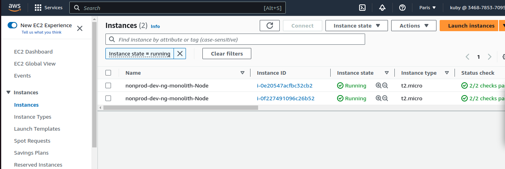


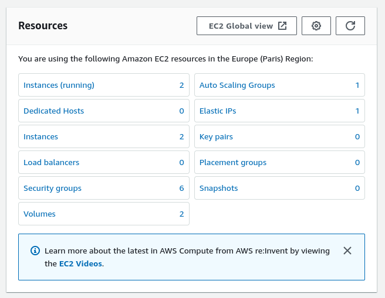


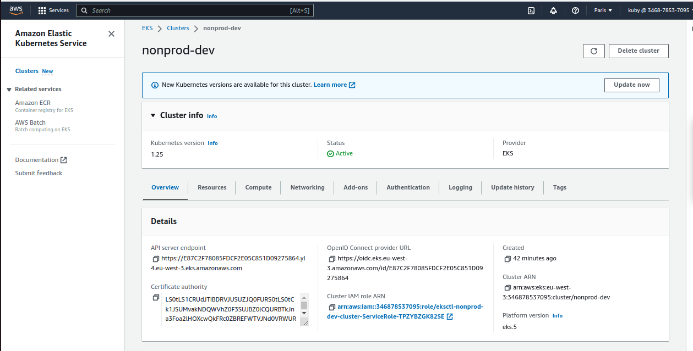


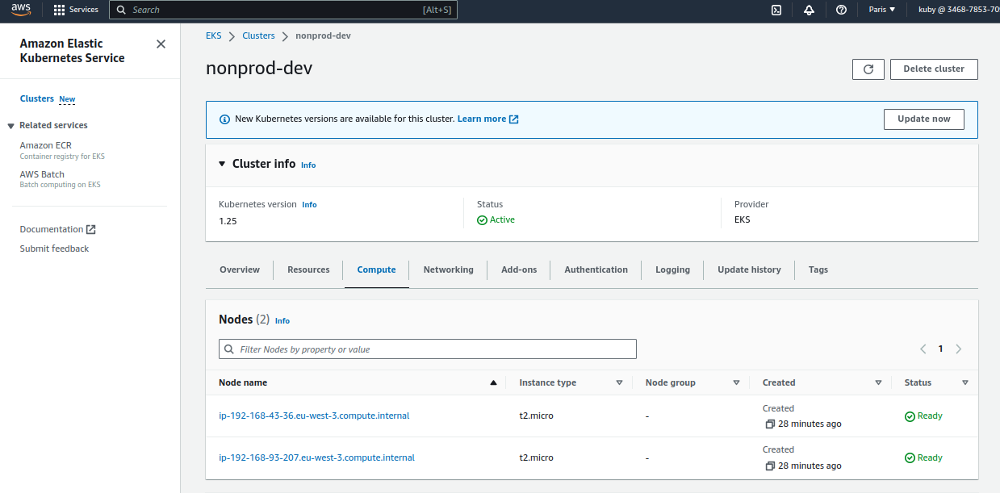


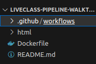