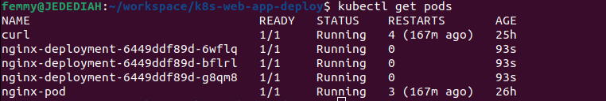

## Deploying Applications Into Kubernetes Cluster

**Project Repo:** https://github.com/stlng1/k8s-web-app-deploy.git


**Dependencies:**

a. make sure docker is installed and running

b. make sure minikube is installed and running.

## DEPLOYING APP TO CLUSTER

1. Create a Pod yaml manifest on your master node

```
sudo cat <<EOF | sudo tee ./nginx-pod.yaml
apiVersion: v1
kind: Pod
metadata:
  name: nginx-pod
spec:
  containers:
  - image: nginx:latest
    name: nginx-pod
    ports:
    - containerPort: 80
      protocol: TCP
EOF
```

2. Apply the manifest with the help of kubectl

```
kubectl apply -f nginx-pod.yaml
```


3. Get an output of the pods running in the cluster

```
kubectl get pods
```


1. To see other fields introduced by kubernetes after you have deployed the resource, simply run below command, and examine the output. -o simply means the output format.

```
kubectl get pod nginx-pod -o yaml 

or

kubectl describe pod nginx-pod
```

## ACCESSING THE APP FROM THE BROWSER

A service is an object that accepts requests on behalf of the Pods and forwards it to the Pod’s IP address, since there is no way to reach it directly from the outside world.

1. To see the Pod’s IP address, run the command below:  

```
kubectl get pod nginx-pod  -o wide 
```


Let us try to access the Pod through its IP address from within the K8s cluster. To do this:

2. We need an image that already has curl software installed. we can find one at dockerhub - dareyregistry/curl

3. Run kubectl to connect inside the container

```
kubectl run curl --image=dareyregistry/curl -i --tty
```

4. Run curl and point to the IP address of the Nginx Pod (Use the IP address from step 1 above)
   
```
curl -v <Pod's IP address>:80
```


If the use case for your solution is required for internal use ONLY, without public Internet requirement. Then, this should be OK. But in most cases, it is NOT!

**Accessing App from Internet:**

1. Let us create a service to access the Nginx Pod

Create a Service yaml manifest file:

```
sudo cat <<EOF | sudo tee ./nginx-service.yaml
apiVersion: v1
kind: Service
metadata:
  name: nginx-service
spec:
  selector:
    app: nginx-pod 
  ports:
    - protocol: TCP
      port: 80
      targetPort: 80
EOF
```

6. Create an nginx-service resource by applying your manifest

```
kubectl apply -f nginx-service.yaml
```

Check the created service

```
kubectl get service
```


7. Since there is no public IP address for accesing the app, we can leverage kubectl's port-forward functionality.

```
kubectl port-forward svc/nginx-service 8089:80
```

8089 is an arbitrary port number on your laptop or client PC, and we want to tunnel traffic through it to the port number of the nginx-service 80.


The nginx service should be able to select the right Pod to route this traffic to. For this, you must reconfigure the Pod manifest and introduce labels to match the selectors key in the field section of the service manifest.

8. Update the Pod manifest with the below and apply the manifest:

```
apiVersion: v1
kind: Pod
metadata:
  name: nginx-pod
  labels:
    app: nginx-pod  
spec:
  containers:
  - image: nginx:latest
    name: nginx-pod
    ports:
    - containerPort: 80
      protocol: TCP
```

Notice that under the metadata section, we have now introduced labels with a key field called app and its value nginx-pod. This matches exactly the selector key in the service manifest.

9. Apply the manifest with:

```
kubectl apply -f nginx-pod.yaml
```

10. Run kubectl port-forward command again

```
kubectl  port-forward svc/nginx-service 8089:80
```


11. Then go to your web browser and enter localhost:8089 – You should now be able to see the nginx page in the browser.


## CREATE A REPLICA SET

1. Let us create a *rs.yaml* manifest for a ReplicaSet object:

```
apiVersion: apps/v1
kind: ReplicaSet
metadata:
  name: nginx-rs
  labels:
    app: nginx-pod
    tier: nginx-pod
spec:
  # modify replicas according to your case
  replicas: 3
  selector:
    matchLabels:
      tier: nginx-pod
  template:
    metadata:
      labels:
        tier: nginx-pod
    spec:
      containers:
      - name: nginx-pod
        image: nginx:latest
        ports:
        - containerPort: 80
          protocol: TCP    
```


2. apply *rs.yaml* manifest for a ReplicaSet object:

```
kubectl apply -f rs.yaml
```

```
kubectl get pods
```


Notice three ngix-pods with some random suffixes created and named automatically by some other object (higher level of abstraction) such as ReplicaSet.

3. Try to delete one of the Pods:

```
kubectl delete po nginx-pod-j784r
```

```
kubectl get pods
```


You can see, that we still have all 3 Pods; another one has been recreated to replace the deleted one.


**Scale ReplicaSet up and down:**

In general, there are 2 approaches of Kubernetes Object Management: imperative and declarative.

Let us see how we can use both to scale our Replicaset up and down:

**Imperative:**

4. We can easily scale our ReplicaSet up by specifying the desired number of replicas in an imperative command, like this:

```
kubectl scale rs nginx-rs --replicas=5
replicationcontroller/nginx-rc scaled
```

```
kubectl get pods
```


5. Scaling down will work the same way, so scale it down to 3 replicas.

**Declarative:**

6. Declarative way would be to open our rs.yaml manifest, change desired number of replicas in respective section

```
spec:
  replicas: 2
```

7. Apply the updated manifest:

```
kubectl apply -f rs.yaml
```


## USING DEPLOYMENT CONTROLLERS

1. create *deployment.yaml*

```
apiVersion: apps/v1
kind: Deployment
metadata:
  name: nginx-deployment
  labels:
    tier: frontend
spec:
  replicas: 3
  selector:
    matchLabels:
      tier: frontend
  template:
    metadata:
      labels:
        tier: frontend
    spec:
      containers:
      - name: nginx
        image: nginx:latest
        ports:
        - containerPort: 80
```

2. Apply

```
kubectl apply -f deployment.yaml
```

**Run commands to get the following:**

3. Get the Deployment

```
kubectl get deployments
```


4. Get the ReplicaSet

```
kubectl get rs
```


5. Get the Pods

```
kubectl get pods
```




6. Scale the replicas in the Deployment to 15 Pods
   
update ReplicaSet in *deployment.yaml* to 15, then apply 

```
kubectl apply -f deployment.yaml
```


7. Exec into one of the Pod’s container to run Linux commands:

```
kubectl exec -it nginx-deployment-6449ddf89d-5fkbj bash
```

8. List the files and folders in the Nginx directory

```
ls -ltr /etc/nginx/
```


9. Check the content of the default Nginx configuration file

```
cat  /etc/nginx/conf.d/default.conf
```


## PERSISTING DATA FOR PODS

Deployments are stateless by design. Hence, any data stored inside the Pod’s container does not persist when the Pod dies.

If you were to update the content of the index.html file inside the container, and the Pod dies, that content will not be lost since a new Pod will replace the dead one.

Let us try that:

1. Scale the Pods down to 1 replica. Edit the *deployment.yaml*


2. Exec into the running container (figure out the command yourself)

```
kubectl exec -it nginx-deployment-6449ddf89d-hhd97 bash
```

3. Install vim so that you can edit the file

```
apt-get update
apt-get install vim
```

4. Update the content of the file and add the code below 
   
```
vi /usr/share/nginx/html/index.html
```

```
<!DOCTYPE html>
<html>
<head>
<title>Welcome to STRANGENIG.IO!</title>
<style>
    body {
        width: 35em;
        margin: 0 auto;
        font-family: Tahoma, Verdana, Arial, sans-serif;
    }
</style>
</head>
<body>
<h1>Welcome to STRANGENIG.IO!</h1>
<p>I love experiencing Kubernetes</p>

<p>Learning by doing is absolutely the best strategy at 
<a href="https://strangenig.io/">www.strangenig.io</a>.<br/>
for skills acquisition
<a href="https://strangenig.io/">www.strangenig.io</a>.</p>

<p><em>Thank you for learning from STRANGENIG.IO</em></p>
</body>
</html>
```

Check the browser – You should see this


5. Now, delete the only running Pod

```
kubectl delete po nginx-deployment-6449ddf89d-hhd97
```


Refresh the web page – You will see that the content you saved in the container is no longer there. That is because Pods do not store data when they are being recreated – that is why they are called ephemeral or stateless. 


