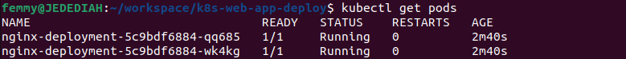

## PERSISTING DATA IN KUBERNETES

Working Repo:   [k8s-web-app-deploy](https://github.com/stlng1/k8s-web-app-deploy.git)

**Dependencies:**

Ensure that the following tools are installed on your local machine:

1. kubectl
   
2. eksctl

3. AWS programatic account

# Run the Nginx deployment into Kubernetes without a volume.


## Provision an EKS Cluster

1. configure aws environment

```
aws configure
```
   
2. create eks-cluster.yaml manifest for deploying eks cluster on aws cloud using the codes below:

```
sudo cat <<EOF | sudo tee ./eks-cluster.yaml
apiVersion: eksctl.io/v1alpha5
kind: ClusterConfig

metadata:
  name: data-cluster
  region: eu-west-3

nodeGroups:
  - name: ng-1
    instanceType: t2.micro
    desiredCapacity: 2
EOF
```

3. Launch eks cluster

```
eksctl create cluster -f eks-cluster.yaml
```


# Create a deployment in your EKS cluster


4. First, we create *nginx-service.yaml*, a load balancer service manifest to access the cluster from internet
   
```
sudo cat <<EOF | sudo tee ./nginx-service.yaml
apiVersion: v1
kind: Service
metadata:
  name: nginx-service
spec:
  type: LoadBalancer
  selector:
    tier: frontend
  ports:
    - protocol: TCP
      port: 80
      targetPort: 80
EOF
```

5. create load balancer service
   
```
kubectl apply -f ./nginx-service.yaml
```

6. create *nginx-deploy.yaml* manifest to deploy nginx pod into eks cluster

```
sudo cat <<EOF | sudo tee ./nginx-deploy.yaml
apiVersion: apps/v1
kind: Deployment
metadata:
  name: nginx-deployment
  labels:
    tier: frontend
spec:
  replicas: 2
  selector:
    matchLabels:
      tier: frontend
  template:
    metadata:
      labels:
        tier: frontend
    spec:
      containers:
      - name: nginx
        image: nginx:latest
        ports:
        - containerPort: 80
EOF
```

7. deploy nginx pod into eks cluster

```
kubectl apply -f ./nginx-deploy.yaml
```

8. Verify that the pod is running

```
kubectl get pods
```




9. Check the logs of the pod

```
kubectl logs nginx-deployment-5c9bdf6884-wk4kg
```


10. Exec into the pod and navigate to the nginx configuration file /etc/nginx/conf.d
Open the config files to see the default configuration.


```
kubectl exec -it nginx-deployment-5c9bdf6884-wk4kg bash
```

```
cat  /etc/nginx/conf.d/default.conf
```


# Create some persistence for our nginx deployment

## Create Persistent Volume

1. Create manifest for PV - nginx-volume

```
sudo cat <<EOF | sudo tee ./nginx-volume.yaml
  kind: StorageClass
  apiVersion: storage.k8s.io/v1
  metadata:
    name: gp2
    annotations:
      storageclass.kubernetes.io/is-default-class: "true"
  provisioner: kubernetes.io/aws-ebs
  parameters:
    type: gp2
    fsType: ext4 
```

2. Apply manifest

```
kubectl apply -f ./nginx-volume.yaml
```

```
kubectl get sc
```

3. Create a manifest file for a PVC (persistentVolumeClaim), and based on the gp2 storageClass a PV (PersistentVolume) will be dynamically created

```
sudo cat <<EOF | sudo tee ./nginx-pvc.yaml
    apiVersion: v1
    kind: PersistentVolumeClaim
    metadata:
      name: nginx-volume-claim
    spec:
      accessModes:
      - ReadWriteOnce
      resources:
        requests:
          storage: 2Gi
      storageClassName: gp2
EOF
```

4. Apply the manifest file 
   
```   
kubectl apply -f ./nginx-pvc.yaml
```

5. Run get on the pvc
   
```
kubectl get pvc
```


notice that the STATUS is in *pending* state. To fix this, simply apply the new deployment manifest below.

6. This manifest configures the Pod spec to use the PVC

```
sudo cat <<EOF | sudo tee ./nginx-deploy.yaml
apiVersion: apps/v1
kind: Deployment
metadata:
  name: nginx-deployment
  labels:
    tier: frontend
spec:
  replicas: 1
  selector:
    matchLabels:
      tier: frontend
  template:
    metadata:
      labels:
        tier: frontend
    spec:
      containers:
      - name: nginx
        image: nginx:latest
        ports:
        - containerPort: 80
        volumeMounts:
        - name: nginx-volume-claim
          mountPath: "/tmp/strange"
      volumes:
      - name: nginx-volume-claim
        persistentVolumeClaim:
          claimName: nginx-volume-claim
EOF
```

```
kubectl apply -f ./nginx-deploy.yaml
```

Notice that the volumes section nnow has a `persistentVolumeClaim`. With the new deployment manifest, the `/tmp/strange` directory will be persisted, and any data written in there will be sotred permanetly on the volume, which can be used by another Pod if the current one gets replaced.

7. Now lets check the dynamically created PV

```
kubectl get pv
```


# CONFIGMAP

ConfigMaps are used to manage configuration files and ensure they are not lost as a result of Pod replacement.

to demonstrate this, we will use the HTML file that came with Nginx. This file can be found in */usr/share/nginx/html/index.html*  directory.


1. Remove the **volumeMounts** and **PVC** sections of the manifest and use kubectl to apply the configuration.

```
apiVersion: apps/v1
kind: Deployment
metadata:
  name: nginx-deployment
  labels:
    tier: frontend
spec:
  replicas: 1
  selector:
    matchLabels:
      tier: frontend
  template:
    metadata:
      labels:
        tier: frontend
    spec:
      containers:
      - name: nginx
        image: nginx:latest
        ports:
        - containerPort: 80
      #   volumeMounts:
      #   - name: nginx-volume-claim
      #     mountPath: "/tmp/strange"
      # volumes:
      # - name: nginx-volume-claim
      #   persistentVolumeClaim:
      #     claimName: nginx-volume-claim
```

```
kubectl apply -f ./nginx-deploy.yaml
```

2. Ensure that you are able to see the "Welcome to nginx" page

get DNS name of the LoadBalancer:

```
kubectl get service
```


3. exec into the running container and keep a copy of the index.html file somewhere. 

```
kubectl exec -it nginx-deployment-5c9bdf6884-cwz2z -- bash
```

copy contents of index.html and store in local machine (e.g notepad)

```
cat /usr/share/nginx/html/index.html 
```


# Persisting configuration data with configMaps

Pods can consume ConfigMaps as environment variables, command-line arguments, or as configuration files in a volume. In this use case, we will use configMap to create a file in a volume.

1. Update the manifest file with the index.html copied above will look like:

```
cat <<EOF | tee ./nginx-configmap.yaml
apiVersion: v1
kind: ConfigMap
metadata:
  name: website-index-file
data:
  # file to be mounted inside a volume
  index-file: |
    <!DOCTYPE html>
    <html>
    <head>
    <title>Welcome to nginx!</title>
    <style>
    html { color-scheme: light dark; }
    body { width: 35em; margin: 0 auto;
    font-family: Tahoma, Verdana, Arial, sans-serif; }
    </style>
    </head>
    <body>
    <h1>Welcome to nginx!</h1>
    <p>If you see this page, the nginx web server is successfully installed and
    working. Further configuration is required.</p>

    <p>For online documentation and support please refer to
    <a href="http://nginx.org/">nginx.org</a>.<br/>
    Commercial support is available at
    <a href="http://nginx.com/">nginx.com</a>.</p>

    <p><em>Thank you for using nginx.</em></p>
    </body>
    </html>
EOF
```

2. Apply the new manifest file
   
```   
kubectl apply -f nginx-configmap.yaml 
```

3. Update the deployment file to use the configmap in the volumeMounts section
   
```
cat <<EOF | tee ./nginx-pod-with-cm.yaml
apiVersion: apps/v1
kind: Deployment
metadata:
  name: nginx-deployment
  labels:
    tier: frontend
spec:
  replicas: 1
  selector:
    matchLabels:
      tier: fron
      tend
  template:
    metadata:
      labels:
        tier: frontend
    spec:
      containers:
      - name: nginx
        image: nginx:latest
        ports:
        - containerPort: 80
        volumeMounts:
          - name: config
            mountPath: /usr/share/nginx/html
            readOnly: true
      volumes:
      - name: config
        configMap:
          name: website-index-file
          items:
          - key: index-file
            path: index.html
EOF
```

4. Apply the new manifest file

```
kubectl apply -f nginx-pod-with-cm.yaml
```

Now the index.html file is no longer ephemeral because it is using a configMap that has been mounted onto the filesystem. This is now evident when you exec into the pod and list the /usr/share/nginx/html directory


You can now see that the index.html is now a soft link to ../data

Lets make some changes to the content of the html file through the configmap, restart the pod, and see all your changes persist.

5. List the available configmaps. You can either use 

```
kubectl get configmap 

or 

kubectl get cm
```


6. Update the configmap - *website-index-file*. You can either update the manifest file, or the kubernetes object directly, using: *kubectl edit cm website-index-file*

Let's edit the *nginx-configmap.yaml* manifest as shown below:

``` 
apiVersion: v1
kind: ConfigMap
metadata:
  name: website-index-file
data:
  # file to be mounted inside a volume
  index-file: |
    <!DOCTYPE html>
    <html>
    <head>
    <title>Welcome to STRANGE.IO!</title>
    <style>
    html { color-scheme: light dark; }
    body { width: 35em; margin: 0 auto;
    font-family: Tahoma, Verdana, Arial, sans-serif; }
    </style>
    </head>
    <body>
    <h1>Welcome to STRANGE.IO!</h1>
    <p>If you see this page, the nginx web server is successfully installed and
    working. Further configuration is required.</p>

    <p>For online documentation and support please refer to
    <a href="http://STRANGE.IO/">nginx.org</a>.<br/>
    Commercial support is available at
    <a href="http://STRANGE.IO/">nginx.com</a>.</p>

    <p><em>Thank you for using nginx.</em></p>
    </body>
    </html>
```

7. Apply edited manifest

```
kubectl apply -f nginx-configmap.yaml 
```

8. Without restarting the pod, your site will not reflect recent changes when refreshed.


9. Restart the deployment to see if the changes persist. simply use the command below:

```
kubectl rollout restart deploy nginx-deployment 
```


Refresh the browser


