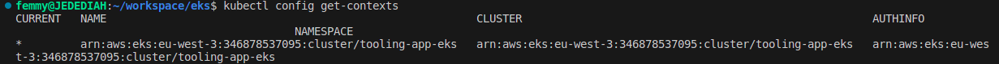
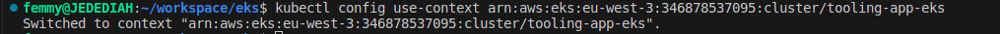
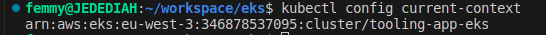
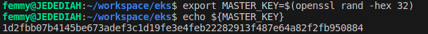
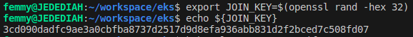
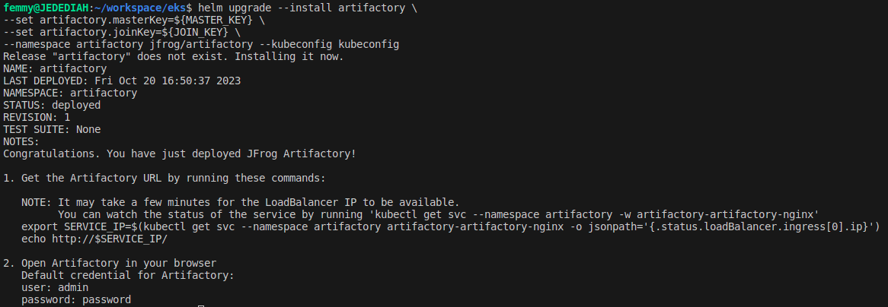
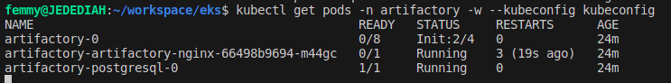
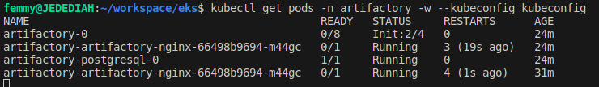
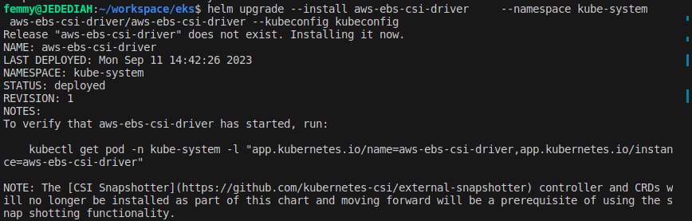
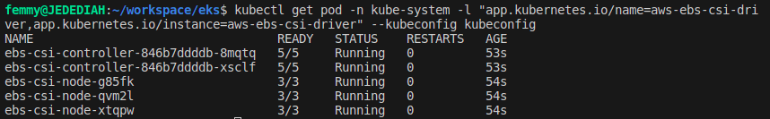

# Building EKS with Terraform

Working Repo:   [eks](https://github.com/stlng1/eks.git)

Note: Use Terraform version v1.0.2 and kubectl version v1.23.6

1. Open up a new directory on your laptop, and name it *eks*

2. log into AWS console, setup IAM programatic user, and attach the following policies directly 

- AWSEC2FullAccess
- AWSDynamoDBFullAccess
- AWSS3FullAccess

3. Use AWS Cli to configure accesskeys for newly created IAM user.

```
aws configure
```

4. Use AWS CLI to create an S3 bucket

Create a file – *backend.tf* Task for you, ensure the backend is configured for remote state in S3
terraform 

```
# backend.tf

resource "aws_s3_bucket" "terraform_state" {
  bucket = var.bucket_name

  # Prevent accidental deletion of this S3 bucket
  lifecycle {
    prevent_destroy = true
  }
}

resource "aws_s3_bucket_versioning" "enabled" {
  bucket = aws_s3_bucket.terraform_state.id
  versioning_configuration {
    status = "Enabled"
  }
}

resource "aws_s3_bucket_server_side_encryption_configuration" "default" {
  bucket = aws_s3_bucket.terraform_state.id

  rule {
    apply_server_side_encryption_by_default {
      sse_algorithm = "AES256"
    }
  }
}

resource "aws_dynamodb_table" "terraform_locks" {
  name         = var.table_name
  billing_mode = "PAY_PER_REQUEST"
  hash_key     = "LockID"
  attribute {
    name = "LockID"
    type = "S"
  }
}


/*# Backend must remain commented until the Bucket
 and the DynamoDB table are created. 
 After the creation you can uncomment it,
 run "terraform init" and then "terraform apply" */

# terraform {
#   backend "s3" {
#     bucket         = var.bucket_name
#     key            = "global/s3/terraform.tfstate"
#     region         = var.region
#     dynamodb_table = var.table_name
#     encrypt        = true
#   }
# }
```

```
# output.tf

output "s3_bucket_arn" {
  value       = aws_s3_bucket.terraform_state.arn
  description = "The ARN of the S3 bucket"
}

output "dynamodb_table_name" {
  value       = aws_dynamodb_table.terraform_locks.name
  description = "The name of the DynamoDB table"
}
```


5. Create a file – network.tf and provision Elastic IP for Nat Gateway, VPC, Private and public subnets.

```
# network.tf
# reserve Elastic IP to be used in our NAT gateway

resource "aws_eip" "nat_gw_elastic_ip" {
vpc = true

tags = {
Name            = "${var.cluster_name}-nat-eip"
iac_environment = var.iac_environment_tag
}
}

# Create VPC using the official AWS module

module "vpc" {
source  = "terraform-aws-modules/vpc/aws"

name = "${var.name_prefix}-vpc"
cidr = var.main_network_block
azs  = data.aws_availability_zones.available_azs.names

private_subnets = [
# this loop will create a one-line list as ["10.0.0.0/20", "10.0.16.0/20", "10.0.32.0/20", ...]
# with a length depending on how many Zones are available
for zone_id in data.aws_availability_zones.available_azs.zone_ids :
cidrsubnet(var.main_network_block, var.subnet_prefix_extension, tonumber(substr(zone_id, length(zone_id) - 1, 1)) - 1)
]

public_subnets = [
# this loop will create a one-line list as ["10.0.128.0/20", "10.0.144.0/20", "10.0.160.0/20", ...]
# with a length depending on how many Zones are available
# there is a zone Offset variable, to make sure no collisions are present with private subnet blocks
for zone_id in data.aws_availability_zones.available_azs.zone_ids :
cidrsubnet(var.main_network_block, var.subnet_prefix_extension, tonumber(substr(zone_id, length(zone_id) - 1, 1)) + var.zone_offset - 1)
]

# Enable single NAT Gateway to save some money
# WARNING: this could create a single point of failure, since we are creating a NAT Gateway in one AZ only
# feel free to change these options if you need to ensure full Availability without the need of running 'terraform apply'
# reference: https://registry.terraform.io/modules/terraform-aws-modules/vpc/aws/2.44.0#nat-gateway-scenarios
enable_nat_gateway     = true
single_nat_gateway     = true
one_nat_gateway_per_az = false
enable_dns_hostnames   = true
reuse_nat_ips          = true
external_nat_ip_ids    = [aws_eip.nat_gw_elastic_ip.id]

# Add VPC/Subnet tags required by EKS
tags = {
"kubernetes.io/cluster/${var.cluster_name}" = "shared"
iac_environment                             = var.iac_environment_tag
}
public_subnet_tags = {
"kubernetes.io/cluster/${var.cluster_name}" = "shared"
"kubernetes.io/role/elb"                    = "1"
iac_environment                             = var.iac_environment_tag
}
private_subnet_tags = {
"kubernetes.io/cluster/${var.cluster_name}" = "shared"
"kubernetes.io/role/internal-elb"           = "1"
iac_environment                             = var.iac_environment_tag
}
}
```


6. create some variables

```
# variables.tf

variable "bucket_name" {
  description = "The name of the S3 bucket. Must be globally unique."
  type        = string
  default = "krusha-terraform-bucket"
}

variable "table_name" {
  description = "The name of the DynamoDB table. Must be unique in this AWS account."
  type        = string
  default = "terraform-locks"
}

variable "region" {
  description = "The name of the aws region"
  type        = string
  default = "eu-west-3"
}

variable "cluster_name" {
type        = string
description = "EKS-krusha-cluster"
}

variable "iac_environment_tag" {
type        = string
description = "AWS tag to indicate environment name of each infrastructure object."
}

variable "name_prefix" {
type        = string
description = "Prefix to be used on each infrastructure object Name created in AWS."
}

variable "main_network_block" {
type        = string
description = "Base CIDR block to be used in our VPC."
}

variable "subnet_prefix_extension" {
type        = number
description = "CIDR block bits extension to calculate CIDR blocks of each subnetwork."
}

variable "zone_offset" {
type        = number
description = "CIDR block bits extension offset to calculate Public subnets, avoiding collisions with Private subnets."
}
```


7. Create a file – data.tf – This will pull the available AZs for use.

```
# get all available AZs in our region
data "aws_availability_zones" "available_azs" {
state = "available"
}
data "aws_caller_identity" "current" {} # used for accesing Account ID and ARN

# get EKS cluster info to configure Kubernetes and Helm providers
data "aws_eks_cluster" "cluster" {
  name = module.eks_cluster.cluster_id
}
data "aws_eks_cluster_auth" "cluster" {
  name = module.eks_cluster.cluster_id
}
```

8. Create a file – *eks.tf* and provision EKS cluster (Create the file only if you are not using your existing Terraform code).

```
# eks.tf
module "eks_cluster" {
  source  = "terraform-aws-modules/eks/aws"
  version = "~> 18.0"
  cluster_name    = var.cluster_name
  cluster_version = "1.22"
  vpc_id     = module.vpc.vpc_id
  subnet_ids = module.vpc.private_subnets
  cluster_endpoint_private_access = true
  cluster_endpoint_public_access = true

  # Self Managed Node Group(s)
  self_managed_node_group_defaults = {
    instance_type                          = var.asg_instance_types[0]
    update_launch_template_default_version = true
  }
  self_managed_node_groups = local.self_managed_node_groups

  # aws-auth configmap
  create_aws_auth_configmap = true
  manage_aws_auth_configmap = true
  aws_auth_users = concat(local.admin_user_map_users, local.developer_user_map_users)
  tags = {
    Environment = "prod"
    Terraform   = "true"
  }
}
```

9. Create a file – *locals.tf* to create local variables. Terraform does not allow assigning variable to variables. There is good reasons for that to avoid repeating codes unecessarily. So terraform's way to achieve this would be to use locals.

```
# locals.tf
# render Admin & Developer users list with the structure required by EKS module
locals {

  admin_user_map_users = [
    for admin_user in var.admin_users :
    {
      userarn  = "arn:aws:iam::${data.aws_caller_identity.current.account_id}:user/${admin_user}"
      username = admin_user
      groups   = ["system:masters"]
    }
  ]

  developer_user_map_users = [
    for developer_user in var.developer_users :
    {
      userarn  = "arn:aws:iam::${data.aws_caller_identity.current.account_id}:user/${developer_user}"
      username = developer_user
      groups   = ["${var.name_prefix}-developers"]
    }
  ]

  self_managed_node_groups = {
    worker_group1 = {
      name = "${var.cluster_name}-wg"

      min_size      = var.autoscaling_minimum_size_by_az * length(data.aws_availability_zones.available_azs.zone_ids)
      desired_size      = var.autoscaling_minimum_size_by_az * length(data.aws_availability_zones.available_azs.zone_ids)
      max_size  = var.autoscaling_maximum_size_by_az * length(data.aws_availability_zones.available_azs.zone_ids)
      instance_type = var.asg_instance_types[0].instance_type

      bootstrap_extra_args = "--kubelet-extra-args '--node-labels=node.kubernetes.io/lifecycle=spot'"

      block_device_mappings = {
        xvda = {
          device_name = "/dev/xvda"
          ebs = {
            delete_on_termination = true
            encrypted             = false
            volume_size           = 10
            volume_type           = "gp2"
          }
        }
      }

      use_mixed_instances_policy = true
      mixed_instances_policy = {
        instances_distribution = {
          spot_instance_pools = 4
        }

        override = var.asg_instance_types
      }
    }
  }
}
```


10. Add more variables to the *variables.tf* file

```
# create some variables
variable "admin_users" {
  type        = list(string)
  description = "List of Kubernetes admins."
}

variable "developer_users" {
  type        = list(string)
  description = "List of Kubernetes developers."
}

variable "asg_instance_types" {
  description = "List of EC2 instance machine types to be used in EKS."
}

variable "autoscaling_minimum_size_by_az" {
  type        = number
  description = "Minimum number of EC2 instances to autoscale our EKS cluster on each AZ."
}

variable "autoscaling_maximum_size_by_az" {
  type        = number
  description = "Maximum number of EC2 instances to autoscale our EKS cluster on each AZ."
}
```

11. Create a file – *variables.tfvars* to set values for variables.

```
cluster_name            = "tooling-app-eks"
iac_environment_tag     = "development"
name_prefix             = "krusha-io-eks"
main_network_block      = "10.0.0.0/16"
subnet_prefix_extension = 4
zone_offset             = 8

# Ensure that these users already exist in AWS IAM. Another approach is that you can introduce an iam.tf file to manage users separately, get the data source and interpolate their ARN.
admin_users                    = ["kuby", "project24"]
#developer_users                = ["leke", "david"]
asg_instance_types                       = [{ instance_type = "t3.small" }, { instance_type = "t2.small" }, ]
autoscaling_minimum_size_by_az           = 1
autoscaling_maximum_size_by_az           = 10
autoscaling_average_cpu                  = 30
```

12. Create file – provider.tf

```
terraform {
  required_providers {
    aws = {
      source  = "hashicorp/aws"
      # version = "~> 4.0"
    }
  }
}

# Configure the AWS Provider
provider "aws" {
  region = var.region
}

provider "random" {
}

# get EKS authentication for being able to manage k8s objects from terraform
provider "kubernetes" {
  host                   = data.aws_eks_cluster.cluster.endpoint
  cluster_ca_certificate = base64decode(data.aws_eks_cluster.cluster.certificate_authority.0.data)
  token                  = data.aws_eks_cluster_auth.cluster.token
}

```


13. Run:

```
terraform init

Terraform plan
```

– Your plan should have an output


14. Create new infrastructure by running Terraform apply:
    
```
terraform apply
```    


Note: Uncomment *backend* section of backend.tf, then run steps 13 and 14 again.


15. Create kubeconfig file using awscli

```
aws eks update-kubeconfig --name <cluster_name> --region <cluster_region> --kubeconfig kubeconfig
```
(aws eks update-kubeconfig --name tooling-app-eks --region eu-west-3 --kubeconfig kubeconfig)


## INSTALL HELM

16. Install Helm

```
curl https://baltocdn.com/helm/signing.asc | sudo apt-key add -
sudo apt-get install apt-transport-https --yes
echo "deb https://baltocdn.com/helm/stable/debian/ all main" | sudo tee /etc/apt/sources.list.d/helm-stable-debian.list
sudo apt-get update
sudo apt-get install helm
```

17. Check that Helm is installed

```
helm version
```


## DEPLOY JENKINS WITH HELM

18. Lets make use of publicly available charts from Artifact Hub to find packaged Jenkins applications as Helm Charts

19. Add the repository to helm so that you can easily download and deploy

```
helm repo add jenkins https://charts.jenkins.io

helm repo update 
```

20. Create namespace

```
kubectl create namespace [Namespace]
```
*(kubectl create namespace jenkins)*


21. Install the Jenkins Helm chart with release name *jenkins-k*

```
helm install [RELEASE_NAME] jenkins/jenkins -n [Namespace]
```
*(helm install jenkins-k jenkins/jenkins -n jenkins)*

You should see an output like this


22. Check the Helm deployment

``` 
helm ls -n [namespace]
```
*(helm ls -n k-space)*


23.  Check the pods 

```
kubectl get pods -n [namespace]
```


24. Describe the running pod

```
kubectl describe pod jenkins-k-0 -n [namespace]
```
(kubectl describe pod jenkins-k-0 -n k-space)

25.  Check the logs of the running pod. There is more than one container inside the pod, so we need to let kubectl know, which pod we are interested to see its log.

```
kubectl logs jenkins-k-0 -c jenkins 
```


## ACCESS JENKINS UI

Lets get access to the Jenkins UI without the --kubeconfig flag.
  
1. From step 21 above, get the password to the admin user

```
kubectl exec --namespace default -it svc/jenkins-k -c jenkins -- /bin/cat /run/secrets/chart-admin-password && echo
```

2. Use port forwarding to access Jenkins from the UI
  
```  
kubectl --namespace default port-forward svc/jenkins-k 9080:8080
```

  
3. Go to the browser *localhost:9080* and authenticate with the username and password from number 1 above


## INSTALLING kubectl plugin - konfig

In order to avoid calling the [kubeconfig file] everytime, we would introduce a kubectl plugin called [konfig] to select an active or default kubeconfig file. This is necessary because it is possible to have more than one cluster running and therefore more than one kubeconfig file in use. The default kubeconfig file is in the location ~/.kube/config. 

1. Install a package manager for kubectl called **krew** to enable you to install plugins to extend the functionality of kubectl. Make sure that git is installed.

Run this command to download and install krew:

```
(
  set -x; cd "$(mktemp -d)" &&
  OS="$(uname | tr '[:upper:]' '[:lower:]')" &&
  ARCH="$(uname -m | sed -e 's/x86_64/amd64/' -e 's/\(arm\)\(64\)\?.*/\1\2/' -e 's/aarch64$/arm64/')" &&
  KREW="krew-${OS}_${ARCH}" &&
  curl -fsSLO "https://github.com/kubernetes-sigs/krew/releases/latest/download/${KREW}.tar.gz" &&
  tar zxvf "${KREW}.tar.gz" &&
  ./"${KREW}" install krew
)
```

2. Add the $HOME/.krew/bin directory to your PATH environment variable. To do this, update your .bashrc or .zshrc file and append the following line:

```
export PATH="${KREW_ROOT:-$HOME/.krew}/bin:$PATH"
```

3. Apply the source command to reload the “.bashrc” file:

```
source .bashrc
```

4. Run kubectl krew to install konfig.

```
kubectl krew install konfig
```

4. Import the kubeconfig into the default kubeconfig file. Ensure to accept the prompt to overide.

```
kubectl konfig import --save  [kubeconfig file]
```
(kubectl konfig import --save kubeconfig)

3. Show all the contexts – Meaning all the clusters configured in your kubeconfig. If you have more than 1 Kubernetes clusters configured, you will see them all in the output.

```
kubectl config get-contexts
```



4. Set the current context to use for all kubectl and helm commands

```
kubectl config use-context [name of EKS cluster]
```



5. Test that it is working without specifying the --kubeconfig flag

```
kubectl get po
```

6. Display the current context. This will let you know the context in which you are using to interact with Kubernetes.

```
kubectl config current-context
```




## Installing Artifactory

1. Add JFrog Helm chart repository
   
```
helm repo add jfrog https://charts.jfrog.io
helm repo update
```
   
2. To install the chart with the release name *artifactory-k*:

```
helm upgrade --install artifactory-k jfrog/artifactory 
```
(helm upgrade --install artifactory-k jfrog/artifactory --kubeconfig kubeconfig)
helm upgrade artifactory --install jfrog/jfrog-platform --kubeconfig kubeconfig



3. Set environmental variables:

```
export SERVICE_IP=$(kubectl get svc --namespace default artifactory-k-artifactory-nginx -o jsonpath='{.status.loadBalancer.ingress[0].ip}')

echo http://$SERVICE_IP/
```
[export SERVICE_IP=$(kubectl get svc --namespace default artifactory-k-artifactory-nginx --kubeconfig kubeconfig -o jso
npath='{.status.loadBalancer.ingress[0].ip}')]

4. Open Artifactory in your browser


```
kubectl get pods
```


## Installing Hashicorp Vault

We will deploy a Vault cluster in High Availability (HA) mode using Hashicorp Consul and we will use AWS KMS to auto unseal our Vault.

1. create the Kubernetes Secret with the IAM user's access key and secret key to authenticate to AWS.

```
kubectl create secret generic -n vault eks-creds \
    --from-literal=AWS_ACCESS_KEY_ID="" \
    --from-literal=AWS_SECRET_ACCESS_KEY=""
```  

2. Add Vault Helm chart repository
   
```
helm repo add hashicorp https://helm.releases.hashicorp.com
helm repo update
helm search repo hashicorp/vault
```

3. Create *override.yaml* file to override default helm configurations:

```
# Vault Helm Chart Value Overrides
global:
  enabled: true

injector:
  enabled: true
  # Use the Vault K8s Image https://github.com/hashicorp/vault-k8s/
  image:
    repository: "hashicorp/vault-k8s"
    tag: "latest"

  resources:
      requests:
        memory: 256Mi
        cpu: 250m
      limits:
        memory: 256Mi
        cpu: 250m

server:
  # This configures the Vault Statefulset to create a PVC for data
  # storage when using the file or raft backend storage engines.
  # See https://www.vaultproject.io/docs/configuration/storage/index.html to know more
  dataStorage:
    enabled: true
    # Size of the PVC created
    size: 20Gi
    # Location where the PVC will be mounted.
    mountPath: "/vault/data"
    # Name of the storage class to use.  If null it will use the
    # configured default Storage Class.
    storageClass: null
    # Access Mode of the storage device being used for the PVC
    accessMode: ReadWriteOnce
    # Annotations to apply to the PVC
    annotations: {}

  # Use the Enterprise Image
  image:
    repository: "hashicorp/vault"
    tag: "latest"

  # These Resource Limits are in line with node requirements in the
  # Vault Reference Architecture for a Small Cluster
  resources:
    requests:
      memory: 8Gi
      cpu: 2000m
    limits:
      memory: 16Gi
      cpu: 2000m

  # For HA configuration and because we need to manually init the vault,
  # we need to define custom readiness/liveness Probe settings
  readinessProbe:
    enabled: true
    path: "/v1/sys/health?standbyok=true&sealedcode=204&uninitcode=204"
  livenessProbe:
    enabled: true
    path: "/v1/sys/health?standbyok=true"
    initialDelaySeconds: 60

  # This configures the Vault Statefulset to create a PVC for audit logs.
  # See https://www.vaultproject.io/docs/audit/index.html to know more
  auditStorage:
    enabled: true

  standalone:
    enabled: false

  # Authentication to AWS for auto unseal
  extraSecretEnvironmentVars:
    - envName: AWS_ACCESS_KEY_ID
      secretName: eks-creds
      secretKey: AWS_ACCESS_KEY_ID
    - envName: AWS_SECRET_ACCESS_KEY
      secretName: eks-creds
      secretKey: AWS_SECRET_ACCESS_KEY

  # Run Vault in "HA" mode.
  ha:
    enabled: true
    replicas: 3
    raft:
      enabled: true
      setNodeId: false

      config: |
        ui = true

        listener "tcp" {
          tls_disable = 1
          address = "[::]:8200"
          cluster_address = "[::]:8201"
        }

        seal "awskms" {
          region     = "us-east-1"
          kms_key_id = ""
        }

        storage "raft" {
          path = "/vault/data"

          retry_join {
          leader_api_addr = "http://vault-0.vault-internal:8200"
          }
          retry_join {
          leader_api_addr = "http://vault-1.vault-internal:8200"
          }
          retry_join {
          leader_api_addr = "http://vault-2.vault-internal:8200"
          }
        }

        service_registration "kubernetes" {}

# Vault UI
ui:
  enabled: true
  serviceType: "LoadBalancer"
  serviceNodePort: null
  externalPort: 8200
```

4. To install Vault Helm chart with the release name *vault-k*:

```
helm install vault-k hashicorp/vault \
    -f ./override.yaml \
    -n k-space
```

3. Get all the pods within the *k-space* namespace

```
kubectl get pods
```



Note from the status check that pods are running but that they are not ready (0/1).

4. Retrieve the status of Vault on the pod.
   



**Initialize and unseal one Vault pod**

Vault starts uninitialized and in the sealed state. Prior to initialization the Integrated Storage backend is not prepared to receive data.For Vault to authenticate with Kubernetes and manage secrets requires that that is initialized and unsealed.

5. Initialize and unseal Vault
   
```
kubectl exec --stdin=true --tty=true vault-0 -n k-space -- vault-k operator init
```



The output displays the key shares and initial root key generated.


Unseal Key 1: MBFSDepD9E6whREc6Dj+k3pMaKJ6cCnCUWcySJQymObb
Unseal Key 2: zQj4v22k9ixegS+94HJwmIaWLBL3nZHe1i+b/wHz25fr
Unseal Key 3: 7dbPPeeGGW3SmeBFFo04peCKkXFuuyKc8b2DuntA4VU5
Unseal Key 4: tLt+ME7Z7hYUATfWnuQdfCEgnKA2L173dptAwfmenCdf
Unseal Key 5: vYt9bxLr0+OzJ8m7c7cNMFj7nvdLljj0xWRbpLezFAI9

Initial Root Token: s.zJNwZlRrqISjyBHFMiEca6GF

6. Unseal the Vault server using the unseal keys until the key threshold is met.
   
```
kubectl exec --stdin=true --tty=true vault-0 -n k-space -- vault-k operator unseal
```

When prompted, enter the Unseal Key value. Repeat process for next vault with a different unseal key value.



7. Once complete, Vault will be unsealed and the other Pods will be auto-unsealed with KMS. Validate that Vault is up and running.

```
kubectl get pods --selector='app.kubernetes.io/name=vault-k'
```




7. Display all Vault services.

```
kubectl get services -n vault --selector='app.kubernetes.io/name=vault-ui'
```



NAME       TYPE       CLUSTER-IP      EXTERNAL-IP   PORT(S)          AGE
vault-ui   NodePort   10.97.113.241   <none>        8200:30096/TCP   16d
Copy

8. Display the nodes of the cluster.

```
kubectl get nodes
```


NAME           STATUS   ROLES                  AGE   VERSION
172.16.0.134   Ready    <none>                 16d   v1.21.6
172.16.0.53    Ready    <none>                 16d   v1.21.6
172.16.0.63    Ready    control-plane,master   16d   v1.21.6
172.16.0.97    Ready    control-plane,master   16d   v1.21.6


8. Install the HashiCorp Vault.

```
wget -O- https://apt.releases.hashicorp.com/gpg | sudo gpg --dearmor -o /usr/share/keyrings/hashicorp-archive-keyring.gpg

echo "deb [signed-by=/usr/share/keyrings/hashicorp-archive-keyring.gpg] https://apt.releases.hashicorp.com $(lsb_release -cs) main" | sudo tee /etc/apt/sources.list.d/hashicorp.list

sudo apt update && sudo apt install vault
```

9. Set the VAULT_ADDR environment variable. Since we exposed Vault using NodePort, Vault will be available at 172.16.0.97:8200. Access it from your bastion host or VPN from the optional step.

```
 export VAULT_ADDR='http://172.16.0.97:30096'
```

10. Set the VAULT_TOKEN environment variable value to the initial root token value generated during the Vault initialization.

```
 export VAULT_TOKEN="s.zJNwZlRrqISjyBHFMiEca6GF"
```

11. Enable the kv secrets engine.

```
 vault secrets enable -path=kv kv
```

Success! Enabled the kv secrets engine at: kv/


12. Store some test data at kv/hello.

 ```
 vault kv put kv/hello target=world
```


Key                Value
---                -----
created_time       2022-03-21T21:23:00.540998543Z
custom_metadata    <nil>
deletion_time      n/a
destroyed          false
version            1
Copy
Read the stored data to verify.

 vault kv get kv/hello

======= Metadata =======
Key                Value
---                -----
created_time       2022-03-21T21:23:00.540998543Z
custom_metadata    <nil>
deletion_time      n/a
destroyed          false
version            1

===== Data =====
Key       Value
---       -----
target    world


## Installing Prometheus

1. Add Prometheus Helm chart repository
   
```
helm repo add prometheus-community https://prometheus-community.github.io/helm-charts
helm repo update
kubectl get pods
```

2. To install prometheus Helm chart with the release name *prom-k*:

```
helm install prom-k prometheus-community/prometheus k-space
```

3. Access to Prometheus UI

Default port for Prometheus dashboard is 9090. We can forward port to host by command and consequently access the dashboard in the browser on http://localhost:9090.

```
kubectl port-forward &lt;prometheus-pod-name&gt; 9090 
```


## Installing Grafana

1. Add Grafana Helm chart repository
   
```
helm repo add grafana https://grafana.github.io/helm-charts
helm repo update
```

2. To install grafana Helm chart with the release name *grafana-k*:

```
helm install grafana-k grafana/grafana k-space
```

3. Check if everything is working fine and extract the external ip of node/ec2 instance:

```
kubectl get all -n grafana
```

4. Default port for grafana dashboard is 3000. We can forward port to host by command 

```
kubectl port-forward &lt;grafana-pod-name&gt; 3000  
```

5. Access the dashboard in the browser on http://<external_ip>:3000.


## Elasticsearch ELK using ECK

1. Add the Elastic Helm charts repo: 
   
```
helm repo add elastic https://helm.elastic.co
helm repo update
```

2. To install Elasticsearch using the eck-elasticsearch Helm Chart directly with the release name *elastic-k*:

```
helm install elastic-k elastic/eck-elasticsearch -n k-space 
```

3. Check if everything is working fine:

```
kubectl get pods
```

4. Once you successfully installed Elasticsearch, forward it to port 9200:

```
kubectl port-forward svc/elasticsearch-master 9200
```