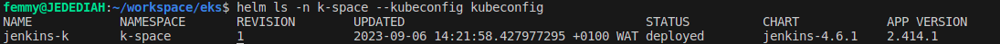

# Building EKS with Terraform

Working Repo:   [eks](https://github.com/stlng1/eks.git)

Note: Use Terraform version v1.0.2 and kubectl version v1.23.6

1. Open up a new directory on your laptop, and name it *eks*

2. log into AWS console, setup IAM programatic user, and attach the following policies directly 

- AWSEC2FullAccess
- AWSDynamoDBFullAccess
- AWSS3FullAccess

3. Use AWS Cli to configure accesskeys for newly created IAM user.

```
aws configure
```

4. Use AWS CLI to create an S3 bucket

Create a file – *backend.tf* Task for you, ensure the backend is configured for remote state in S3
terraform 

```
# backend.tf

resource "aws_s3_bucket" "terraform_state" {
  bucket = var.bucket_name

  # Prevent accidental deletion of this S3 bucket
  lifecycle {
    prevent_destroy = true
  }
}

resource "aws_s3_bucket_versioning" "enabled" {
  bucket = aws_s3_bucket.terraform_state.id
  versioning_configuration {
    status = "Enabled"
  }
}

resource "aws_s3_bucket_server_side_encryption_configuration" "default" {
  bucket = aws_s3_bucket.terraform_state.id

  rule {
    apply_server_side_encryption_by_default {
      sse_algorithm = "AES256"
    }
  }
}

resource "aws_dynamodb_table" "terraform_locks" {
  name         = var.table_name
  billing_mode = "PAY_PER_REQUEST"
  hash_key     = "LockID"
  attribute {
    name = "LockID"
    type = "S"
  }
}


/*# Backend must remain commented until the Bucket
 and the DynamoDB table are created. 
 After the creation you can uncomment it,
 run "terraform init" and then "terraform apply" */

# terraform {
#   backend "s3" {
#     bucket         = var.bucket_name
#     key            = "global/s3/terraform.tfstate"
#     region         = var.region
#     dynamodb_table = var.table_name
#     encrypt        = true
#   }
# }
```

```
# output.tf

output "s3_bucket_arn" {
  value       = aws_s3_bucket.terraform_state.arn
  description = "The ARN of the S3 bucket"
}

output "dynamodb_table_name" {
  value       = aws_dynamodb_table.terraform_locks.name
  description = "The name of the DynamoDB table"
}
```


5. Create a file – network.tf and provision Elastic IP for Nat Gateway, VPC, Private and public subnets.

```
# network.tf
# reserve Elastic IP to be used in our NAT gateway

resource "aws_eip" "nat_gw_elastic_ip" {
vpc = true

tags = {
Name            = "${var.cluster_name}-nat-eip"
iac_environment = var.iac_environment_tag
}
}

# Create VPC using the official AWS module

module "vpc" {
source  = "terraform-aws-modules/vpc/aws"

name = "${var.name_prefix}-vpc"
cidr = var.main_network_block
azs  = data.aws_availability_zones.available_azs.names

private_subnets = [
# this loop will create a one-line list as ["10.0.0.0/20", "10.0.16.0/20", "10.0.32.0/20", ...]
# with a length depending on how many Zones are available
for zone_id in data.aws_availability_zones.available_azs.zone_ids :
cidrsubnet(var.main_network_block, var.subnet_prefix_extension, tonumber(substr(zone_id, length(zone_id) - 1, 1)) - 1)
]

public_subnets = [
# this loop will create a one-line list as ["10.0.128.0/20", "10.0.144.0/20", "10.0.160.0/20", ...]
# with a length depending on how many Zones are available
# there is a zone Offset variable, to make sure no collisions are present with private subnet blocks
for zone_id in data.aws_availability_zones.available_azs.zone_ids :
cidrsubnet(var.main_network_block, var.subnet_prefix_extension, tonumber(substr(zone_id, length(zone_id) - 1, 1)) + var.zone_offset - 1)
]

# Enable single NAT Gateway to save some money
# WARNING: this could create a single point of failure, since we are creating a NAT Gateway in one AZ only
# feel free to change these options if you need to ensure full Availability without the need of running 'terraform apply'
# reference: https://registry.terraform.io/modules/terraform-aws-modules/vpc/aws/2.44.0#nat-gateway-scenarios
enable_nat_gateway     = true
single_nat_gateway     = true
one_nat_gateway_per_az = false
enable_dns_hostnames   = true
reuse_nat_ips          = true
external_nat_ip_ids    = [aws_eip.nat_gw_elastic_ip.id]

# Add VPC/Subnet tags required by EKS
tags = {
"kubernetes.io/cluster/${var.cluster_name}" = "shared"
iac_environment                             = var.iac_environment_tag
}
public_subnet_tags = {
"kubernetes.io/cluster/${var.cluster_name}" = "shared"
"kubernetes.io/role/elb"                    = "1"
iac_environment                             = var.iac_environment_tag
}
private_subnet_tags = {
"kubernetes.io/cluster/${var.cluster_name}" = "shared"
"kubernetes.io/role/internal-elb"           = "1"
iac_environment                             = var.iac_environment_tag
}
}
```


6. create some variables

```
# variables.tf

variable "bucket_name" {
  description = "The name of the S3 bucket. Must be globally unique."
  type        = string
  default = "krusha-terraform-bucket"
}

variable "table_name" {
  description = "The name of the DynamoDB table. Must be unique in this AWS account."
  type        = string
  default = "terraform-locks"
}

variable "region" {
  description = "The name of the aws region"
  type        = string
  default = "eu-west-3"
}

variable "cluster_name" {
type        = string
description = "EKS-krusha-cluster"
}

variable "iac_environment_tag" {
type        = string
description = "AWS tag to indicate environment name of each infrastructure object."
}

variable "name_prefix" {
type        = string
description = "Prefix to be used on each infrastructure object Name created in AWS."
}

variable "main_network_block" {
type        = string
description = "Base CIDR block to be used in our VPC."
}

variable "subnet_prefix_extension" {
type        = number
description = "CIDR block bits extension to calculate CIDR blocks of each subnetwork."
}

variable "zone_offset" {
type        = number
description = "CIDR block bits extension offset to calculate Public subnets, avoiding collisions with Private subnets."
}
```


7. Create a file – data.tf – This will pull the available AZs for use.

```
# get all available AZs in our region
data "aws_availability_zones" "available_azs" {
state = "available"
}
data "aws_caller_identity" "current" {} # used for accesing Account ID and ARN

# get EKS cluster info to configure Kubernetes and Helm providers
data "aws_eks_cluster" "cluster" {
  name = module.eks_cluster.cluster_id
}
data "aws_eks_cluster_auth" "cluster" {
  name = module.eks_cluster.cluster_id
}
```

8. Create a file – *eks.tf* and provision EKS cluster (Create the file only if you are not using your existing Terraform code).

```
# eks.tf
module "eks_cluster" {
  source  = "terraform-aws-modules/eks/aws"
  version = "~> 18.0"
  cluster_name    = var.cluster_name
  cluster_version = "1.22"
  vpc_id     = module.vpc.vpc_id
  subnet_ids = module.vpc.private_subnets
  cluster_endpoint_private_access = true
  cluster_endpoint_public_access = true

  # Self Managed Node Group(s)
  self_managed_node_group_defaults = {
    instance_type                          = var.asg_instance_types[0]
    update_launch_template_default_version = true
  }
  self_managed_node_groups = local.self_managed_node_groups

  # aws-auth configmap
  create_aws_auth_configmap = true
  manage_aws_auth_configmap = true
  aws_auth_users = concat(local.admin_user_map_users, local.developer_user_map_users)
  tags = {
    Environment = "prod"
    Terraform   = "true"
  }
}
```

9. Create a file – *locals.tf* to create local variables. Terraform does not allow assigning variable to variables. There is good reasons for that to avoid repeating codes unecessarily. So terraform's way to achieve this would be to use locals.

```
# locals.tf
# render Admin & Developer users list with the structure required by EKS module
locals {

  admin_user_map_users = [
    for admin_user in var.admin_users :
    {
      userarn  = "arn:aws:iam::${data.aws_caller_identity.current.account_id}:user/${admin_user}"
      username = admin_user
      groups   = ["system:masters"]
    }
  ]

  developer_user_map_users = [
    for developer_user in var.developer_users :
    {
      userarn  = "arn:aws:iam::${data.aws_caller_identity.current.account_id}:user/${developer_user}"
      username = developer_user
      groups   = ["${var.name_prefix}-developers"]
    }
  ]

  self_managed_node_groups = {
    worker_group1 = {
      name = "${var.cluster_name}-wg"

      min_size      = var.autoscaling_minimum_size_by_az * length(data.aws_availability_zones.available_azs.zone_ids)
      desired_size      = var.autoscaling_minimum_size_by_az * length(data.aws_availability_zones.available_azs.zone_ids)
      max_size  = var.autoscaling_maximum_size_by_az * length(data.aws_availability_zones.available_azs.zone_ids)
      instance_type = var.asg_instance_types[0].instance_type

      bootstrap_extra_args = "--kubelet-extra-args '--node-labels=node.kubernetes.io/lifecycle=spot'"

      block_device_mappings = {
        xvda = {
          device_name = "/dev/xvda"
          ebs = {
            delete_on_termination = true
            encrypted             = false
            volume_size           = 10
            volume_type           = "gp2"
          }
        }
      }

      use_mixed_instances_policy = true
      mixed_instances_policy = {
        instances_distribution = {
          spot_instance_pools = 4
        }

        override = var.asg_instance_types
      }
    }
  }
}
```


10. Add more variables to the *variables.tf* file

```
# create some variables
variable "admin_users" {
  type        = list(string)
  description = "List of Kubernetes admins."
}

variable "developer_users" {
  type        = list(string)
  description = "List of Kubernetes developers."
}

variable "asg_instance_types" {
  description = "List of EC2 instance machine types to be used in EKS."
}

variable "autoscaling_minimum_size_by_az" {
  type        = number
  description = "Minimum number of EC2 instances to autoscale our EKS cluster on each AZ."
}

variable "autoscaling_maximum_size_by_az" {
  type        = number
  description = "Maximum number of EC2 instances to autoscale our EKS cluster on each AZ."
}
```

11. Create a file – *variables.tfvars* to set values for variables.

```
cluster_name            = "tooling-app-eks"
iac_environment_tag     = "development"
name_prefix             = "krusha-io-eks"
main_network_block      = "10.0.0.0/16"
subnet_prefix_extension = 4
zone_offset             = 8

# Ensure that these users already exist in AWS IAM. Another approach is that you can introduce an iam.tf file to manage users separately, get the data source and interpolate their ARN.
admin_users                    = ["kuby", "project24"]
#developer_users                = ["leke", "david"]
asg_instance_types                       = [{ instance_type = "t3.small" }, { instance_type = "t2.small" }, ]
autoscaling_minimum_size_by_az           = 1
autoscaling_maximum_size_by_az           = 10
autoscaling_average_cpu                  = 30
```

12. Create file – provider.tf

```
terraform {
  required_providers {
    aws = {
      source  = "hashicorp/aws"
      # version = "~> 4.0"
    }
  }
}

# Configure the AWS Provider
provider "aws" {
  region = var.region
}

provider "random" {
}

# get EKS authentication for being able to manage k8s objects from terraform
provider "kubernetes" {
  host                   = data.aws_eks_cluster.cluster.endpoint
  cluster_ca_certificate = base64decode(data.aws_eks_cluster.cluster.certificate_authority.0.data)
  token                  = data.aws_eks_cluster_auth.cluster.token
}

```


13. Run:

```
terraform init

Terraform plan
```

– Your plan should have an output


14. Create new infrastructure by running Terraform apply:
    
```
terraform apply
```    


Note: Uncomment *backend* section of backend.tf, then run steps 13 and 14 again.

15.  Create kubeconfig file using awscli

```
aws eks update-kubeconfig --name <cluster_name> --region <cluster_region> --kubeconfig kubeconfig
```
(aws eks update-kubeconfig --name tooling-app-eks --region eu-west-3 --kubeconfig kubeconfig)


## INSTALL HELM

16. Install Helm

```
curl https://baltocdn.com/helm/signing.asc | sudo apt-key add -
sudo apt-get install apt-transport-https --yes
echo "deb https://baltocdn.com/helm/stable/debian/ all main" | sudo tee /etc/apt/sources.list.d/helm-stable-debian.list
sudo apt-get update
sudo apt-get install helm
```

17. Check that Helm is installed

```
helm version
```


## DEPLOY JENKINS WITH HELM

18. Lets make use of publicly available charts from Artifact Hub to find packaged Jenkins applications as Helm Charts

19. Add the repository to helm so that you can easily download and deploy

```
helm repo add jenkins https://charts.jenkins.io

helm repo update 
```

20.  Create Namespace *k-space*
    
```
kubectl create ns [NAMESPACE] 
```
*(kubectl create ns k-space --kubeconfig kubeconfig)*


21.  Install the Jenkins Helm chart with release name *jenkins-k*

```
helm install [RELEASE_NAME] jenkins/jenkins
```
*(helm install jenkins-k jenkins/jenkins -n k-space --kubeconfig kubeconfig)*

You should see an output like this


22. Check the Helm deployment

``` 
helm ls -n [namespace]
```
*(helm ls --kubeconfig kubeconfig)*




23.  Check the pods 

```
kubectl get pods
```
*(kubectl get pods --kubeconfig kubeconfig)*


24. Describe the running pod

```
kubectl describe pod jenkins-k-0 
```
*(kubectl describe pod jenkins-k-0 --kubeconfig kubeconfig)*

25. Check the logs of the running pod. There is more than one container inside the pod, so we need to let kubectl know, which pod we are interested to see its log.

```
kubectl logs jenkins-k-0 -c jenkins
```

*(kubectl logs jenkins-k-0 -c jenkins --kubeconfig kubeconfig)*


## ACCESS JENKINS UI

Lets get access to the Jenkins UI without the --kubeconfig flag.
  
26. From step 21 above, get the password to the admin user

```
kubectl exec --namespace default -it svc/jenkins-k -c jenkins -- /bin/cat /run/secrets/chart-admin-password && echo
```

27. Use port forwarding to access Jenkins from the UI
  
```  
kubectl --namespace default port-forward svc/jenkins-k 9080:8080
```
  
28. Go to the browser *localhost:9080* and authenticate with the username and password from number 1 above


