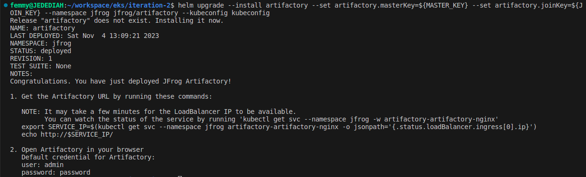

## Installing the JFrog Platform on Amazon EKS

## Pre-requisites

1. create service account 
   
2. iam role for artifactory

3. EKS cluster

4. TLS Certificate

# steps

1. create service account for artifactory
2. create iam role for artifactory
3. add ALB ingress controller to cluster
4. configure values.yaml for aws eks and s3
5. create namespace
6. install artifactory
*(helm upgrade artifactory --install -n jfrog jfrog/jfrog-platform -f values.yaml --kubeconfig kubeconfig)*
7. 


   

## Installation Steps for Artifactory Single Node with Helm Charts


1. Add https://charts.jfrog.ioto your Helm client and update the repository

```
helm repo add jfrog https://charts.jfrog.io

helm repo update

```

2. Create a unique Master Key (Artifactory requires a unique master key) pass it to the template during installation.

```
export MASTER_KEY=$(openssl rand -hex 32) 
echo ${MASTER_KEY}
```

3. Next, create a unique join key.

```
export JOIN_KEY=$(openssl rand -hex 32)
echo ${JOIN_KEY}
```

Note: By default the chart has one set in the values.yaml (artifactory.joinKey). However, this key is for demonstration purposes only and should not be used in a production environment. Generate a unique key and pass it to the template during installation.

4. Install the chart with the release name artifactory and with master key and join key.

```
helm upgrade --install artifactory --set artifactory.masterKey=${MASTER_KEY} --set artifactory.joinKey=${JOIN_KEY} --namespace artifactory jfrog/artifactory
```
*(helm upgrade --install artifactory --set artifactory.masterKey=${MASTER_KEY} --set artifactory.joinKey=${JOIN_KEY} --namespace jfrog jfrog/artifactory --kubeconfig kubeconfig)*

Note: If you are using an internal PostgreSQL, it is recommended to change the PostgreSQL password. For more information, see Auto-generated Passwords (Internal PostgreSQL).




5. Connect to Artifactory.

It may take a few minutes for Artifactory's public IP to become available. Follow the instructions that are output by the install command above to get the Artifactory IP to access it. 


6. To access the logs, find the name of the pod using the following command.

kubectl --namespace <your namespace> get pods
⧉
To get the container logs, run the following command.

kubectl --namespace <your namespace> logs -f <name of the pod>
⧉


1. Deploy the license as a secret.
```
kubectl create secret generic artifactory-licenses --from-file=artifactory.cluster.lic=license.txt -n <K8S_NAMESPACE>
```

1.  Deploy the Helm Chart.

```
helm upgrade artifactory --install -n <K8S_NAMESPACE> jfrog/jfrog-platform -f values.yaml
```


## CONFIGURING INGRESS FOR TLS

To ensure that every created ingress also has TLS configured, we will need to update the ingress manifest with TLS specific configurations.

```
apiVersion: networking.k8s.io/v1
kind: Ingress
metadata:
  annotations:
    cert-manager.io/cluster-issuer: "letsencrypt-prod"
    spec.ingressClassName: nginx
  name: artifactory
spec:
  rules:
  - host: "tooling.artifactory.sandbox.svc.darey.io"
    http:
      paths:
      - path: /
        pathType: Prefix
        backend:
          service:
            name: artifactory
            port:
              number: 8082
  tls:
  - hosts:
    - "tooling.artifactory.sandbox.svc.darey.io"
    secretName: "tooling.artifactory.sandbox.svc.darey.io"
```

```
kubectl apply -n jfrog -f ingress.yaml --kubeconfig kubeconfig
```
    