# **PROJECT 3: MERN STACK IMPLEMENTATION**

In this project, you are tasked to implement a web solution based on MERN stack in AWS Cloud.

MERN Web stack consists of following components:

MongoDB: A document-based, No-SQL database used to store application data in a form of documents.

ExpressJS: A server side Web Application framework for Node.js.

ReactJS: A frontend framework developed by Facebook. It is based on JavaScript, used to build User Interface (UI) components.

Node.js: A JavaScript runtime environment. It is used to run JavaScript on a machine rather than in a browser.

## **AWS account setup and Provisioning and Ubuntu Server**

> 1. Create Darey_Projects_03_MERN instance of ubuntu server
> 2. use exisitng keypair
> 3. use existing security group launch-wizard-1

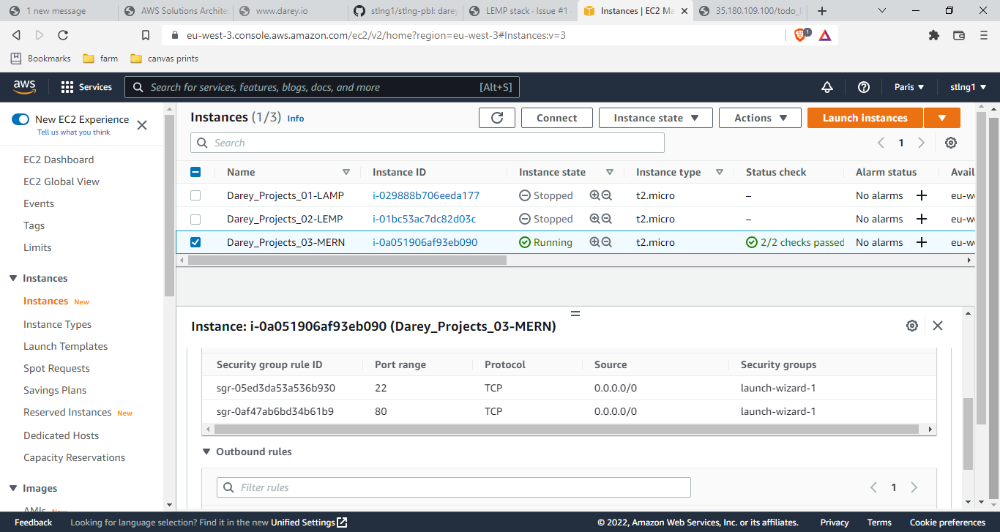

## **Connecting to EC2 terminal**

Connect to EC2 terminal using the git bash terminal from folder containing my private key

```ssh -i "femmy_EC2.pem" ubuntu@ec2-52-47-193-222.eu-west-3.compute.amazonaws.com```

# **BACKEND CONFIGURATION**

Update ubuntu

```sudo apt update```

Upgrade ubuntu

```sudo apt upgrade```

Lets get the location of Node.js software from Ubuntu repositories.

```curl -fsSL https://deb.nodesource.com/setup_18.x | sudo -E bash -```


## Install Node.js on the server

Install Node.js with the command below

```sudo apt-get install -y nodej```

Note: The command above installs both nodejs and npm. NPM is a package manager for Node like apt for Ubuntu, it is used to install Node modules & packages and to manage dependency conflicts.

Verify the node installation with the command below

```node -v```

Verify the node installation with the command below

```npm -v```

## Application Code Setup

Create a new directory for your To-Do project:

```mkdir Todo```

Run the command below to verify that the Todo directory is created with ls command

```ls```

TIP: In order to see some more useful information about files and directories, you can use following combination of keys ls -lih – it will show you different properties and size in human readable format. You can learn more about different useful keys for ls command with ls --help.

Now change your current directory to the newly created one:

```cd Todo```

Next, you will use the command npm init to initialise your project, so that a new file named package.json will be created. This file will normally contain information about your application and the dependencies that it needs to run. Follow the prompts after running the command. You can press Enter several times to accept default values, then accept to write out the package.json file by typing yes.

```npm init```

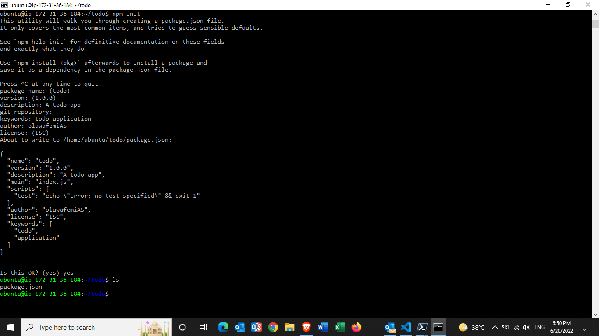

## Install ExpressJS

Remember that Express is a framework for Node.js, therefore a lot of things developers would have programmed is already taken care of out of the box. Therefore it simplifies development, and abstracts a lot of low level details. For example, Express helps to define routes of your application based on HTTP methods and URLs.

To use express, install it using npm:

```npm install express```

Now create a file index.js with the command below

```touch index.js```

Run ls to confirm that your index.js file is successfully created

Install the dotenv module

```npm install dotenv```

Open the index.js file with the command below

```vim index.js```

Type the code below into it and save. Do not get overwhelmed by the code you see. For now, simply paste the code into the file.

```
const express = require('express');
require('dotenv').config();

const app = express();

const port = process.env.PORT || 5000;

app.use((req, res, next) => {
res.header("Access-Control-Allow-Origin", "\*");
res.header("Access-Control-Allow-Headers", "Origin, X-Requested-With, Content-Type, Accept");
next();
});

app.use((req, res, next) => {
res.send('Welcome to Express');
});

app.listen(port, () => {
console.log(`Server running on port ${port}`)
});
```

Notice that we have specified to use port 5000 in the code. This will be required later when we go on the browser.

Use :w to save in vim and use :q to exit vim

Now it is time to start our server to see if it works. Open your terminal in the same directory as your index.js file and type:

```node index.js```

If every thing goes well, you should see '*Server running on port 5000*' in your terminal.

Now we need to open this port in EC2 Security Groups.

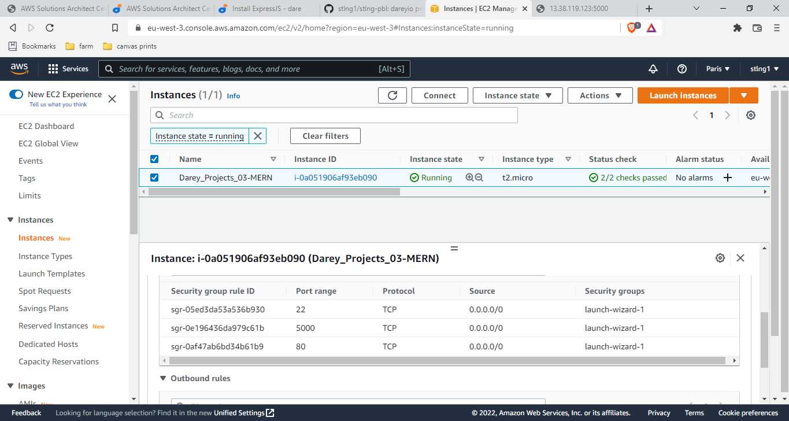

Open up your browser and try to access your server’s Public IP or Public DNS name followed by port 5000:

http://<PublicIP-or-PublicDNS>:5000

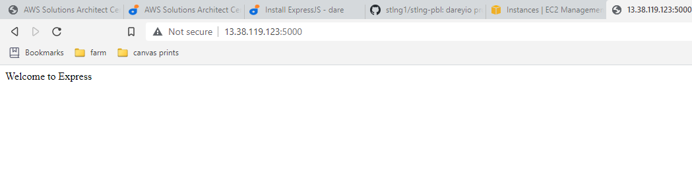

## Routes

There are three actions that our To-Do application needs to be able to do:

1. Create a new task
2. Display list of all tasks
3. Delete a completed task

Each task will be associated with some particular endpoint and will use different standard HTTP request methods: POST, GET, DELETE.

For each task, we need to create routes that will define various endpoints that the To-do app will depend on. So let us create a folder, routes

```mkdir routes```

Change directory to routes folder

```cd routes```

Now, create a file api.js with the command below

```touch api.js```

Open the file with the command below

```nano api.js```

Copy below code in the file. (Do not be overwhelmed with the code)

```
const express = require ('express');
const router = express.Router();

router.get('/todos', (req, res, next) => {

});

router.post('/todos', (req, res, next) => {

});

router.delete('/todos/:id', (req, res, next) => {

})

module.exports = router;
```


## MODELS

Now comes the interesting part, since the app is going to make use of Mongodb which is a NoSQL database, we need to create a model.

A model is at the heart of JavaScript based applications, and it is what makes it interactive.

We will also use models to define the database schema . This is important so that we will be able to define the fields stored in each Mongodb document.

In essence, the Schema is a blueprint of how the database will be constructed, including other data fields that may not be required to be stored in the database. These are known as virtual properties

To create a Schema and a model, install mongoose which is a Node.js package that makes working with mongodb easier.

Change directory back 'todo' folder

```cd todo```

install Mongoose

```npm install mongoose```

Create a new folder models

```mkdir models```

Change directory into the newly created ‘models’ folder with

```cd models```

Inside the models folder, create a file and name it todo.js

```touch todo.js```

**Tip:** All three commands above can be defined in one line to be executed consequently with help of && operator, like this:

```mkdir models && cd models && touch todo.js```

Open the file created with vim todo.js then paste the code below in the file:

```
const mongoose = require('mongoose');
const Schema = mongoose.Schema;

//create schema for todo
const TodoSchema = new Schema({
action: {
type: String,
required: [true, 'The todo text field is required']
}
})

//create model for todo
const Todo = mongoose.model('todo', TodoSchema);

module.exports = Todo;
```

Now we need to update our routes from the file *api.js* in ‘routes’ directory to make use of the new model.

In Routes directory, open *api.js* with nano editor

```nano api.js```

delete the code inside and paste the code below into it 

```
const express = require ('express');
const router = express.Router();
const Todo = require('../models/todo');

router.get('/todos', (req, res, next) => {

//this will return all the data, exposing only the id and action field to the client
Todo.find({}, 'action')
.then(data => res.json(data))
.catch(next)
});

router.post('/todos', (req, res, next) => {
if(req.body.action){
Todo.create(req.body)
.then(data => res.json(data))
.catch(next)
}else {
res.json({
error: "The input field is empty"
})
}
});

router.delete('/todos/:id', (req, res, next) => {
Todo.findOneAndDelete({"_id": req.params.id})
.then(data => res.json(data))
.catch(next)
})

module.exports = router;
```

then save and exit with

```Ctrl+X, Y and Enter```

The next piece of our application will be the MongoDB Database

## MongoDB Database

We need a database where we will store our data. For this we will make use of mLab. mLab provides MongoDB database as a service solution (DBaaS), so to make life easy, you will need to sign up for a shared clusters free account, which is ideal for our use case. Sign up here. Follow the sign up process, select AWS as the cloud provider, and choose a region near you.

Complete a get started checklist below

1. Register for an Atlas account
2. Create and deploy a free cluster, collections and database. Go to 

    >**cluster0 > collections > Add my own data**

      created 'foolsDbase' and 'collection_01'

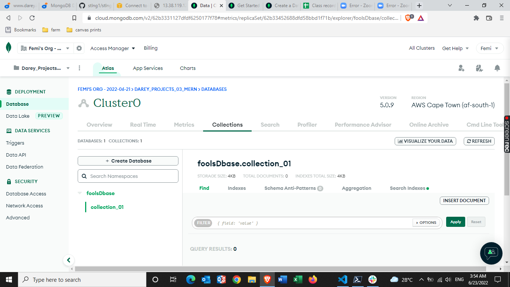

3. Add your connection IP address to your IP access list and allow access to the MongoDB database from anywhere (Not secure, but it is ideal for testing). Go to 

    >**Network Access > +ADD IP ADDRESS**

4. Create a database user for your cluster. Be sure to assign read & write privilege to this user.

5. Connect to your cluster

In the *index.js* file, we specified process.env to access environment variables, but we have not yet created this file. So we need to do that now.

Create a file in your todo directory and name it *.env*

```touch .env```

open .env with the nano editor

```nano .env```

Add the connection string to access the database in it, just as below:

```
DB = 'mongodb+srv://<username>:<password>@<network-address>/<dbname>?retryWrites=true&w=majority'```

or

DB = 'connection string'
```

then save and exit with

```Ctrl+X, Y and Enter```

Ensure to update **username, password, network-address and database** according to your setup

Here is how to get your connection string: Go to 
>**clusters > connect > connect your application > copy connection string**

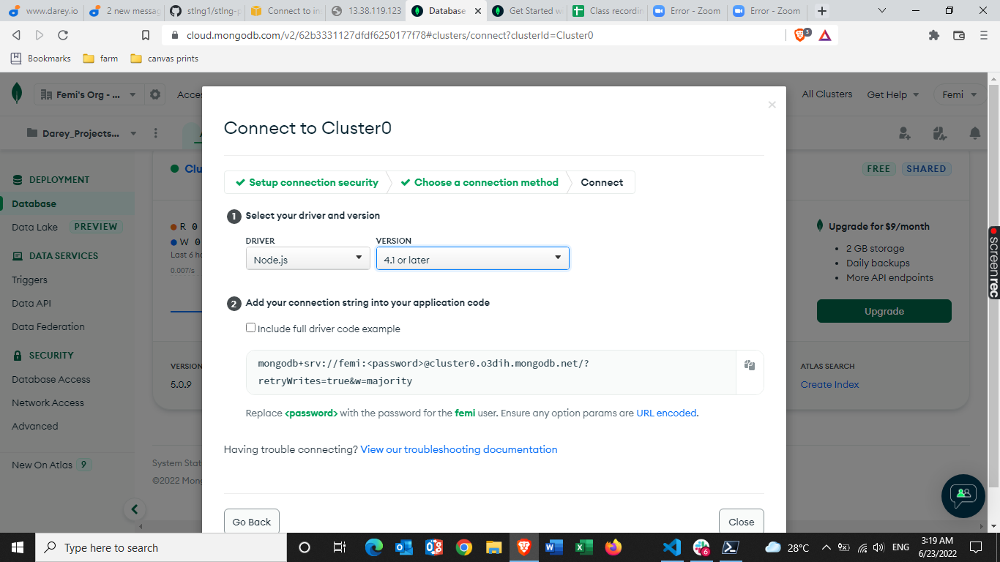

Now we need to update the *index.js* to reflect the use of *.env* so that *Node.js* can connect to the database.

Using the nano editor, simply delete existing content in the index.js file, and update it with the entire code below.

```
const express = require('express');
const bodyParser = require('body-parser');
const mongoose = require('mongoose');
const routes = require('./routes/api');
const path = require('path');
require('dotenv').config();

const app = express();

const port = process.env.PORT || 5000;

//connect to the database
mongoose.connect(process.env.DB, { useNewUrlParser: true, useUnifiedTopology: true })
.then(() => console.log(`Database connected successfully`))
.catch(err => console.log(err));

//since mongoose promise is depreciated, we overide it with node's promise
mongoose.Promise = global.Promise;

app.use((req, res, next) => {
res.header("Access-Control-Allow-Origin", "\*");
res.header("Access-Control-Allow-Headers", "Origin, X-Requested-With, Content-Type, Accept");
next();
});

app.use(bodyParser.json());

app.use('/api', routes);

app.use((err, req, res, next) => {
console.log(err);
next();
});

app.listen(port, () => {
console.log(`Server running on port ${port}`)
});
```

then save and exit with

```Ctrl+X, Y and Enter```

Using environment variables to store information is considered more secure and best practice to separate configuration and secret data from the application, instead of writing connection strings directly inside the index.js application file.

Start your server using the command:

```node index.js```

You shall see a message ‘Database connected successfully’, if so – we have our backend configured. Now we are going to test it.

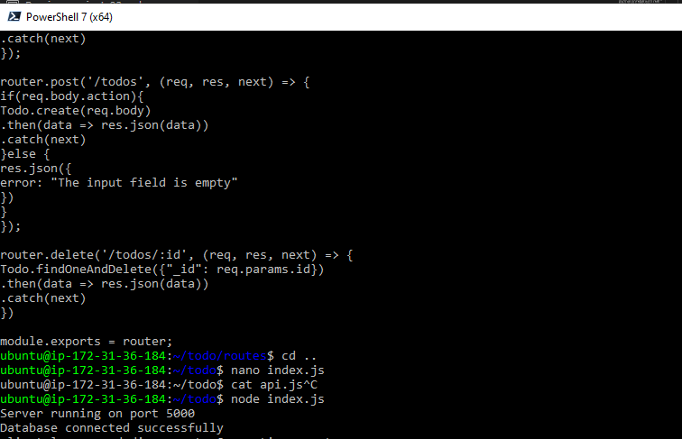

## Testing Backend Code without Frontend using RESTful API

So far we have written backend part of our To-Do application, and configured a database, but we do not have a frontend UI yet. We need ReactJS code to achieve that. But during development, we will need a way to test our code using RESTfulL API. Therefore, we will need to make use of some API development client to test our code.

In this project, we will use **Postman** to test our API.

Download and install postman 

You should test all the API endpoints and make sure they are working. For the endpoints that require body, you should send JSON back with the necessary fields since it’s what we setup in our code.

Now open your Postman, create a POST request to the API http://<PublicIP-or-PublicDNS>:5000/api/todos. This request sends a new task to our To-Do list so the application could store it in the database.

Note: make sure your set header key Content-Type as application/json and in the body, add new task - '*complete project 3 today*'

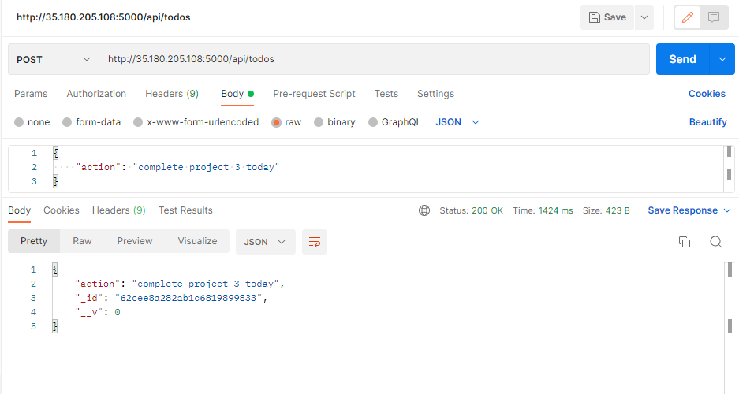

In a similar fashion create GET request to the API

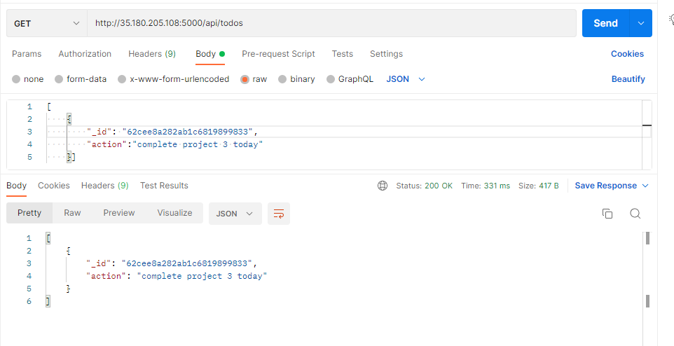

We have successfully created our Backend, now let go create the Frontend.


# **FRONTEND CREATION**

Since we are done with the functionality we want from our backend and API, it is time to create a user interface for a Web client (browser) to interact with the application via API. To start out with the frontend of the To-do app, we will use the *create-react-app* command to scaffold our app.

In the same root directory as your backend code, which is the Todo directory, run:

```npx create-react-app client```

This will create a new folder in your Todo directory called client, where you will add all the react code.

## Running a React App

Before testing the react app, there are some dependencies that need to be installed.

1. Install concurrently. It is used to run more than one command simultaneously from the same terminal window.

```npm install concurrently --save-dev```

2. Install nodemon. It is used to run and monitor the server. If there is any change in the server code, nodemon will restart it automatically and load the new changes.

```npm install nodemon --save-dev```

3. In Todo folder open the *package.json* file. Modify by replacing with the code below as highlighted in the screenshot.

```
"scripts": {
"start": "node index.js",
"start-watch": "nodemon index.js",
"dev": "concurrently \"npm run start-watch\" \"cd client && npm start\""
},
```

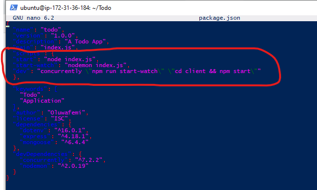

## Configure Proxy in package.json

1. Change directory to ‘client’

```cd client```

2. Open the package.json file

```nano package.json```

3. Add the key value pair in the package.json file "proxy": "http://localhost:5000".

The whole purpose of adding the proxy configuration in number 3 above is to make it possible to access the application directly from the browser by simply calling the server url like http://localhost:5000 rather than always including the entire path like http://localhost:5000/api/todos

Now, ensure you are inside the Todo directory, and simply run:

```npm run dev```

Your app should open and start running on localhost:3000

**Important note**: In order to be able to access the application from the Internet you have to open TCP port 3000 on EC2 by adding a new Security Group rule. You already know how to do it.

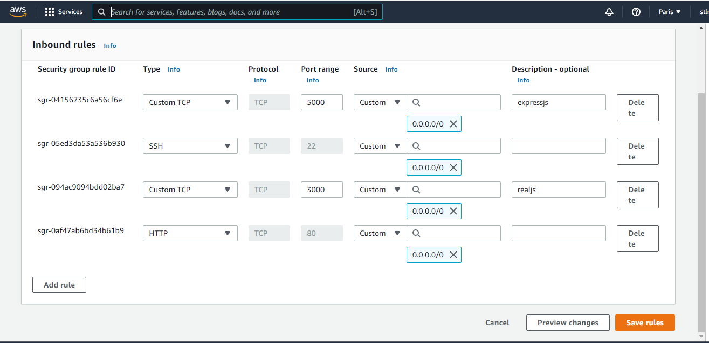

## Creating your React Components
One of the advantages of react is that it makes use of components, which are reusable and also makes code modular. For our Todo app, there will be two stateful components and one stateless component.

From your Todo directory run

```cd client```

move to the src directory

```cd src```

Inside your src folder create another folder called components and move into the components directory

```mkdir components && cd components```

Inside ‘components’ directory create three files *Input.js, ListTodo.js and Todo.js*.

```touch Input.js ListTodo.js Todo.js```

Open Input.js file

```nano Input.js```

Copy and paste the following

```
import React, { Component } from 'react';
import axios from 'axios';

class Input extends Component {

state = {
action: ""
}

addTodo = () => {
const task = {action: this.state.action}

    if(task.action && task.action.length > 0){
      axios.post('/api/todos', task)
        .then(res => {
          if(res.data){
            this.props.getTodos();
            this.setState({action: ""})
          }
        })
        .catch(err => console.log(err))
    }else {
      console.log('input field required')
    }

}

handleChange = (e) => {
this.setState({
action: e.target.value
})
}

render() {
let { action } = this.state;
return (
<div>
<input type="text" onChange={this.handleChange} value={action} />
<button onClick={this.addTodo}>add todo</button>
</div>
)
}
}

export default Input
```

To make use of **Axios**, which is a Promise based HTTP client for the browser and node.js, you need to move into your client directory from your terminal and run *yarn add axios* or *npm install axios*.

Move to the src folder

```cd ..```

Move to client folder

```cd ..```

Install Axios

```npm install axios```

Go to ‘components’ directory

```cd src/components```

After that, open your ListTodo.js

```nano ListTodo.js```

in the ListTodo.js copy and paste the following code

```
import React from 'react';

const ListTodo = ({ todos, deleteTodo }) => {

return (
<ul>
{
todos &&
todos.length > 0 ?
(
todos.map(todo => {
return (
<li key={todo._id} onClick={() => deleteTodo(todo._id)}>{todo.action}</li>
)
})
)
:
(
<li>No todo(s) left</li>
)
}
</ul>
)
}

export default ListTodo
Then in your Todo.js file you write the following code

import React, {Component} from 'react';
import axios from 'axios';

import Input from './Input';
import ListTodo from './ListTodo';

class Todo extends Component {

state = {
todos: []
}

componentDidMount(){
this.getTodos();
}

getTodos = () => {
axios.get('/api/todos')
.then(res => {
if(res.data){
this.setState({
todos: res.data
})
}
})
.catch(err => console.log(err))
}

deleteTodo = (id) => {

    axios.delete(`/api/todos/${id}`)
      .then(res => {
        if(res.data){
          this.getTodos()
        }
      })
      .catch(err => console.log(err))

}

render() {
let { todos } = this.state;

    return(
      <div>
        <h1>My Todo(s)</h1>
        <Input getTodos={this.getTodos}/>
        <ListTodo todos={todos} deleteTodo={this.deleteTodo}/>
      </div>
    )

}
}

export default Todo;
```

We need to make little adjustment to our react code. Delete the logo and adjust the look of our App.js

Move to the src folder

```cd ..```

Make sure that you are in the src folder and run

```nano App.js```

Copy and paste the code below into it

```
import React from 'react';

import Todo from './components/Todo';
import './App.css';

const App = () => {
return (
<div className="App">
<Todo />
</div>
);
}

export default App;
```

After pasting, exit the editor.

In the src directory open the App.css

```nano App.css```

Then paste the following code into App.css:

```
.App {
text-align: center;
font-size: calc(10px + 2vmin);
width: 60%;
margin-left: auto;
margin-right: auto;
}

input {
height: 40px;
width: 50%;
border: none;
border-bottom: 2px #101113 solid;
background: none;
font-size: 1.5rem;
color: #787a80;
}

input:focus {
outline: none;
}

button {
width: 25%;
height: 45px;
border: none;
margin-left: 10px;
font-size: 25px;
background: #101113;
border-radius: 5px;
color: #787a80;
cursor: pointer;
}

button:focus {
outline: none;
}

ul {
list-style: none;
text-align: left;
padding: 15px;
background: #171a1f;
border-radius: 5px;
}

li {
padding: 15px;
font-size: 1.5rem;
margin-bottom: 15px;
background: #282c34;
border-radius: 5px;
overflow-wrap: break-word;
cursor: pointer;
}

@media only screen and (min-width: 300px) {
.App {
width: 80%;
}

input {
width: 100%
}

button {
width: 100%;
margin-top: 15px;
margin-left: 0;
}
}

@media only screen and (min-width: 640px) {
.App {
width: 60%;
}

input {
width: 50%;
}

button {
width: 30%;
margin-left: 10px;
margin-top: 0;
}
}
```

Exit

In the src directory open the index.css

```nano index.css```

Copy and paste the code below:

```
body {
margin: 0;
padding: 0;
font-family: -apple-system, BlinkMacSystemFont, "Segoe UI", "Roboto", "Oxygen",
"Ubuntu", "Cantarell", "Fira Sans", "Droid Sans", "Helvetica Neue",
sans-serif;
-webkit-font-smoothing: antialiased;
-moz-osx-font-smoothing: grayscale;
box-sizing: border-box;
background-color: #282c34;
color: #787a80;
}

code {
font-family: source-code-pro, Menlo, Monaco, Consolas, "Courier New",
monospace;
}
```

Go to the Todo directory

```cd ../..```

When you are in the Todo directory run:

```npm run dev```

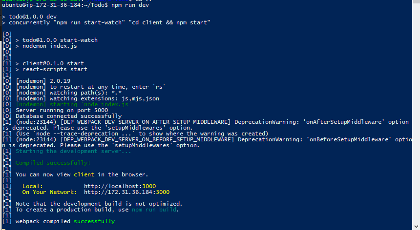

Assuming no errors when saving all these files, our To-Do app should be ready and fully functional with the functionality discussed earlier: creating a task, deleting a task and viewing all your tasks.

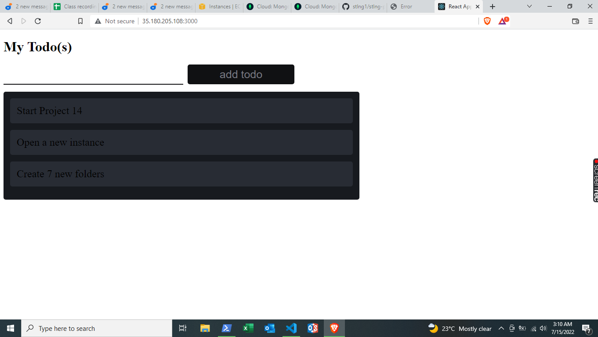

