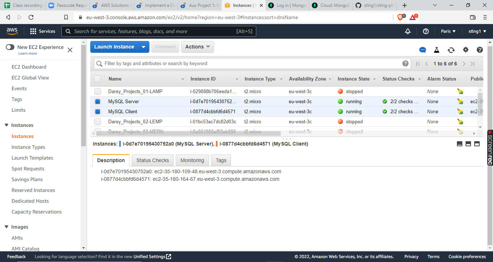
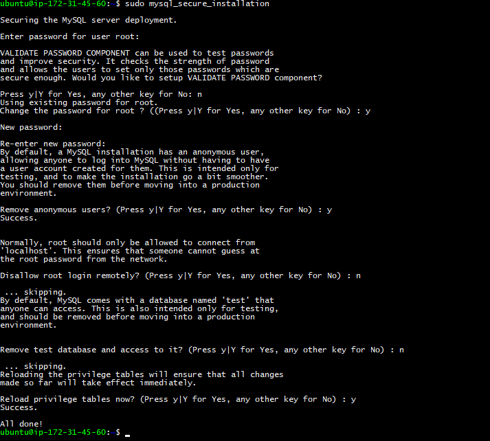
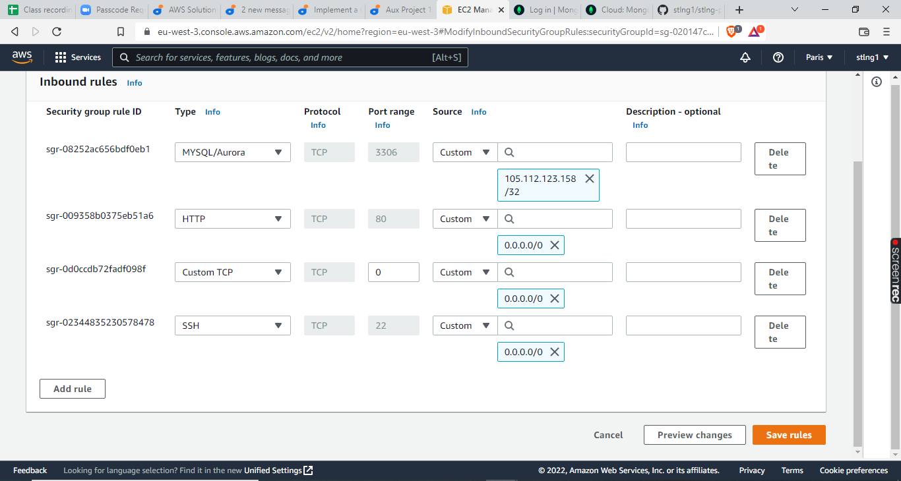
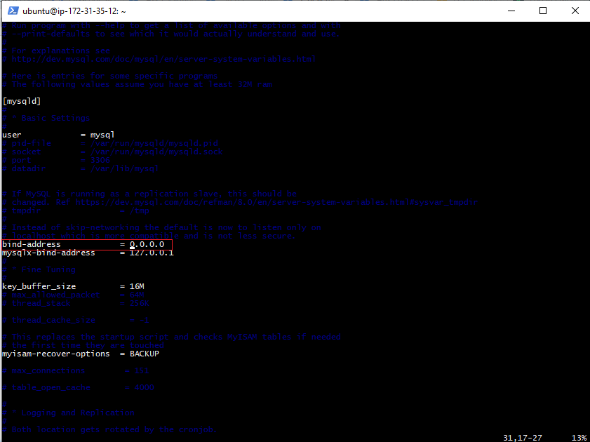
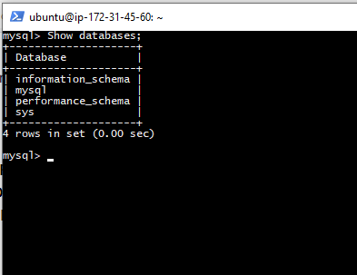

# IMPLEMENT A CLIENT SERVER ARCHITECTURE USING MYSQL DATABASE MANAGEMENT SYSTEM (DBMS).

TASK – Implement a Client Server Architecture using MySQL Database Management System (DBMS).
To demonstrate a basic client-server using MySQL Relational Database Management System (RDBMS), follow the below instructions

Create and configure two Linux-based virtual servers (EC2 instances in AWS).

Server A name - `mysql server`

Server B name - `mysql client`



# Install and Connect MySQL to EC2 Instance

## Update System Packages and Install MySQL
Run install update for your server system packages

```sudo apt update```

install MySQL using the below command

```sudo apt-get install mysql-server -y```

After successful installation of mysql-server, we can check the MySQL version by using this command-

```mysql --version```

*mysql  Ver 8.0.29 installed succesfully.*

## Configure MySQL Installation

Log in to the MySQL console

```sudo mysql```

It’s recommended that you run a security script that comes pre-installed with MySQL. This script will remove some insecure default settings and lock down access to your database system. Before running the script you will set a password for the root user, using mysql_native_password as default authentication method. We’re defining this user’s password as PassWord.1.

```ALTER USER 'root'@'localhost' IDENTIFIED WITH mysql_native_password BY 'PassWord.1';```

Exit the MySQL shell

```exit```

Run a security script to remove some insecure default settings and lock down access to your database system.

```sudo mysql_secure_installation```



Test if you’re able to log in to the MySQL console

```sudo mysql -p```

Exit the MySQL console

```exit```

## Login into MySQL and Create a User

Use the below command to login into MySQL:

```sudo mysql -p```

*In case you experience the following error while trying to login -*

>ERROR 1045 (28000): Access denied for user 'root'@'localhost' (using password: NO)```

*try this command instead*

```mysql -u root -p```

*it will ask you for a password*

```Enter password:```

*enter your password and continue*

The command will log in to MySQL using the root user. Once you are logged in, create a user in the MySQL database using these commands:

```use mysql;```

Next, create a new MySQL user with:

```CREATE USER 'username' IDENTIFIED BY 'password';```

Replace **username** and **password** with a username and password of your choice.

Alternatively, you can set up a user by specifying the machine hosting the database.

If you are working on the machine with MySQL, use username@localhost to define the user.

If you are connecting remotely, use username@ip_address, and replace ip_address with the actual address of the remote system hosting MySQL.

Therefore, the command will be:

>CREATE USER 'username'@'localhost' IDENTIFIED BY 'password';

or

>CREATE USER 'username'@'ip_address' IDENTIFIED BY 'password';

You can also create a user that can connect from any machine with the command:

>CREATE USER 'username'@'%' IDENTIFIED BY 'password';

To create a user named 'pretty' that can connect from anywhere, use the string below

```CREATE USER 'pretty'@'%' IDENTIFIED BY 'pretty';```

## Grant Access Privileges to User

Before logging in with a new account, permissions should be set for the user.

>Depending on how much authority you want your user to have, you can grant them one, several or all of the following privileges:
>
>**All Privileges:** The user account has full access to the database
>
>**Insert:** The user can insert rows into tables
>
>**Delete:** The user can remove rows from tables
>
>**Create:** The user can create entirely new tables and databases
>
>**Drop:** The user can drop (remove) entire tables and databases
>
>**Select:** The user gets access to the select command, to read the information in the databases
>
>**Update:** The user can update table rows
>
>**Grant Option:** The user can modify other user account privileges
>
>The basic syntax used to grant privileges to a user account is:
>
>*GRANT permission_type ON database.table TO 'username'@'localhost';*

Now, to grant access privileges to this newly created user, use this command:

```GRANT ALL PRIVILEGES ON *.* TO '<user>'@'%';```

Once this is done, run this command,

```FLUSH PRIVILEGES;```

## Connect User with MySQL

Now you can use this user to connect with MySQL like this:

```mysql -u <user> -p```

Once prompted for a password, provide the password, and you will be connected.

Now, your MySQL has been set up in your Ubuntu Ec2 Instance - MySQL Server.

## Install MySQL Client

On mysql client Linux Server EC2 instance, install MySQL Client software.

```sudo apt install mysql-client```

By default, both of your EC2 virtual servers are located in the same local virtual network, so they can communicate to each other using local IP addresses. Use mysql server's local IP address to connect from mysql client. MySQL server uses TCP port 3306 by default, so you will have to open it by creating a new entry in ‘Inbound rules’ in ‘mysql server’ Security Groups. For extra security, do not allow all IP addresses to reach your ‘mysql server’ – allow access only to the specific local IP address of your ‘mysql client’.



configure MySQL server to allow connections from remote hosts.

```sudo vi /etc/mysql/mysql.conf.d/mysqld.cnf```

Replace ‘127.0.0.1’ to ‘0.0.0.0’ like this:



From mysql client Linux Server connect remotely to mysql server Database Engine without using SSH. You must use the mysql utility to perform this action.

connect from mysql client using the newly created user

```mysql -u <user> -p```

Check that you have successfully connected to a remote MySQL server and can perform SQL queries:

```Show databases;```



Congratulations! – you have deloyed a fully functional MySQL Client-Server set up. 