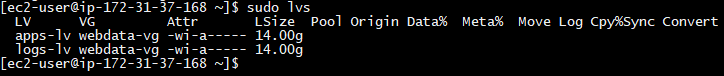

# Web Solution With WordPress

## LAUNCH AN EC2 INSTANCE THAT WILL SERVE AS “WEB SERVER”.

## Prepare a Web Server

Launch an EC2 instance that will serve as "Web Server". Create 3 volumes in the same AZ as your Web Server EC2, each of 10 GiB.


Add EBS Volume to an EC2 instance here


Attach all three volumes one by one to your Web Server EC2 instance

Open up the Linux terminal to begin configuration

Use *lsblk* command to inspect what block devices are attached to the server. 

```lsblk```

Notice names of your newly created devices. 

All devices in Linux reside in /dev/ directory. Inspect it with ls /dev/ and make sure you see all 3 newly created block devices there – their names will likely be xvdf, xvdh, xvdg.

```ls /dev/```

Use df -h command to see all mounts and free space on your server

```df -h```


Use gdisk utility to create a single partition on each of the 3 disks

```sudo gdisk /dev/xvdf```


Now, your changes has been configured succesfully, do the same for the remaining disks.

```sudo gdisk /dev/xvdg```

```sudo gdisk /dev/xvdh```

Use *lsblk* utility to view the newly configured partition on each of the 3 disks.


Install lvm2 package 

```sudo yum install lvm2```

*Note: Previously, in Ubuntu we used 'apt' command to install packages, in RedHat/CentOS a different package manager is used, so we shall use 'yum' command instead.*

check for available partitions, run: 

```sudo lvmdiskscan```


Use *pvcreate* utility to mark each of 3 disks as physical volumes (PVs) to be used by LVM

```sudo pvcreate /dev/xvdf1```

```sudo pvcreate /dev/xvdg1```

```sudo pvcreate /dev/xvdh1```

Verify that your Physical volume has been created successfully, run: 

```sudo pvs```


Use vgcreate utility to add all 3 PVs to a volume group (VG). Name the VG webdata-vg

```sudo vgcreate webdata-vg /dev/xvdh1 /dev/xvdg1 /dev/xvdf1```

Verify that your VG has been created successfully, run:

```sudo vgs```


Use lvcreate utility to create 2 logical volumes. apps-lv (Use half of the PV size), and logs-lv Use the remaining space of the PV size. 

*NOTE: apps-lv will be used to store data for the Website while, logs-lv will be used to store data for logs.*

```sudo lvcreate -n apps-lv -L 14G webdata-vg```

```sudo lvcreate -n logs-lv -L 14G webdata-vg```

Verify that your Logical Volume has been created successfully. Run:

```sudo lvs```



Verify the entire setup

```sudo vgdisplay -v #view complete setup - VG, PV, and LV```

```sudo lsblk```


Use mkfs.ext4 to format the logical volumes with ext4 filesystem

```sudo mkfs -t ext4 /dev/webdata-vg/apps-lv```

```sudo mkfs -t ext4 /dev/webdata-vg/logs-lv```

Create **/var/www/html** directory to store website files

```sudo mkdir -p /var/www/html```

Create **/home/recovery/logs** to store backup of log data

```sudo mkdir -p /home/recovery/logs```

Mount **/var/www/html** on **apps-lv** logical volume

```sudo mount /dev/webdata-vg/apps-lv /var/www/html/```

Use *rsync* utility to backup all the files in the log directory **/var/log** into **/home/recovery/logs** (This is required before mounting the file system)

```sudo rsync -av /var/log/. /home/recovery/logs/```

Mount /var/log on logs-lv logical volume. (Note that all the existing data on /var/log will be deleted. That is why the backup step above is very
important)

```sudo mount /dev/webdata-vg/logs-lv /var/log```

Restore log files back into **/var/log** directory

```sudo rsync -av /home/recovery/logs/. /var/log```

Update */etc/fstab* file so that the mount configuration will persist after restart of the server.

## UPDATE THE `/ETC/FSTAB` FILE

The UUID of the device will be used to update the /etc/fstab file;

To extract the UUID of the device, run:

```sudo blkid```


To replace the UUID of the /etc/fstab file, run:

```sudo vi /etc/fstab```


Update */etc/fstab* in the format shown above using your own UUID and remember to remove the leading and ending quotes.

Test the configuration and reload the daemon

```sudo mount -a```

```sudo systemctl daemon-reload```

Verify your setup. Run: 

```df -h```

output must look like this:


# Prepare the Database Server
Launch a second RedHat EC2 instance named **Dbase** that will have a Database Server role.
Repeat the same steps as for the Web Server, but instead of apps-lv create db-lv and mount it to /db directory instead of /var/www/html/.

Add 10GB EBS Volume to an Dbase EC2 instance


Attach all three volumes one by one to your Dbase EC2 instance

Open up the Linux terminal to begin configuration

Use *lsblk* command to inspect what block devices are attached to the server. 

```lsblk```

Notice names of your newly created devices. 

```ls /dev/```

Use df -h command to see all mounts and free space on your server

```df -h```

create a single partition on each of the 3 disks

```sudo gdisk /dev/xvdf```

```sudo gdisk /dev/xvdg```

```sudo gdisk /dev/xvdh```

Use lsblk utility to view the newly configured partition on each of the 3 disks.

```lsblk```

Install lvm2 package 

```sudo yum install lvm2```

check for available partitions, run: 

```sudo lvmdiskscan```


Use *pvcreate* utility to mark each of 3 disks as physical volumes (PVs) to be used by LVM

```sudo pvcreate /dev/xvdf1```

```sudo pvcreate /dev/xvdg1```

```sudo pvcreate /dev/xvdh1```

Verify that your Physical volume has been created successfully, run: 

```sudo pvs```

Use vgcreate utility to add all 3 PVs to a volume group (VG). Name the VG webdata-vg

```sudo vgcreate webdata-vg /dev/xvdh1 /dev/xvdg1 /dev/xvdf1```

Verify that your VG has been created successfully, run:

```sudo vgs```

Use lvcreate utility to create 2 logical volumes. db-lv (Use half of the PV size), and logs-lv (Use the remaining space of the PV size). 

*NOTE: db-lv will be used to store data for the Database while, logs-lv will be used to store data for logs.*

```sudo lvcreate -n db-lv -L 14G webdata-vg```

```sudo lvcreate -n logs-lv -L 14G webdata-vg```

Verify that your Logical Volume has been created successfully, run:

```sudo lvs```

Verify the entire setup

```sudo vgdisplay -v #view complete setup - VG, PV, and LV```

```sudo lsblk```


Use mkfs.ext4 to format the logical volumes with ext4 filesystem

```sudo mkfs -t ext4 /dev/webdata-vg/db-lv```

```sudo mkfs -t ext4 /dev/webdata-vg/logs-lv```

Create **/db** directory to store database files

```sudo mkdir -p /db```

Create **/home/recovery/logs** to store backup of log data

```sudo mkdir -p /home/recovery/logs```

Mount **/db** on **db-lv** logical volume

```sudo mount /dev/webdata-vg/db-lv /db```

Use *rsync* utility to backup all the files in the log directory **/var/log** into **/home/recovery/logs** (This is required before mounting the file system)

```sudo rsync -av /var/log/. /home/recovery/logs/```

Mount /var/log on logs-lv logical volume. (Note that all the existing data on /var/log will be deleted. That is why the backup step above is very important)

```sudo mount /dev/webdata-vg/logs-lv /var/log```

Restore log files back into **/var/log** directory

```sudo rsync -av /home/recovery/logs/. /var/log```

Update /etc/fstab file so that the mount configuration will persist after restart of the server.

## UPDATE THE `/ETC/FSTAB` FILE

The UUID of the device will be used to update the /etc/fstab file;

To extract the UUID of the device, run:

```sudo blkid```

To replace the UUID of the /etc/fstab file, run:

```sudo vi /etc/fstab```

*To Update /etc/fstab file, refer to guide in the webserver installation above using your own UUID and rememeber to remove the leading and ending quotes.*

Test the configuration and reload the daemon

```sudo mount -a```

```sudo systemctl daemon-reload```

Verify your setup, run: 

```df -h```

output must look like this:


## Install WordPress on your Web Server EC2

Update the repository

```sudo yum -y update```

Install wget, Apache and it’s dependencies

```sudo yum -y install wget httpd php php-mysqlnd php-fpm php-json```

Start Apache

```sudo systemctl enable httpd```

```sudo systemctl start httpd```

To install PHP and it’s dependencies

```sudo yum install https://dl.fedoraproject.org/pub/epel/epel-release-latest-8.noarch.rpm```

```sudo yum install yum-utils http://rpms.remirepo.net/enterprise/remi-release-8.rpm```

```sudo yum module list php```

```sudo yum module reset php```

```sudo yum module enable php:remi-7.4```

```sudo yum install php php-opcache php-gd php-curl php-mysqlnd```

```sudo systemctl start php-fpm```

```sudo systemctl enable php-fpm```

```sudo setsebool -P httpd_execmem 1```

Restart Apache

```sudo systemctl restart httpd```

Download wordpress and copy wordpress to var/www/html

```mkdir wordpress```

```cd   wordpress```

```sudo wget http://wordpress.org/latest.tar.gz```

```sudo tar xzvf latest.tar.gz```

```sudo rm -rf latest.tar.gz```

```sudo cp wordpress/wp-config-sample.php wordpress/wp-config.php```

```sudo cp -R wordpress /var/www/html/```

Configure SELinux Policies

```sudo chown -R apache:apache /var/www/html/wordpress```

```sudo chcon -t httpd_sys_rw_content_t /var/www/html/wordpress -R```

```sudo setsebool -P httpd_can_network_connect=1```

## Install MySQL on your DB Server EC2

```sudo yum update```

```sudo yum install mysql-server```

Verify that the service is up and running 

```sudo systemctl status mysqld```

if it is not running, restart the service and enable it so it will be running even after reboot:

```sudo systemctl restart mysqld```

```sudo systemctl enable mysqld```

## Configure MySQL Installation on DB Server

Log in to the MySQL console

```sudo mysql```

It’s recommended that you run a security script that comes pre-installed with MySQL. This script will remove some insecure default settings and lock down access to your database system. Before running the script you will set a password for the root user, using mysql_native_password as default authentication method. We’re defining this user’s password as PassWord.1.

```ALTER USER 'root'@'localhost' IDENTIFIED WITH mysql_native_password BY 'PassWord.1';```

Exit the MySQL shell

```exit```

Run a security script to remove some insecure default settings and lock down access to your database system.

```sudo mysql_secure_installation```

## Configure MySQL on DB Server to work with WordPress

login mysql

```sudo mysql -p```

create database

```CREATE DATABASE wordpress;```

create users

```CREATE USER `myuser`@`<Web-Server-Private-IP-Address>` IDENTIFIED BY 'mypass';```

set user permissions

```GRANT ALL ON wordpress.* TO 'myuser'@'<Web-Server-Private-IP-Address>';```

```FLUSH PRIVILEGES;```

```SHOW DATABASES;```

```exit```

## Configure WordPress to connect to remote database.

Open MySQL port 3306 to inbound traffic on DB Server EC2. For extra security, you should allow access to the DB server ONLY from your Web Server’s IP address, so in the Inbound Rule configuration specify source as /32


Install MySQL client on the webserver and test that you can connect from your Web Server to your DB server.

Install mysql-client

```sudo yum install mysql```

login to mysql client as admin or root user

```sudo mysql -u <admin user> -p -h <DB-Server-Private-IP-address>```

Verify if you can successfully execute SHOW DATABASES; command and see a list of existing databases.


## Change permissions and configuration so Apache could use WordPress:

As a content management system, WordPress uses a database to store all your content and other website data. It then connects to the database each time someone visits your website. WordPress needs the following information for connecting to the database: Database name, Database username, Database password and Database server. This information is stored in your WordPress configuration file called *wp-config.php*. 

To update the configuration, run:

```sudo vi /var/www/html/wordpress/wp-config.php```


Enable TCP port 80 in Inbound Rules configuration for your Web Server EC2 (enable from everywhere 0.0.0.0/0 or from your workstation’s IP)

Try to access from your browser the link to your WordPress http://<Web-Server-Public-IP-Address>/wordpress/


Fill out your DB credentials:


CONGRATULATIONS!
we have configured Linux storage susbystem and have also deployed a full-scale Web Solution using WordPress CMS and MySQL RDBMS!