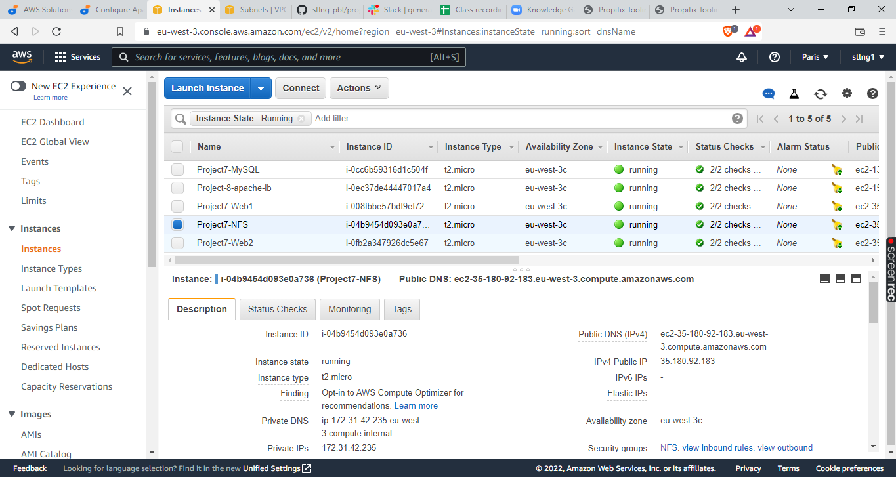
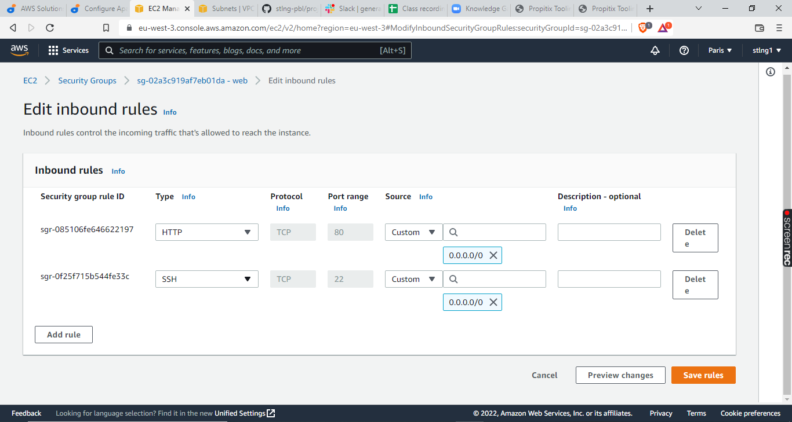
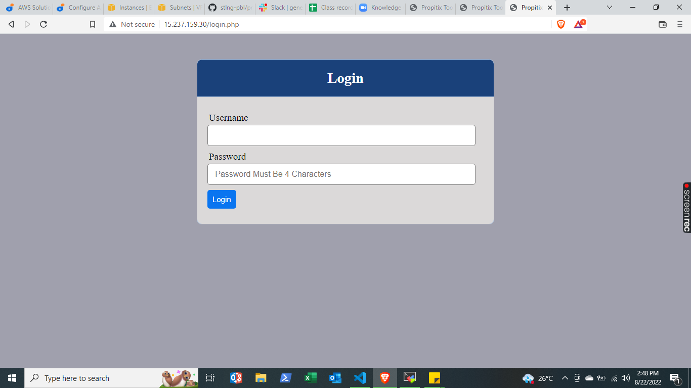

# Load Balancer Solution With Apache

For this project, we need just two web servers and one Load Balancer. We will use two of the webservers created in project 7: Project7-Web1 & Project7-Web2.Create a new Ubuntu Server 20.04 EC2 instance named Project-8-apache-lb, in addition to the servers created in Project 7, so your EC2 list should look like this:



Open TCP port 80 on Project-8-apache-lb by creating an Inbound Rule in Security Group.



## Install & Configure Apache As A Load Balancer

Install Apache Load Balancer (LB) on Project-8-apache-lb server and configure it to point traffic coming to LB to both Web Servers:

```
#Install apache2
sudo apt update
sudo apt install apache2 -y
sudo apt-get install libxml2-dev

#Enable following modules:
sudo a2enmod rewrite
sudo a2enmod proxy
sudo a2enmod proxy_balancer
sudo a2enmod proxy_http
sudo a2enmod headers
sudo a2enmod lbmethod_bytraffic

#Restart apache2 service
sudo systemctl restart apache2
```

Make sure apache2 is up and running

```sudo systemctl status apache2```

Configure Load Balancing

```sudo vi /etc/apache2/sites-available/000-default.conf```

Add the configuration below into this section,<VirtualHost *:80>  </VirtualHost>
```
<Proxy "balancer://mycluster">
               BalancerMember http://<WebServer1-Private-IP-Address>:80 loadfactor=5 timeout=1
               BalancerMember http://<WebServer2-Private-IP-Address>:80 loadfactor=5 timeout=1
               ProxySet lbmethod=bytraffic
               # ProxySet lbmethod=byrequests
        </Proxy>

        ProxyPreserveHost On
        ProxyPass / balancer://mycluster/
        ProxyPassReverse / balancer://mycluster/
```

Restart apache server

```sudo systemctl restart apache2```


*bytraffic* balancing method will distribute incoming load between your Web Servers according to current traffic load. We can control in which proportion the traffic must be distributed by loadfactor parameter.

Verify that our configuration works – try to access your LB’s public IP address or Public DNS name from your browser:

```http://<Load-Balancer-Public-IP-Address-or-Public-DNS-Name>/index.php```



Note: If in the Project-7 you mounted /var/log/httpd/ from your Web Servers to the NFS server – unmount them and make sure that each Web Server has its own log directory.

> *To unmount /var/log, first backup the directory:*
>
>       sudo mkdir -p /home/recovery/logs
>       sudo rsync -av /var/log/. /home/recovery/logs/
> 
> *then, unmount-*
>
>       sudo umount -l /var/log```
>
> *verify unmount*
>
>       df -h
>
> *restore backup*
>
>       sudo rsync -av /home/recovery/logs/. /var/log
>
>   .


Open ssh/Putty consoles for each of the two Web Servers and run following command:

```sudo tail -f /var/log/httpd/access_log```

Try to refresh your browser page several times and make sure that both servers receive HTTP GET requests from your LB – new records must appear in each server’s log file. 

http://```<Load-Balancer-Public-IP-Address-or-Public-DNS-Name>/index.php```

 The number of requests to each server will be approximately the same since we set loadfactor to the same value for both servers – it means that traffic will be distributed evenly between them. If you have configured everything correctly – your users will not even notice that their requests are served by more than one server.


Project7-Web1


Project7-Web2

If you have configured everything correctly – your users will not even notice that their requests are served by more than one server.

# Target Architecture
Now your set up looks like this:


Congratulations!
